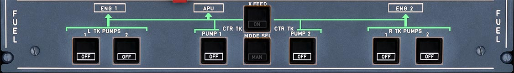

# Fuel Control Panel

---

[Back to Flight Deck](../index.md){ .md-button }

---

!!! note "API Documentation: [Fire Panel API](../../a32nx_api.md#fuel-panel)"

## Description

Total Fuel Capacity:

- Two outer tanks: 1,760 liters (1,408kg)
- Two inner tanks: 13,849 liters (11,079kg)
- One center tank: 8,250 liters (6,600kg)

The tanks empty in the following sequence :

1. Center tank
2. Inner tanks (down to 750 kg in each inner tank)
3. Outer tanks (fuel transferred into the inner tanks)

Each engine is fed by their corresponding center and wing tanks. The pumps stay turned on during the flight.

Both engines can be fed from one side or both sides can feed only one engine.

## Usage

###  L + R TK PUMPS 1 + 2

- ON:
    - Pump is on but only provides fuel if center tank is empty.
- OFF:
    - Pump is OFF and button lights up a white OFF.
- FAULT:
    - Amber light and ECAM caution appear, when the pressure drops and pump is not OFF.

### MODE SEL

- AUTO:
    - Automatic control.
        - Runs 2 minutes at engine start.
        - Outside engine start sequence, the pumps activate while slats are retracted.
        - After center tank low level is reached, they deactivate after 5 minutes.
- MAN:
    - Manual control of center tank pump with center tank pumps button switches.
- FAULT:
    - Amber light and ECAM caution appear, when the left or right wing tank has less than 5000 kg (11000 lb) and center tank has more than 250 kg (550 lb).

!!! attention ""
    Currently not available or INOP in the FBW A32NX for Microsoft Flight Simulator.

### CTR TK PUMP 1 + 2

- ON:
    - Pump runs if MAN mode is selected on MODE SEL pushbutton switch. Pump is automatically controlled when AUTO mode is selected.
- OFF:
    - Pump is off and OFF button lights up white.
- FAULT:
    - Amber light and ECAM caution appear, when delivery pressure drops while pump operates.

!!! note ""
     The A320neo doesn't have center tank pumps anymore. These have been replaced by transfer valves. The current aircraft model used by the FlyByWire A32NX has incorrect labels.

### X FEED

- OFF:
    - Valve closes (no light).
- ON:
    - Valve opens.
- OPEN:
    - When the valve is fully open, Green light comes on.

---

[Back to Flight Deck](../index.md){ .md-button }

