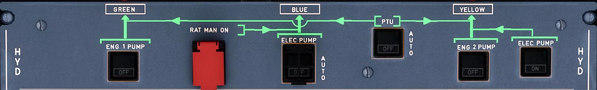

# Hydraulics Control Panel

---

[Back to Flight Deck](../index.md){ .md-button }

---

## Description

The aircraft has three fully independent hydraulic systems: Green, Yellow, Blue.

Normal operation:

- Green and Yellow system are pressurized by an engine-driven pump (one pump for each system).
- Blue system is pressurized by an electric pump.

Abnormal operation:

- If engine No. 1 is not running or the Green pump has failed:
    - The Green system is pressurized by the reversible Power Transfer Unit (PTU).
- If engine No. 2 is not running or the Yellow pump has failed:
    - The Yellow system is pressurized by the reversible PTU.
- In case of dual engine failure or total electrical power loss:
    - The Ram Air Turbine (RAT) will pressurize the Blue system.

On ground:

- Blue and Yellow systems can be pressurized by electric pumps. A hand pump (operated from the ground on the yellow system) facilitates maneuvering of the cargo doors.
- Green/Yellow system can be pressurized by the PTU.

## Usage

###  ENG 1 + 2 PUMP

- ON:
    - When the engine is running, the pump pressurizes the system.
- OFF:
    - The pump is deactivated (depressurized). No generation of hydraulic power.
- FAULT:
    - Amber light and ECAM caution appears if the reservoir level is low, overheats or air pressure is low. It also lights when the pump pressure is low (inhibited on the ground, when the engine is stopped). It goes out, when the crew selects OFF, except during an overheat, where it stays on as long as the overheat lasts.

### BLUE ELEC PUMP

- AUTO:
    - If AC power is available, the electric pump operates when in flight or when on the ground, if one engine is running or if the crew has pressed the BLUE PUMP OVRD pushbutton on the maintenance panel.
- OFF:
    - The pump is not powered.
- FAULT:
    - Amber light and ECAM caution appears, if the reservoir level is low, overheats or air pressure is low. It also lights when the pump pressure is low (inhibited on the ground, when the engine is stopped) or the pump overheats. It goes out, when the crew selects OFF, except during an overheat, where it stays on as long as the overheat lasts.

### YELLOW ELEC PUMP

- ON:
    - The electric pump is ON.
- OFF:
    - The pump is off. When the lever of the cargo door manual selector valve is set to OPEN or CLOSE, the pump automatically comes on. This inhibits the operation of other yellow system functions (except alternate braking and engine 2 reverse).
- FAULT:
    - Amber light and ECAM caution appears, if the reservoir level is low, overheats or air pressure is low. It also lights when the pump pressure is low (inhibited on the ground, when the engine is stopped) or the pump overheats. It goes out, when the crew selects OFF, except during an overheat, where it stays on as long as the overheat lasts.

### PTU

- AUTO:
    - The bidirectional power transfer unit is armed and both the yellow and the green electrohydraulic valves are open. The power transfer unit runs automatically when the differential pressure between the green and yellow systems exceeds 500 psi.

    !!! info ""
        Note : The PTU is inhibited during the first engine start and automatically tested during the second engine start.

- OFF:
    - Both PTU valve close, stopping power transfer.
- FAULT:
    -  Amber light and ECAM caution appears, if the green or the yellow reservoir overheat, have low air pressure or have a low fluid level. It goes out, when the crew selects OFF, except during an overheat, where it stays on as long as the overheat lasts.

### RAT MAN ON

- Manually extends the RAT at any time. The RAT is extended automatically if AC BUS 1 and AC BUS 2 are lost.

---

[Back to Flight Deck](../index.md){ .md-button }

