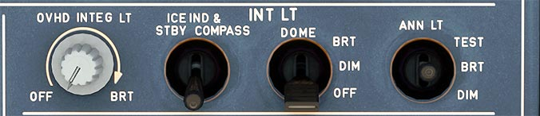

# Internal Lights Panel

---

[Back to Flight Deck](../index.md){ .md-button }

---

## Usage

### OVHD INTEG LT

Brightness for the integral lightning of the overhead panel.

### ICE IND & STBY COMPASS

Integral lighting for the standby compass and the visual indicator.

!!! attention ""
    Currently not available or INOP in the FBW A32NX for Microsoft Flight Simulator.

### DOME

Switch for dome lights. Settings are OFF, DIM (dimmed) and BRT (bright)

### ANN LT

Brightness of cockpit annunciator lights. Either "bright" or "dim", or test.

- TEST:
    - Turns on all annunciator lights in the cockpit and LCDs in the FCU for the test.
- DIM:
    - Dims all annunciator lights.
- BRT:
    - Normal brightness for all annunciator lights.

---

[Back to Flight Deck](../index.md){ .md-button }

