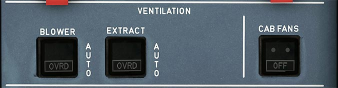

# Ventilation Panel

---

[Back to Flight Deck](../index.md){ .md-button }

---

## Usage

### BLOWER and EXTRACT

- AUTO:
    - When both switches are on AUTO:
        - On the ground before TO power, the system is in open circuit configuration (or in closed configuration when the skin temperature is below the ground threshold).
        - On the ground after TO power, and in flight, the ventilation system is in closed-circuit configuration.
- OVRD:
    - When either switch is on OVRD:
        - Closed-circuit configuration.
        - Air from the a/c system is added to ventilation air.
        - The blower fan stops if the BLOWER pushbutton switch is in the OVRD position.
    - When both pushbutton switches are on OVRD:
        - Air flows from the a/c system and then overboard.
        - The extract fan continues to run.
- FAULT It:
    - Amber light and ECAM message
        - in blower switch, when:
            - low blowing pressure
            - duct overheats
            - power supply to the computer fails
            - smoke warning is activated
        - in the extract switch, when
            - extract pressure is low
            - computer power supply fails
            - smoke warning is activated.

### CAB FAN pushbutton

- ON:
    - The two cabin fans are on.
- OFF:
    - The two cabin fans are off.

---

[Back to Flight Deck](../index.md){ .md-button }
