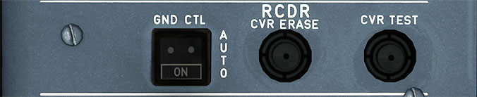

# Voice Recorder Panel

---

[Back to Flight Deck](../index.md){ .md-button }

---

## Description

The voice recorder panel consist of cockpit voice recorder (CVR) and digital flight data recorder (DFDR) controls.

The CVR and DFDR are energized automatically during the following conditions:

- On the ground for five minutes following electrical power
- On the ground continuously with at least one engine running
- Continuously in flight regardless if engines are operating
- The CVR and DFDR both automatically stop five minutes after the last engine is shut down

The cockpit voice recorder is located in the aft section of the airplane, equipped with an underwater locating beacon. It records direct conversations between crew members through a cockpit area microphone and boom microphones, aural cockpit warnings, intercommunication and radio transmissions.

The passenger address system is also recorded if the PA reception knob is selected on. Only the last 30 minutes of recording is retained.

## Usage

- GND CTRL:
    - The ON function energizes the CVR and DFDR. This is used to test the CVR and DFDR.

- CVR ERASE:
    - When the ERASE button is pushed for two seconds, it erases the CVR tape, provided the airplane is on the ground and the parking brake is on.

- CVR TEST:
    - When pushed and held, the CVR test is activated provided the CVR is energized and the parking brake is on. During the test, a low frequency tone is heard through the cockpit loudspeakers.

---

[Back to Flight Deck](../index.md){ .md-button }
