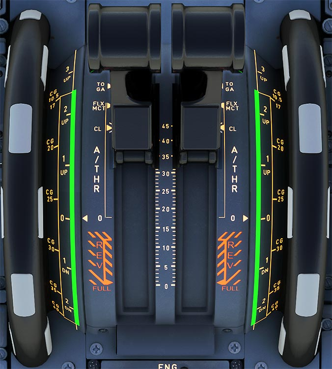

# Flightstick and Tiller

---

[Back to Flight Deck](../index.md){ .md-button }

---

!!! note "API Documentation: [Thrust Lever Panel](../../a32nx_api.md#isis)"

## Description

---

[Back to Flight Deck](../index.md){ .md-button }
