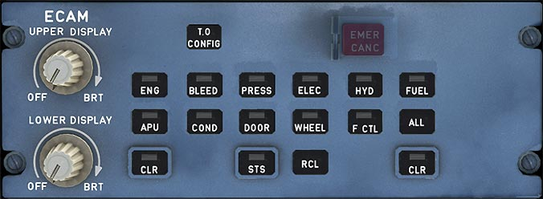

# ECAM Control Panel

---

[Back to Flight Deck](../index.md){ .md-button }

---

## Description

The ECAM Control Panel is used to change what is displayed on the Warning Display and System Display (Lower ECAM) and also has knobs to regulate brightness of the both ECAM displays.

## Usage

###  OFF / BRT knobs

These knobs control the brightness of the ECAM displays and also allow to turn the ECAM displays off.

### System page buttons

Displays the respective page on the SD.

[Detailed ECAM Pages Documentation](../../ecam){ .md-button }

### CLR and RCL

The CLR button is lit when the E/WD is displaying a warning or caution message, or a status message on the SD. If it is lit, pressing it changes removes the warning or caution message.

The RCL button is used to recall the caution or warning messages that have been suppressed by the CLR button or by flight-phase-related inhibition.

### STS (status)

The pilot pushes this button to show the STATUS page on the lower SD. The button is lit, as long as the SD displays the STS page. If the system has no status messages, the status page displays "NORMAL".

### ALL

The SD successively displays all the system pages at one-second intervals, when this button is pressed and held down.

### EMER CANC

Silences warnings and cancels cautions for the rest of the flight but continues to show these warnings and cautions on the ECAM Status page.

The RCL button can be pressed for 3 seconds to recall the caution messages.

!!! note ""
    Currently not available in the FBW A32NX for Microsoft Flight Simulator.

### T.O. CONFIG pb

To test the take off configuration this button simulates the use of takeoff power. It triggers a warning, if the aircraft is not in takeoff configuration.

The E/WD displays the "TO CONFIG NORMAL" message when the configuration is correct.

---

[Back to Flight Deck](../index.md){ .md-button }
