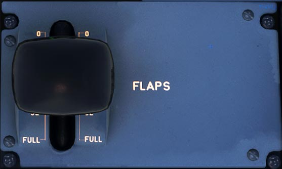

# Flaps

---

[Back to Flight Deck](../index.md){ .md-button }

---

## Controls

### FLAPS lever

The FLAPS lever controls the operation of the slats and flaps.

The five lever positions correspond to the following surface positions :

| Position | Slats ° | Flaps ° | ECAM  | Max Speed | Phase                 |
|:--------:|:-------:|:-------:|:-----:|:---------:|:----------------------|
|    0     |    0    |    0    |       |           | CRUISE                |
|    1     |   18    |  0/10   | 1/1+F |  230 kt   | HOLD / TAKE OFF       |
|    2     |   22    |   15    |   2   |  215 kt   | TAKE OFF / APPR       |
|    3     |   22    |   20    |   3   |  185 kt   | TAKE OFF / LDG / APPR |
|   FULL   |   27    |   40    | FULL  |  177 kt   | LDG                   |

Before selecting any position, the pilot must pull the lever out of the detent. Stops at positions 1 and 3 prevent the pilot from calling for excessive flap/slat travel with a single action.

!!! info ""
    Note : The pilot cannot select an intermediate lever position.

Takeoff in CONFIG 1:

- 1 + F (18° Slats /  10° **F**laps) is selected. If the pilot does not select configuration 0 after takeoff, the flaps retract automatically at 210 knots.

Takeoff or go-around in CONFIG 2 or 3:

- If the pilot selects CONFIG 1, he gets 1 + F (18°/10°) if airspeed is under 210 knots.
- If the pilot does not select configuration 0 after takeoff, the flaps retract automatically at 210 knots.

CONFIG O to CONFIG 1 in flight:

- CONFIG 1 ( 18° Slats / 0° Flaps) is selected.

!!! info ""
    Note: After flap retraction, CONFIG 1 + F is no longer available until the airspeed is 100 knots or less, unless CONFIG 2, 3, or FULL has been selected previously.

---

[Back to Flight Deck](../index.md){ .md-button }

