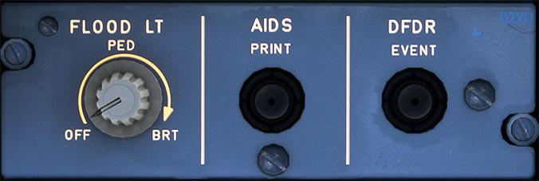

# Lighting Pedestal, AIDS, DFDR First Officer Side

---

[Back to Flight Deck](../index.md){ .md-button }

---

### FLOOD LT PED knob

Sets brightness of the floodlighting for the pedestal.

### AIDS PRINT pushbutton

To print a specific flight phase dependent report, the crew can push this button and then use the MCDU to select another report for printing.

!!! attention ""
    Currently not available or INOP in the FBW A32NX for Microsoft Flight Simulator.

### DFDR EVENT

This button sets an event mark on the flight data records if pressed.

!!! info "Flight Data Recorder"
    The A32NX has a virtual flight data recorder which collects hundreds of data points from the aircraft and the 
    sim. This helps the FlyByWire development and support team to find and reproduce issues quickly. 
    

    Pressing the DFDR button will mark a point in time in this recorded data to easily find a specific point in time.
    

    See [FDR Files](../../../../fbw-a32nx/support/index.md#fdr-files)

---

[Back to Flight Deck](../index.md){ .md-button }
