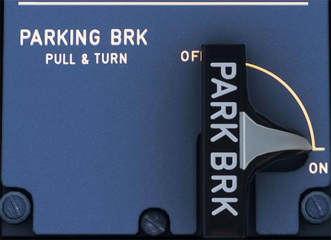

# Parking Brake Panel

---

[Back to Flight Deck](../index.md){ .md-button }

---

!!! note "API Documentation: [Parking Brake Panel](../../a32nx_api.md#parking-brake)"

## Description

To apply the Parking Brake the flight crew pulls this handle and turns it clockwise.

The message "PARK BRK" appears on the ECAM.

To release the Parking Brake the handle is turned counterclockwise.

---

[Back to Flight Deck](../index.md){ .md-button }
