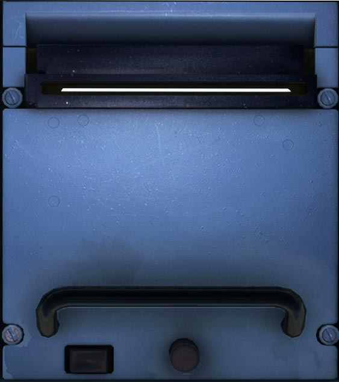

# Printer Panel

---

[Back to Flight Deck](../index.md){ .md-button }

---

## Description

The following systems (if installed) can print reports on paper: ACARS, AIDS, FMGC, CFDIU and EVMU.

After loading a new paper roll, the SLEW switch can be used to feed the paper forward.

New paper can be added by opening the printer panel using the latch, which locks the door.
