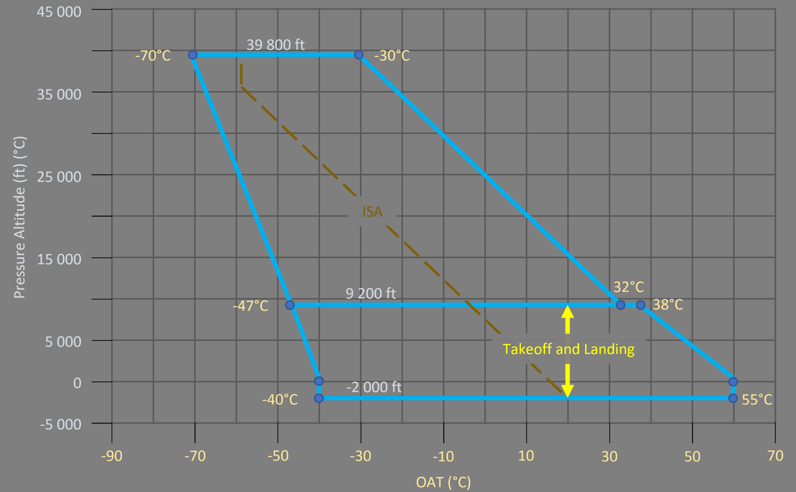

# Aircraft Limitations

The page describes various operational limitations of the currently simulated aircraft model of the A32NX. Other 
variations of the A320 might have different limitations and characteristics.

This list if by far not complete but should mention the most important operational limitations for flight simulation.

## Aircraft General

### Flight Maneuvering Load Acceleration Limits

- Clean configutation: -1.0g to +2.5g
- Other configutations: 0g to +2g

### Environmental Envelope

!!! bug "IMAGE TO BE REPLACED"

### Airport Operations and Wind Limitations

| Parameter                                  | Value             |
|--------------------------------------------|-------------------|
| Runway altitude                            | 9.200 ft          |
| Runway slope                               | +- 3% (mean)      |
| Nominal Runway Width                       | 45m               |
|                                            |                   |
| Maximum certified crosswind for takeoff    | 35kt (incl. gust) |
| Maximum demonstrated crosswind for landing | 38kt (incl. gust) |
| Maximum tailwind for takeoff               | 15kt              |
|                                            |                   |

!!! note
    For landing with a tailwind greater than 10 kt, FLAPS FULL is recommended.

### Speeds

#### Maximum Flaps/Slats Speeds

| Position | Slats ° | Flaps ° | ECAM  | Max Speed | Phase                 |
|:--------:|:-------:|:-------:|:-----:|:---------:|:----------------------|
|    0     |    0    |    0    |       |           | CRUISE                |
|    1     |   18    |  0/10   | 1/1+F |  230 kts  | HOLD / TAKE OFF       |
|    2     |   22    |   15    |   2   |  215 kts  | TAKE OFF / APPR       |
|    3     |   22    |   20    |   3   |  185 kts  | TAKE OFF / LDG / APPR |
|   FULL   |   27    |   40    | FULL  |  177 kts  | LDG                   |

#### Maximum Operating Speeds

| Parameter | Description                      | Value  |
|-----------|----------------------------------|--------|
| VMO       | Maximum operating speed in Knots | 350 kt |
| MMO       | Maximum operating speed in Mach  | M0.82  |

!!! bug "IMAGE TO BE REPLACED"

#### Landing Gear

| Parameter      | Description                                              | Value           |
|----------------|----------------------------------------------------------|-----------------|
| VLE            | Maximum Speeds with the Landing Gear Extended            | 280 kt / M 0.67 |
| VLO extension  | Maximum speed at which the landing gear may be extended  | 250 kt / M 0.60 |
| VLO retraction | Maximum speed at which the landing gear may be retracted | 220 kt / M 0.54 |

| Parameter            | Description     | Value  |
|----------------------|-----------------|--------|
| Maximum ground speed | Tire protection | 195 kt |

#### Minimum Control Speeds

| Parameter | Description                         | Value           |
|-----------|-------------------------------------|-----------------|
| VMCL      | Minimum control speed for landing   | 116 kt          |
| VMCA      | Minimum control speed in the air    | see table below |
| VMCG      | Minimum control speed on the ground | see table below |

| Altitude  | VMCA       | VMCG / >CONF 1 |
|-----------|------------|----------------|
| -2.000 ft | 115 kt IAS | 117 kt IAS     |
| 0 ft      | 114 kt IAS | 116 kt IAS     |
| 2.000 ft  | 114 kt IAS | 116 kt IAS     |
| 4.000 ft  | 113 kt IAS | 115 kt IAS     |
| 6.000 ft  | 112 kt IAS | 114 kt IAS     |
| 8.000 ft  | 109 kt IAS | 112 kt IAS     |
| 10.000 ft | 106 kt IAS | 109 kt IAS     |
| 12.000 ft | 103 kt IAS | 106 kt IAS     |
| 14.100 ft | 99 kt IAS  | 102 kt IAS     |
| 15.100 ft | 97 kt IAS  | 101 kt IAS     |

#### Taxi Speed

| Parameter          | Description                               | Value               |
|--------------------|-------------------------------------------|---------------------|
| Maximum taxi speed | When takeoff weight >76.000kg / 167.550lb | 20 kt during a turn |

### Weight Limitations

- OEW (Empty Weight): 42500 kg / 93697 lbs
    - Also referred to as DOW (Dry Operating Weight) which can be seen in other simBrief OFP formats such as EZY
- MZFW (Max Zero Fuel Weight): 64300 kg / 141757 lbs
- MTOW (Max Takeoff Weight): 79000 kg / 174165 lbs
- MLW (Max Landing Weight): 67400 kg / 148591 lbs

| Parameter | Description              | Value                   |
|-----------|--------------------------|-------------------------|
| MTXW      | Maximum Taxi Weight      | 79.400 kg / 175.047 lbs |
| MTOW      | Maximum Takeoff Weight   | 79.000 kg / 174.165 lbs |
| MLW       | Maximum Landing Weight   | 67.400 kg / 148.591 lbs |
| MZFW      | Maximum Zero Fuel Weight | 64.300 kg / 141.757 lbs |
|           | Minimum Weight           | 40.600 kg / 89.508l lb  |

!!! note
    In exceptional cases (in flight turn back or diversion), an immediate landing at weight above maximum landing 
    weight is permitted, provided the pilot follows the overweight landing procedure.

## Cabin Pressure

| Parameter                              | Value    |
|----------------------------------------|----------|
| Maximum positive differential pressure | 9.0 PSI  |
| Maximum negative differential pressure | -1.0 PSI |
| Safety relief valve setting            | 8.6 PSI  |

## Autoflight

### Autopilot

| Parameter                           | Value                                |
|-------------------------------------|--------------------------------------|
| At takeoff / manual go-around       | 100 ft AGL and min. 5s after liftoff |
| Approach with FINAL APP, V/S or FPA | 250 ft AGL                           |
| Circling Appraoch                   | 500 ft AGL                           |
| ILS CAT1                            | 160 ft AGL                           |
| ILS CAT2 or CAT3                    | 0 ft AGL if autoland                 |
| All other modes                     | 500 ft AGL                           |

!!! note
    The AP or FD in OP DES or DES mode can be used in approach. However, its use is only permitted if the FCU 
    selected altitude is set to, or above, the higher of the two: MDA/MDH or 500 ft AGL.

See also [Autoland](../advanced-guides/flight-guidance/autoland.md#aircraft-limitations)
