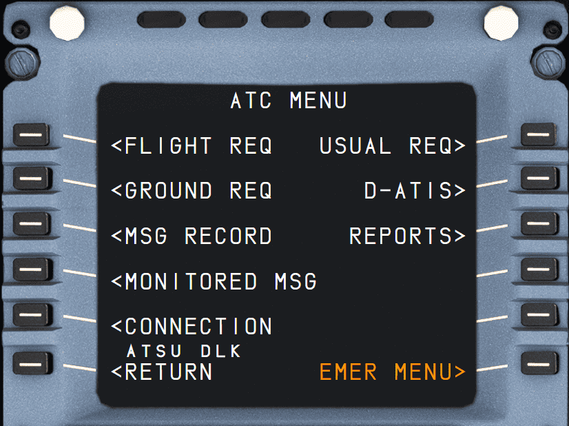

# ATC COMM: ATC Communication Applications Page

<link rel="stylesheet" href="/stylesheets/admonitions.css">

This page will not be documented in this guide.

Use our [Hoppie ACARS Guide](../../../fbw-a32nx/feature-guides/hoppie.md) instead.
