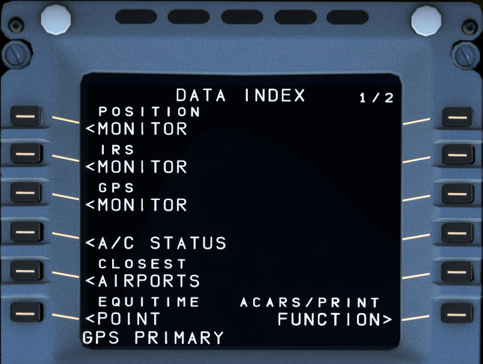
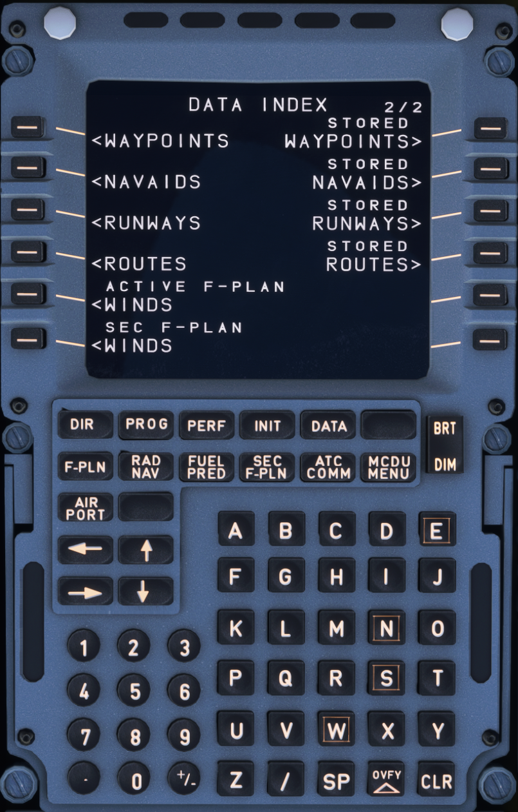
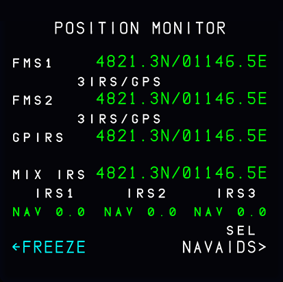
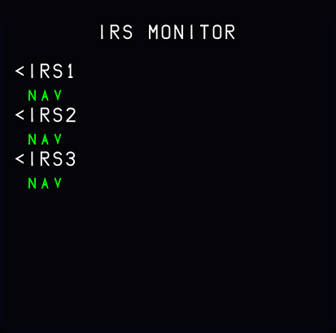
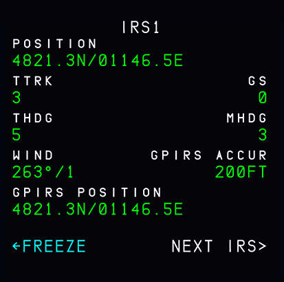
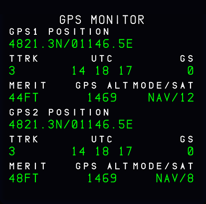
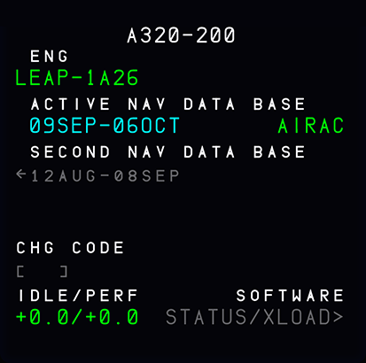
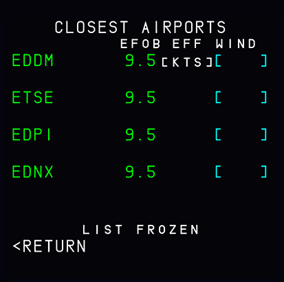
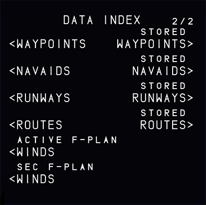

# DATA: Data Index Page

!!! block ""

    {loading=lazy align=left width=46%}

    {loading=lazy align=right width=46%}

## Description

The DATA INDEX pages give access to various systems and databases in the aircraft.

PAGE 1 is dedicated to navigation systems and corresponding sub pages.

PAGE 2 is dedicated to navigation data that is entered or stored in the FMGS.

!!! attention ""
    This section will not cover all DATA INDEX pages as most are not useful in a simulation anyway or not implemented yet in the FlyByWire A32NX.

## DATA INDEX page 1

### POSITION MONITOR

{loading=lazy}

This page displays all the different positions that the FMGC has computed with the various available methods of navigation. It also shows which method obtained each position. (The positions should be almost identical).

### IRS MONITOR

{loading=lazy}

{loading=lazy}

### GPS MONITOR

{loading=lazy}

### A/C STATUS

{loading=lazy}

### CLOSEST AIRPORTS

{loading=lazy}
## DATA INDEX page 2

{loading=lazy}

- WAYPOINTS (1L)
- NAVAIDS (2L)
- RUNWAYS (3L)
- ROUTES (4L)

These keys call up details of waypoints, NAVAIDs, runways, and routes
stored in the database.

!!! attention ""
    Currently not all of these are available in the FBW A32NX for Microsoft Flight Simulator.

- STORED WAYPOINTS (1R)
- STORED NAVAIDS (2R)
- STORED RUNWAYS (3R)
- STORED ROUTES (4R)

These keys call up waypoints, NAVAIDs, runways, and routes that the pilot has stored, to review and store them in, or delete them from, the database. The airline can choose to have all pilot-stored data automatically erased in the done phase.

!!! attention ""
    Currently not available or INOP in the FBW A32NX for Microsoft Flight Simulator.
