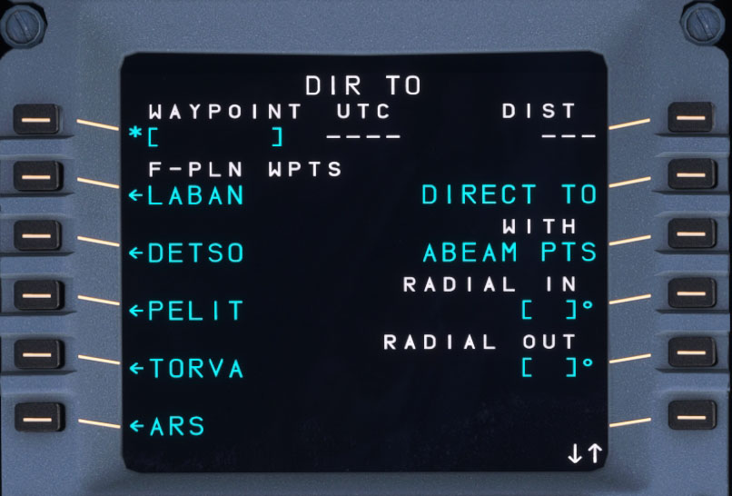

# DIR: Direct To Page

## Description

The DIR TO page is used by the flight crew to select waypoints from the flight plan or to enter new waypoints to modify the current active flight plan by creating a direct leg to the selected/entered waypoint.

When in NAV mode this changes the currently active leg and waypoint. In HDG mode activation of a DIR TO will switch to NAV mode for a direct course to the new waypoint.

!!! attention ""
    This page describes the current capability of the FlyByWire A32NX.

## Usage

### DIR TO (1L)

The entry field can be filled manually or by selecting a flight plan waypoint from 2L to 6L.

When data is entered two amber functions appear in 6L and 6R to either erase the entry or to confirm the insertion of the direct leg to this waypoint.

### LSK 3L to 6L

These lines on the left list the flight plan waypoints for the flight crew to select from.

### ERASE (6L)

After selecting a waypoint (now in 1L data field) an amber ERASE functions appears in 6L.

Pressing ERASE clears the selected DIR TO waypoint in 1L.

### DIRECT (6R)

After selecting a waypoint (now in 1L data field) an amber DIRECT functions appears in 6R.

Pressing DIRECT inserts the selected DIR TO waypoint in 1L into the flight plan as the active leg and next waypoint. The aircraft immediately starts turing towards the waypoints.

### DIRECT TO (2R)

!!! attention ""
    Currently not available or INOP in the FBW A32NX for Microsoft Flight Simulator.

### ABEAM PTS (3R)

!!! attention ""
    Currently not available or INOP in the FBW A32NX for Microsoft Flight Simulator.

### RADIAL IN (4R)

!!! attention ""
    Currently not available or INOP in the FBW A32NX for Microsoft Flight Simulator.

### RADIAL OUT (5R)

!!! attention ""
    Currently not available or INOP in the FBW A32NX for Microsoft Flight Simulator.

