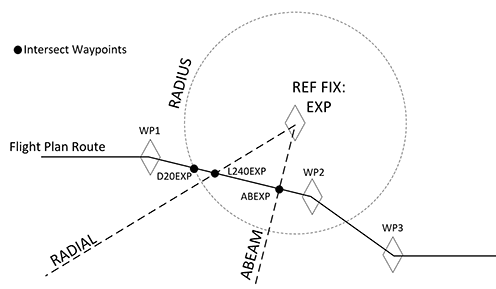

# F-PLN: Flight Plan Page

<link rel="stylesheet" href="/stylesheets/admonition.css">
<link rel="stylesheet" href="/stylesheets/reported-issues.css">

## Description

The MCDU F-PLN page is actually a series of page for the management of
the aircraft's active flight plan.

Revisions to the lateral and vertical flight plans can be made from
these pages. For lateral revision press the left LSK and for vertical
revision press the right LSK.

## Flight Plan A Page

### General

The flight plan page A lists all waypoints of the active flight plan in sequence providing time, speed and altitude predictions.

The FROM waypoint (last waypoint overflown) is listed at the top and TO waypoint is listed in white as the second entry. This FROM-TO is called the active leg.

To scroll through the flight plan the vertical slew keys can be used. To return to the beginning of the flight plan page, the F-PLN key can be pressed.

The AIRPORT key serves as a fast slew key. It can be pressed to call up the next airport (DEST, ALTN, ORIGIN) to be displayed on the flight plan page.

Between two waypoints the display shows:

- Name of the leg
- Bearing from the aircraft position to the TO waypoint
- Distance between the waypoints
- During an approach, this in-between line also defines the angle of the final descent path. For example, “2-3°” indicates that the leg is two nautical miles long, and the flight path angle is -3 °.
- Shows track (TRK) between the waypoints in lines 2 and 3. This is the outbound track of the next leg.

If the route contains a published missed approach procedure,it is shown in blue after the destination runway. It turns green when the go-around phase becomes active. After the last waypoint of the missed approach, the display shows the alternate flight plan in NAV mode.

!!! attention "Missed Approach Procedure and ALTN Flight Plan"
    Currently not available or INOP in the FBW A32NX for Microsoft Flight Simulator.

In NAV mode, the TO waypoint can only be cleared by using the DIR key .

#### Predictions

Predictions for all waypoints are calculated based on the current and predicted winds and displayed.

#### Constraints

For the climb, descent, and approach phases the nav database might define constraints for altitude and speed. Constraints can also be manually added by the flight crew (except at origin, destination, FROM, and pseudo-waypoints).

Constraints are displayed in magenta, as long as predictions are not completed.

Once predictions are calculated, constraints are replaced by speed and altitude predictions, preceded by stars. If the STAR is magenta, the system predicts that the aircraft will match the constraint (altitude within 250 ft, speed not more than 10 kt above the constraints). If the star is amber, the system predicts that the aircraft will miss the constraint and the MCDU displays: “SPD ERROR AT WPT”.

Note: SPD and ALT CSTR may either be entered on the VERT REV page or directly on the F-PLN A page, whereas TIME CSTR may only be entered from the RTA page.

!!! attention ""
    Currently not available or INOP in the FBW A32NX for Microsoft Flight Simulator.

#### Pseudo Waypoints

Pseudo waypoints are FMS-generated waypoints inserted into the flight plan to indicate a vertical event.

Pseudo waypoints are:

- Speed limit (SPD LIM)
- Top-of-climb (T/C)
- Top-of-descent (T/D)
- Step climb point (S/C)
- Step descent point (S/D)
- Deceleration point (DECEL),
- Time markers (UTC/HHMM).

Pseudo waypoints are displayed in parentheses.

#### Approach Display

The flight crew cannot enter an altitude constraint at destination or Missed Approach Point (MAP).

### F-PLN Page Elements

- TITLE FLIGHT NUMBER
    - If no flight number has been entered, this is blank.
    - May display:
        - TMPY in yellow if a temporary flight plan exists
        - OFST in white, if a lateral offset is flown; or,
        - OFST in yellow, if a lateral offset revision is pending.

- Line 1 to Line 5 WPT, UTC, SPD, ALT
    - Display consecutive waypoints with associated predictions of time,
        speed or Mach and altitude.
    - Before takeoff TIME is displayed, and after takeoff UTC. UTC is
        displayed, if the pilot enters an estimated takeoff time (ETT).
    - The FROM waypoint (first line of the flight plan) displays values
        that the system memorized at waypoint sequencing.

- SPD/ALT (1R)
    - The field dedicated to SPEED or MACH is blank at the FROM
        waypoint, except at the departure airport. V1 associated with
        runway elevation, is displayed.
    - Note: When the HOLD marker is slewed, the HOLD SPD Label will
        overwrite the TIME/UTC title.
    - Note: The predicted altitude at a waypoint is related to the QNH
        below the transition altitude, and is given as a flight level
        above the transition altitude.

- DEST UTC/TIME DIST, EFOB (6)
    - DIST: Distance to destination along the displayed flight plan.
    - EFOB: Estimated fuel on board at destination. EFOB at destination
        will turn to amber, if it becomes less than the MIN DEST FOB
        value.
    - Line is permanent and displayed in white font once predictions are
        available. Not visible when a TMPY F-PLN is displayed or in some
        cases when an ALT CSTR is entered (“*CLB or DES*” prompt
        appears).

## Flight Plan B Page

!!! attention "F-PLN B"
    Currently not available or INOP in the FBW A32NX for Microsoft Flight Simulator.

## Lateral Revision Pages

A lateral revision is a change or changes made to the lateral flight plan. The waypoint from which the change origins is the revise waypoint. To enter the Lateral Revision page the pilots pushes the LSK left of the waypoint in the F-PLN page.

There are 4 different types of lateral revisions:

- Adding or removing a waypoint directly on the F-PLN page.
- Using the LAT REV page.
- DIR-TO with abeams and radial in or out.
- Using FIX INFO page and adding radial, radius and abeam intercept points.

There are 4 types of LAT REV pages:

- FROM Origin page:
- FROM Destination page:
- FROM Waypoint page
- FROM Present Position page

SID revisions are done only at the origin airport (Origin page).

STAR revisions are done only at a destination airport (Destination page).

### LAT REV Page Elements

- TITLE / Latitude and Longitude
    - the FROM waypoint/airport/PPOS
    - the latitude and longitude of the revised waypoint (not when PPOS)
- DEPARTURE (1L)
    - Used for selecting the departure runway and procedure.
    - Only available on origin or alternate airport.
- FIX INFO (1R)
    - Used for entering radial, radius and abeam intercept points.
    - Only available on departure or alternate departure airport.
- ARRIVAL (1R)
    - Used for selecting the arrival runway and procedures (STAR, APPR, TRANS, etc.)
- OFFSET (2L)
    - Used to enter an offset from the direct route between two waypoints defined as a distance to the left or right of the direct line between the waypoints.
    - Only available on waypoint or present position
    !!! attention ""
        Currently not available or INOP in the FBW A32NX for Microsoft Flight Simulator.
- LL XING/INCR/NO (2R)
    - The pilot can create latitude or longitude crossing points by entering a starting lat or long, an increment (in degrees), and the number of crossing points desired in 2R
    - Only available on origin, ppos and waypoint.
    !!! attention ""
        Currently not available or INOP in the FBW A32NX for Microsoft Flight Simulator.
- HOLD (3L)
    - Used to setup a hold pattern at the present position or waypoint.
    - Only available on ppos and waypoint.
    !!! attention ""
        Currently not available or INOP in the FBW A32NX for Microsoft Flight Simulator.
- NEXT WPT (3R)
    - A new waypoint after the selected one can entered into this field.
    - If it is a waypoint already in the flight plan after the current waypoint then all intermediate waypoints are removed.
    - If it is a new waypoint a discontinuity is created.
    - Only available on departure, waypoint and destination.
- ENABLE ALTN (4L)
    - Used to enable the alternate flight plan.
    - Will create a temporary flight plan.
    - Only available on departure, waypoint and destination.
    !!! attention ""
        Currently not available or INOP in the FBW A32NX for Microsoft Flight Simulator.
- NEW DEST (4R)
    - Used to change the destination airport.
    - Will create a temporary flight plan direct to the new destination.
    - Clears all waypoints between the current waypoint and the new destination.
    - Creates a discontinuity.
    - Only available on departure, waypoint.
- ALTN (5L)
    - Used to display a list of alternate airports from the database.
    - Only available on destination airport.
    !!! attention ""
       Currently not available or INOP in the FBW A32NX for Microsoft Flight Simulator.
- AIRWAYS (5R)
    - Displays the AIRWAYS page.
    - Used to select airways to enter into the flight plan.
    - Only available on waypoint.

!!! note
    Any lateral revision done with a LAT REV page creates a temporary flight plan. Lateral revisions done directly on the F-PLN pages do not result in a temporary flight plan.

## Vertical Revision Pages

A vertical revision is a change or changes made to the vertical flight plan. The waypoint from which the change origins is the revise waypoint. To enter the Lateral Revision page the pilots pushes the LSK right of the waypoint in the F-PLN page.

Vertical revisions have an immediate or future impact on the flight profile. The flight profile is the desired aircraft trajectory, thrust settings, and speed on the vertical path of the flight plan.

Changes made on the VERT REV page are:

- Speed limits for CLIMB, CRUISE, and DESCENT flight phase.
- Speed constraints for CLIMB or DESCENT flight phase.
- Altitude constraints for CLIMB or DESCENT flight phase.
- Altitude steps.
- Waypoint winds.
- Destination QNH.
- Constant Mach segment.

Any change to the vertical revision page causes a complete recalculation of the vertical flight plan profile and invalidates all performance predictions.

A vertical revision is rejected by the FMS, and NOT ALLOWED is displayed in the scratchpad, if it is not meeting certain criteria.

### VERT REV Page Elements

- EFOB and EXTRA (1L and 1R)
    - Shows the estimated fuel on board and the extra fuel consumed after taxi, trip, reserves, alternate and final. Extra fuel might be negative if reserves will be used.
- CLB/DES SPD LIM (2L)
    - CLB SDP is show in CLIMB phase, DES SPD in DES phase
    - The speed limit is either a system default, a NAV database airport default, or a pilot--entry.
- RTA (2R)
    - Calls Required Time of Arrival page
    !!! attention ""
        Currently not available or INOP in the FBW A32NX for Microsoft Flight Simulator.
- SPD CSTR (§L)
    - Used to enter a speed constraint for this waypoint.
    - Will be displayed in large magenta font until predictions are calculated.
    - After predictions are available it will show the predicted spped or constraint speed, whichever is lower.
    - An asterisk is displayed in amber if the constraint is predicted to be missed, or in magenta if the constraint is predicted to be met.
- ALT CSTR (3R)
    - Used to enter an altitude constraint for this waypoint.
    - Preceded with a + indicates AT OR ABOVE.
    - Preceded with a - indicates AT OR BELOW.
    - During TAKEOFF and CLIMB only AT or AT OR ABOVE constraints are restrictive.
    - During DESCENT and APPROACH only AT or AT OR BELOW constraints are restrictive.
        - A yellow * indicates the constraint will be missed.
        - A magenta * indicates the constraint will be met.
- GS INTCPT (3R)
    - Shows glideslope intercept altitude when approach is ILS (MLS, GLS).
    - Only on destination airport.
    !!! attention ""
        Currently not available or INOP in the FBW A32NX for Microsoft Flight Simulator.
- MACH/START WPT (4L)
    - Used to enter start point for a Constant Mach Segment (CMS).
    - Only for cruise waypoints.
    !!! attention ""
        Currently not available or INOP in the FBW A32NX for Microsoft Flight Simulator.
- END WPT (4R)
    - Used to enter end point for a Constant Mach Segment (CMS).
    - Only for cruise waypoints.
    !!! attention ""
        Currently not available or INOP in the FBW A32NX for Microsoft Flight Simulator.
- QNH (4L)
    - Used to enter the QNH for the destination.
    - When entered it is also shown on the APPROACH page.
    - Only on destination airport.
    !!! attention ""
        Currently not available or INOP in the FBW A32NX for Microsoft Flight Simulator.
- ALT ERROR (4R)
    - During CLIMB and DESCENT this shows how far the corresponding constraint will be missed (estimation).
    - When estimated miss is >250ft.
    !!! attention ""
        Currently not available or INOP in the FBW A32NX for Microsoft Flight Simulator.
- WIND (5L)
    - Calls the WIND page.
    - True wind vectors are entered into the WIND page to update the flight plan wind model.
    !!! attention ""
        Currently not available or INOP in the FBW A32NX for Microsoft Flight Simulator.
- STEP ALTS (5R)
    - Calls the STEP ALTS page.
    - Only show once a cruise alt has been entered.
    - Not shown in DESCENT, APPROACH or GO-AROUND phases
    !!! attention ""
        Currently not available or INOP in the FBW A32NX for Microsoft Flight Simulator.
- \*CLB OR DES* (L6)
    - Shown if the system can't determine climb or descent after a constraint has been entered.
    !!! attention ""
        Currently not available or INOP in the FBW A32NX for Microsoft Flight Simulator.

## Fix Info Pages

The FIX INFO pages are used to create waypoint intersections of the
flight plan with radials, radiuses, and abeam intercept points associated
with a waypoint.

!!! attention ""
    Currently only partly implemented in the FBW A32NX for Microsoft Flight Simulator.

See [Feature Guide: Fix Info](../../../pilots-corner/advanced-guides/flight-planning/fixinfo.md)

The FIX INFO pages can be accessed from the LAT REV page of the FROM waypoint.

- REF FIX (1L)
    - When the FIX INFO page is first accessed, amber boxes are displayed in 1L for the pilot to enter a waypoint identifier.
    - Once the waypoint identifier is entered, the FIX INFO page is displayed
- RADIAL (2L, 3L)
    - Used to create an intercept waypoint with the radial line from the REF FIX.
- RADIUS (4L)
    - Used to create intercept waypoints with the radius circle around the REF FIX.
- ABEAM (5L)
    - Used to create a an intersection waypoint with the perpendicular line from the REF FIX and the flight plan leg.

Visual example for intersections:

## Departure Pages

!!! bug "TODO"

## Arrival Pages

!!! bug "TODO"
