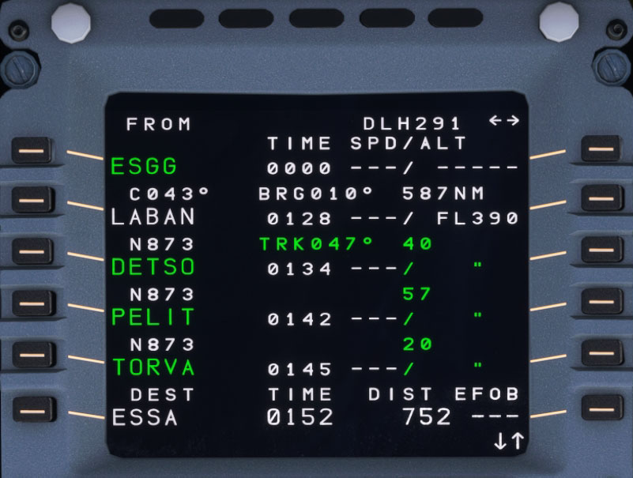

# F-PLN: Flight Plan Page

The MCDU F-PLN page is in fact a series of page for the management of the aircraft's flight plan.

The pilot can make all revisions to the lateral and vertical flight plans from these pages. He presses the left key to revise the lateral flight plan, and the right key to revise the vertical flight plan.

## Flight Plan A Page

Page A displays time, speed, and altitude predictions for each waypoint of the active flight plan.

- TITLE FLIGHT NUMBER
    - Flight number is blank, if no flight number has been entered.
    - This line may display: TMPY in yellow if a temporary flight plan exists;
    - OFST in white, if a lateral offset is flown; or, OFST in yellow, if a lateral offset revision is pending.

- Line 1 to Line 5 WPT, UTC, SPD, ALT
    - These lines display consecutive waypoints along with associated predictions of time, speed or Mach and altitude for each.
    - TIME is displayed before takeoff, and UTC after takeoff. After the pilot enters an estimated takeoff time (ETT), UTC is displayed.
    - The time and flight level display at the FROM waypoint (first line of the flight plan) are values that the system memorized at waypoint sequencing.
