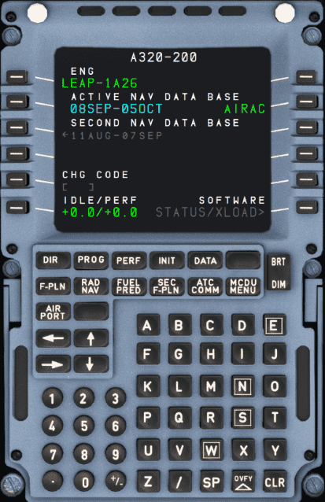

# Multipurpose Control and Display Unit

<link rel="stylesheet" href="/stylesheets/reported-issues.css">
<link rel="stylesheet" href="/stylesheets/admonitions.css">

## CHapters

!!! block ""

    {loading=lazy width=50% align=left}

    | Page                             | 
    |----------------------------------|
    | [MCDU Overview](#)               | 
    | [MCDU Interface](interface.md)   | 
    | -------------------------------- |   
    | [DIR](dir.md)                    | 
    | [PROG](prog.md)                  | 
    | [PERF](perf.md)                  | 
    | [INIT](init.md)                  | 
    | [DATA](data.md)                  | 
    | [F-PLN](f-pln.md)                | 
    | [RAD NAV](rad-nav.md)            | 
    | [FUEL PRED](fuel-pred.md)        | 
    | [SEC F-PLN ](sec-f-plan.md)      | 
    | [ATC COMM](atc-comm.md)          | 
    | [MCDU MENU](mcdu-menu.md)        | 
    | -------------------------------- | 
    | [MCDU Messages](messages.md)     | 

## Description

The MCDU is the main interface for them flight crew to the FMGC (Flight Management Guidance Computer). There are two 
independent MCDUs installed in the A320.

!!! warning "Currently the A32NX only has one mirrored MCDU. This will be split into two in the future."

Typical usage is the definition and selection of a flight plan for lateral and vertical navigation during various 
flight phases.

After entry or selection of the flight plan and other required performance data into the MCDU, the FMGS generates 
the climb and descent profiles for departure and arrival, provides automatic airplane guidance, and computes current 
and predicted progress along the flight plan.

This section describes the MCDU in detail, covering each page and also the standard process for setting up a flight.

See the [MCDU Setup Procedure](../../beginner-guide/preparing-mcdu.md) in our [Beginner Guide](../../beginner-guide/overview.md) .

