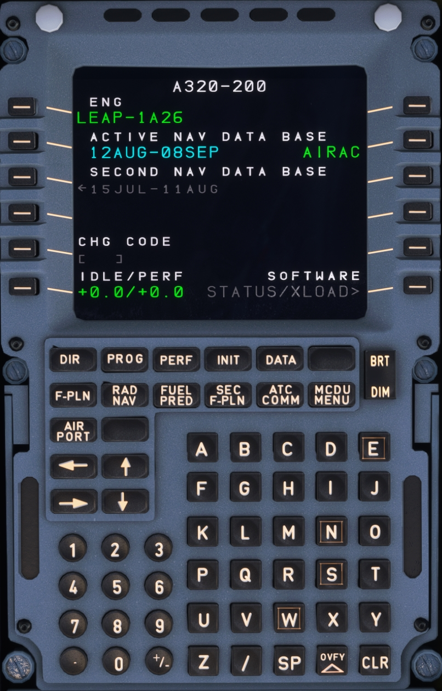

# Multipurpose Control and Display Unit

{width=50%}

## Description

The MCDU is the main interface for the flight crew to the FMGC (Flight Management Guidance Computer). There are two MCDUs installed in the A320.

Typical usage is the definition and selection of a flight plan for lateral and vertical navigation during various flight phases.

After entry or selection of the flight plan and other required performance data into the MCDU, the FMGS generates the climb and descent profiles for departure and arrival, provides automatic airplane guidance, and computes current and predicted progress along the flight plan.

This section describes the MCDU in detail, covering each page and also the standard process for setting up a flight.

## Chapters

- [MCDU Interface](interface.md)
- [MCDU Setup Procedure]()
- Pages:
    - [DIR TO]()
    - [PROG]()
    - [PERF]()
    - [INIT]()
    - [DATA]()
    - [F-PLN]()
    - [RAD NAV]()
    - [FUEL PRED]()
    - [SEC F-PLN]()
    - [ATC COMM]()
    - [MCDU MENU]()
    - [AIR PORT]()
