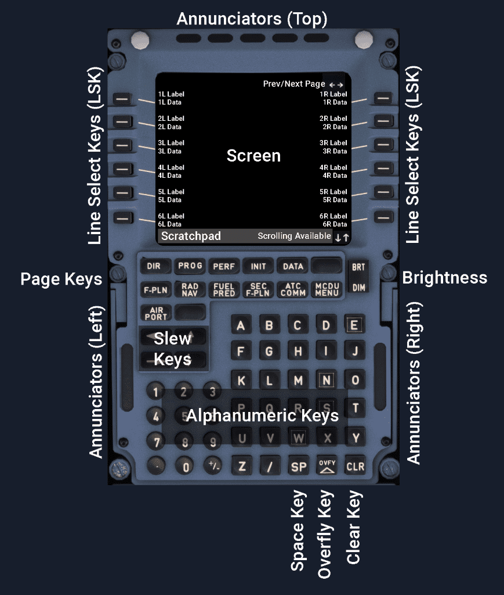

# MCDU Interface

## General

The Multipurpose Control and Display Unit (MCDU) has 14 lines and 24 characters in each line.

Each page has a title line.

## Scratchpad

The Scratchpad is mainly used for the crew to enter temporary data before moving the entered data to the appropriate data field. After entering data, the crew selects the LSK next to the data field where this data shall be applied to.

The Scratchpad is also displaying specific messages, as described in the next chapter.

### Messages on Scratchpad

Messages displayed on the Scratchpad are colored by importance as either amber or white.

Amber messages are:

- Navigation messages
- Data entry messages
- EFIS repeat messages

Amber messages are categorized into two types:

- Type 1:
    - Messages are a direct result of a flight crew action. Type 1 messages are displayed immediately in the scratchpad ahead of other messages.
- Type 2:
    - Messages inform the flight crew of a given situation or request a specific action. Stored in “last in”, “first out” message queue that holds a maximum of 5 messages. Type 2 messages are displayed in the scratchpad only if there are no Type 1 messages or other data, and will remain until all the messages have been viewed and cleared with the CLR key.

White messages are advisory only and do not require any action from the flight crew. These messages can be cleared with the CLR key.

## Keys

### Line Select Keys and Data Fields

The MCDU has two columns of data (left and right) with 6 rows of title and data fields on each side. The data is either a stored value, a computed value, or a value entered by the crew.

The LSK next to the line is used to move data from the scratchpad to that corresponding line, or to call specific function pages indicated by a prompt or a flight plan element next to the LSK.

### Page Keys

These keys call up certain pages used by the flight crew for flight management purposes. They are described in detail in the other sections of this MCDU documentation.

### Slew Keys

&uarr; &darr;: Used to scroll a page up or down. Arrows on the bottom right indicate that the page can be scrolled.

&larr; &rarr;: Used to move to the next page of a multipage element. The arrow in the top-right corner indicates there is another page available.

### Brightness and Dimming Keys

Control the light intensity of the entire MCDU. MCDU power up is performed with the BRT key and MCDU shut down is performed with the DIM key.

### Alphanumeric Keys

Used to insert data into the Scratchpad.

### Space Key

Inserts an empty character (space) into the Scratchpad.

### Clear Key

The CLR key is used to:

- remove the last character in Scratchpad.
- clear the whole Scratchpad (hold the CLR key).
- clearing of data fields by first pressing CLR on an empty Scratchpad, so that CLR appears in the Scratchpad and then pressing the LSK next to the data field which needs to be erased.

### Overfly Key

Allows the aircraft to overfly a selected waypoint (Flyover Waypoint).

See [Waypoint on SKYbrary](https://skybrary.aero/articles/waypoint){target=new} for more information.

### Airport Key

Calls up the flight plan page that contains the next airport along the current flight plan. Successive pushes on the key show the destination airport, alternate airport (if in the flight plan), the origin airport (before takeoff), and the destination airport again.

## Annunciators

!!! info ""
    Currently not available or INOP in the FBW A32NX for Microsoft Flight Simulator.

### Top

- FM 1 and FM 2 (amber):
    - The onside FM is failed
- IND (amber):
    - The onside FM detects an independent mode of operation while both FM are healthy.
- RDY (green):
    - MCDU has passed its power up test after it was turned off using its DIM key.

### Left

- FAIL (amber):
    - Indicates that the Multipurpose Control and Display Unit (MCDU) has failed.
- FM (white):
    - Comes on while the flight crew is using the MCDU to display peripherals. This light tells the flight crew that the FMGC has an important message to deliver. The flight crew accesses the message by pressing the MCDU MENU key and the line select key adjacent to the FMGC prompt.

### Right

- MCDU MENU (white):
    - Indicates that the flight crew should call up a peripheral linked to the MCDU (such as ACARS, ATSU or CFDS).

## Characters

The MCDU uses small and large fonts according to the following rules:

- Title and the Scratchpad use large font
- Data fields usually use large font
- Label lines use small font
- Flight crew entries and modifiable data use large font
- Defaulted, computed and non-modifiable data use small font.

## Colors

- 
White

    - Titles
    - Comments
    - <, >
    - &uarr;, &darr;, &larr;, &rarr;
    - Dashes
    - Advisory Messages

- 
Blue

    - Modifiable data
    - Selectable data
    - Brackets

- 
Green

    - Non-modifiable data
    - Active data

- 
Amber

    - Mandatory data (boxes)
    - Flight crew action required
    - Important messages
    - Missed constraint

- 
Magenta

    - Constraints
    - Max altitude

^^Colors used in Flight Plan:^^

- Primary Flight Plan: green waypoints, white legs 
- Temporary F-PLN: yellow waypoints, white legs
- Secondary F-PLN: white waypoints and legs
- Missed Approach (not active): blue waypoints, white legs
- Alternate F-PLN (not active): blue waypoints, white legs
- Offset:  green waypoints, white legs, "OFST" displayed in the title of the f-pln page
- Tuned Navaid: blue
- "TO" waypoint and Destination: white

!!! info ""
    Currently, only Primary F-PLN is available in the FBW A32NX for Microsoft Flight Simulator.
