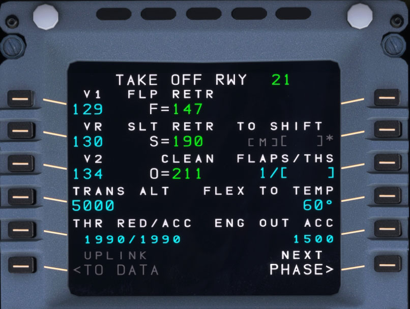
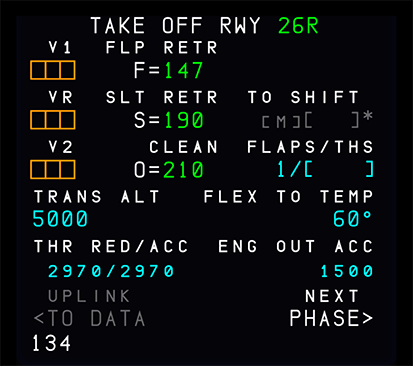
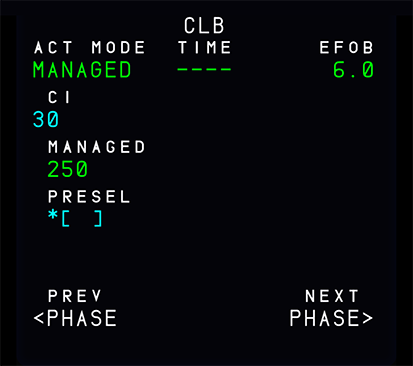
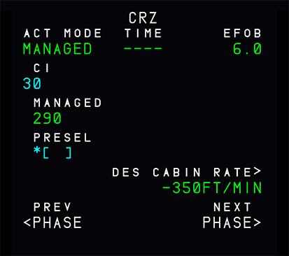
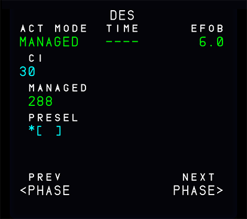
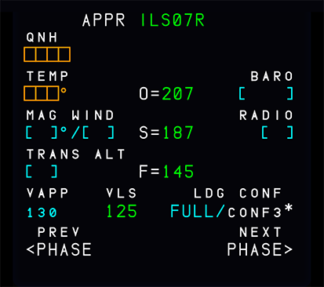
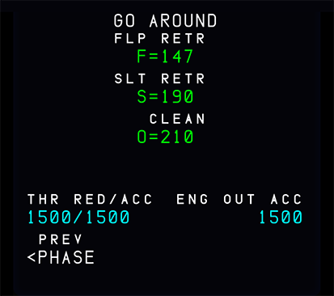

# PERF: Performance Page

{loading=lazy}

## Description

The Airbus A320neo divides each flight into these flight phases:

PREFLIGHT, TAKEOFF, CLIMB, CRUISE, DESCENT, APPROACH, GO-AROUND, DONE.

Except for the preflight and done phases, each flight phase has a performance page. These display performance data, speeds related to the various phases, and predictions. When pressing the PERF key the page for the currently active phase brought up. Pages for already completed flight phases are not available any more. In the preflight and done phases, pressing the PERF key brings up the takeoff performance page.

Prompts on each PERF page:

- PREV PHASE (6L):
    - To switch to the page for the previous phase. Not available on the takeoff performance page or already completed phases.
- ACTIVATE APPR PHASE (&L):
    - Replaces the PREV PHASE prompt when the current phase is active.
    - To activate the APPR phase (needs a second push for confirmation).
    !!! note ""
        Note: If the pilot activates the approach phase inadvertently, it can reselect the cruise flight level into the progress page to reactivate the cruise phase.
- NEXT PHASE (&R):
    - To review the performance page for the next phase.

## TAKE OFF

{loading=lazy}

- TITLE TAKE OFF:
    - Green when active, white when inactive.

    !!! note ""
         If the takeoff shift or the runway is changed after V1, V2 or VR insertion, but the origin airport remains the same, the MCDU message “CHECK TAKEOFF DATA” is displayed, but all takeoff parameters are retained.

- V1 (1L) VR (2L) V2 (3L):
    - The boxes remain amber, as long as the pilot does not make entries in them. The pilot can modify any entry, as long as the takeoff phase is not active.

    !!! note ""
        If the pilot does not enter V2, the SRS mode will not be available at takeoff.

    !!! tip
        In the FlyByWire A32NX you can click on the LSK next to V1, VR, V2, to let the aircraft calculate the correct V-Speed for you. This calculated value is placed in the Scratchpad and can be move to the V-Speed field with a second click.
        In real life this value us usually calculated by a specific airline application on the EFB.

- TRANS ALT (4L)
    - This field displays the navigation database default transition altitude (if defined) once the origin airport is entered. The pilot can modify it.

    !!! attention ""
        Currently no default database entry if filled in the FBW A32NX for Microsoft Flight Simulator.

- THR RED (5L)
    - The thrust reduction altitude is the altitude at which the pilot should reduce the thrust from TOGA/FLX to MAX CLIMB (CL detent).
    ‐ The thrust reduction altitude defaults to 1.500 ft above the runway elevation, or to the altitude set by the airline.
    !!! note ""
        Can be set in the flyPad settings.
    - The pilot can modify this altitude: The minimum is 400 ft above the runway elevation.

- ACC (5L)
    - Passing acceleration altitude triggers the climb phase.
    - The target speed changes to the initial climb speed
    - The default value is 1.500 ft above runway elevation
    - The flight crew can modify the value. The minimum value is 400 ft above runway elevation, though it is always higher than, or equal to, THR RED.
    !!! note ""
        - A clearing action reverts both values to the defaulted ones.
        - When the flight crew selects an altitude on the FCU that is below THR RED, it brings THR RED and ACC down to this altitude. (The 400 ft minimum still applies).

- UPLINK TO DATA (6L)
    - This key calls up the UPLINK TO DATA REQ page. It is only displayed in the preflight and done phases.

    !!! attention ""
        Currently not available or INOP in the FBW A32NX for Microsoft Flight Simulator.

- TO SHIFT (2R)
    - Distance in meters or feet between the beginning of the runway and the aircraft's takeoff position. The flight crew should insert this value when taking off from an intersection to ensure a correct update of the FM position. The takeoff shift value must be positive, and cannot be greater than the runway length.

    !!! attention ""
        Currently not available or INOP in the FBW A32NX for Microsoft Flight Simulator.

- FLAPS/THS (3R)
    - Positions of the flaps and the trimmable horizontal stabilizer (THS) at takeoff to be entered by the crew.
    - Can be edited until takeoff, by entering “UP X.X” or “X.X UP”, or “DN X.X” or “X.X DN” for the THS.

- FLX TO TEMP (4R)
    - Flight crew inserts the FLX TO temperature in Celsius for FLX takeoff setting purposes. It can only be entered during preflight. This value will be sent to the FADEC and displayed on the upper ECAM display.

- ENG OUT ACC (5R)
    - Engine-out acceleration altitude, as defined in the database, or manually entered by the flight crew. This is for display only, as a reminder. It cannot be cleared. The above ACC altitude rules of (5L) apply to this field.

## CLIMB

{loading=lazy}

- TITLE CLB:
    - Green when active, white when inactive.

- ACT MODE (1L):
    - Displays the preselected or active speed mode: SELECTED or MANAGED. Can't be modified from this field.

- CI (2L):
    - Cost index, as initialized either on the INIT A page, defaulted from the database, or inserted in this field by the pilot.

- MANAGED (3L):
    - This field displays the FMGS computed ECON speed/Mach.
    - Before CLIMB phase is active, a star is displayed next to the MANAGED speed, if the preselected speed mode is SELECTED. Pressing the 3L key in this case preselects MANAGED speed, and 4L reverts to brackets.

    !!! attention ""
        Currently not available or INOP in the FBW A32NX for Microsoft Flight Simulator.

- PRESEL or SELECTED (4L):
    - Climb phase is not active:
        - As long as the climb phase is not active this field displays PRESEL. A preselected speed can be entered.
    - Climb phase is active:
        - Title becomes SELECTED.
        - Displays selected (or preselected) SPD or MACH target.
        - Cannot be modified directly in this field, but with the SPD/MACH selection knob on the FCU.
        - If the FCU SPD/MACH selection knob if pushed it reverts to managed speed and the system selects/re-selects ECON SPD/MACH and (4L) is blank.

<!-- these are not available in the A32NX but documented in the FCOM

- Blank or EXPEDITE (5L):
    - Blank as long as the aircraft is in preflight.
    - Displays this legend when the takeoff or climb phase is active.
    - The flight crew cannot engage EXPEDITE from this field. It indicates the time and distance required to reach the altitude displayed in the 2R field, in case of climb at green dot.

    !!! attention ""
        Currently not available or INOP in the FBW A32NX for Microsoft Flight Simulator.

- EO CLR (1R):
    - The system displays the EO CLR prompt in case of engine out in climb.

    !!! attention ""
        Currently not available or INOP in the FBW A32NX for Microsoft Flight Simulator.

- PRED TO... (2R):
    - This field displays the target altitude for the predictions shown in 3R, 4R, or 5L. It defaults to FCU altitude, but the pilot can modify it to any altitude below   CRZ FL.

    !!! attention ""
        Currently not available or INOP in the FBW A32NX for Microsoft Flight Simulator.

- (3R) (4R) (5R):
    - These fields show time and distance predictions for the target altitude selected in (2R), computed for the current vertical mode and speed mode (MANAGED, SELECTED). These fields are displayed only while the takeoff, or climb phase is active.

    !!! attention ""
        Currently not available or INOP in the FBW A32NX for Microsoft Flight Simulator.
-->

## CRUISE

{loading=lazy}

- TITLE CRZ:
    - Green when active, white when inactive.

- ACT MODE (1L):
    - Displays the preselected or active speed mode: SELECTED or MANAGED. Can't be modified from this field.

- CI (2L):
    - Cost index, as initialized either on the INIT A page, defaulted from the database, or inserted in this field by the pilot.

- MANAGED (3L):
    - This field displays the FMGS computed ECON speed/Mach.
    - Before CRUISE phase is active, a star is displayed next to the MANAGED speed, if the preselected speed mode is SELECTED. Pressing the 3L key in this case preselects MANAGED speed, and 4L reverts to brackets.

    !!! attention ""
        Currently not available or INOP in the FBW A32NX for Microsoft Flight Simulator.

- PRESEL (4L)
    - Cruise phase not active:
        - A preselected speed or Mach number can be entered.
    - Cruise phase active:
        - This field is blank.
        !!! note ""
            If a value in the PRESEL field is entered during the cruise altitude capture (ALT CRZ*), the selected speed in the FCU may revert to M 0.01.

- TIME/UTC DES EFOB
    - Before takeoff: Displays the flight time to destination and the predicted remaining fuel on board. If an estimated takeoff time has been entered, the field displays automatically the predicted arrival time (UTC) at destination.
    - After takeoff: Displays the predicted arrival time at destination (UTC) and the remaining fuel on board.
    - EO CLR is displayed when an engine out is detected.

<!--  these are not available in the A32NX but documented in the FCOM

- STEP TO FL XX, DRIFT DOWN TO FLxxx, or TO T/D (2R):
    - The field, in combination with 3R, displays the predictions for the step point and the step altitude, the drift down altitude, or the Top of Descent.

- TIME/UTC and DIST (3R):
    - This field displays the time and distance to go to the various points identified (2R).

- DES CABIN RATE (4R)
    - This field displays MAX (computed DES cabin rate, maximum descent cabin rate). The pilot may modify the value: the FM recomputes then the top of descent in order to match this value. If the FM cannot match the pilot entry, the FM computed value overwrites the pilot entry. A clear action reverts to the default value (-350 ft/min). DES CAB RATE being a negative value, 'minus” is not a necessary entry.

- STEP ALTS (5R)
    - This key calls up the STEP ALTS page .
-->

## DESCENT

{loading=lazy}

- TITLE DES:
    - Green when active, white when inactive.

- ACT MODE (1L):
    - Displays the preselected or active speed mode: SELECTED or MANAGED. Can't be modified from this field.

- CI (2L):
    - Cost index, as initialized either on the INIT A page, defaulted from the database, or inserted in this field by the pilot.

- MANAGED (3L):
    - If the descent phase is not active:
        Before the flight crew makes any entry. This field displays MANAGED in white, with the associated ECON descent Mach or speed in blue. The crew may overwrite the ECON descent Mach or speed by entering a Mach number or a speed in this field. The system uses the pilot entry to compute the descent profile. The descent may be flown in managed using this new pilot entry.
        - The entry is modifiable. It can be cleared to revert to ECON speed/Mach.
    - If the descent phase is active:
        - The flight crew cannot make an entry in this field.
        - The field displays the ECON speed/Mach or the speed/Mach value previously entered by the pilot.

- Blank or SELECTED (4L):
    - If the descent phase is not active, or the descent phase is active but the active speed mode is MANAGED:
        - This field is blank.
    - If the descent phase is active and the active speed mode is SELECTED:
        - The field displays the speed or Mach target manually selected by the pilot.
        “SELECTED” is displayed in the (1L) field.
        - To modify the field value, the pilot will use the SPD/MACH selector knob of the FCU. (4L) field and FCU window will display the same value.
        - Pushing in the FCU speed selector knob activates the managed SPD/MACH target displayed in the (3L) field.

- Blank or EXPEDITE (5L):
    - If the descent phase is not active this field is blank.
    - Displays this legend if the descent phase is active.
    - It indicates the time and distance required to reach the altitude displayed in the 2R field at MMO/VMO speed. The pilot cannot select the EXPEDITE mode through this field.

- TIME/UTC DES EFOB
    - Before takeoff: Displays the flight time to destination and the predicted remaining fuel on board. If an estimated takeoff time has been entered, the field displays automatically the predicted arrival time (UTC) at destination.
    - After takeoff: Displays the predicted arrival time at destination (UTC) and the remaining fuel on board.
    - EO CLR is displayed when an engine out is detected.

<!--
[2R] PRED TO...
This field displays the target altitude for the predictions in [3R] [4R], or [5R].
The display defaults to the altitude selected on the FCU. The flight crew can modify it to any altitude lower than present altitude.

[3R] [4R] [5R]
These fields display time and distance predictions down to the target altitude selected in [2R], computed for the current vertical mode (DES or OP DES) and the indicated speed mode (MANAGED, SELECTED).
-->

## APPROACH

{loading=lazy}

- TITLE APPR:
    - Green when active, white when inactive.

- QNH (1L)
    - This field displays brackets, when the aircraft is more than 180 NM from the destination. Inside 180 NM, a mandatory amber box appears. The flight crew must enter the QNH in hPa or in inches of mercury.

    - For hPa, enter three or four digits
    - For inches of mercury:
        - Enter two digits, or
        - Enter two digits followed by a decimal point and two additional digits.

    - The system interprets:
        - 1003 as 1003 hPa;
        - 29 as 29.00 in.
        - 29.92 as 29.92 in.

    !!! note ""
        An erroneous entry of an OAT in QNH field, for example 22 °C, or a higher value, is accepted by the system.

    - The flight crew can modify this entry at any time.
    - The Cabin Pressure Controller [CPC) uses the QNH to compute the cabin repressurization segment. Therefore, an erroneous QNH entry may result in a cabin pressurization that is not appropriate.

- TEMP (2L):
     - This field displays the temperature at destination. The field displays brackets until the pilot enters the temperature. The pilot can modify this figure.
     - The system uses this temperature to refine its computation of the descent profile [ISA model).

- MAG WIND (3L)
    - The flight crew enters the magnetic wind in knots at the destination in this field. The system transmits any entry made in this field to the vertical revision and flight plan B pages [which display wind direction as true, not magnetic).

- TRANS ALT (4L)
    - This field displays the transition altitude taken from the data base [small font) or entered by the flight crew [large font).
    - The flight crew can modify it at any time.

- VAPP (5L)
    - The FMGC computes this approach speed, using the formula:
        - VAPP = VLS + 1/3 of the headwind components [limited to VLS + 5 as a minimum and VLS + 15 as a maximum).
        - The flight crew can modify VAPP. A clear action reverts VAPP to the computed value.

        !!! note ""
            VLS = 1.23 VS1G of the selected landing configuration [full or 3).

- FINAL (1R)
    - This field displays the approach specified in the flight plan.
    - The flight crew cannot modify it through this field.

- MDA/MDH or BARO (2R):
    - This field displays:
      - The Minimum Descent Altitude with associated brackets, or
      - The Minimum Descent Height with associated brackets, if:
          - The QFE pin program is activated, or
          - The FCU setting is QFE, on aircraft equipped with the BARO 
        option.
      - The flight crew inserts the value, which it can modify at any time. If the flight crew makes an entry in (3R) or changes the approach, it clears this figure.

- DH or RADIO (3R):
    - If the flight plan includes an ILS approach, this field displays “DH" or "RADIO" and empty brackets. The flight crew inserts the decision height. The system will accept an entry of “NO", "NODH" or "NO DH". If the flight crew inserts an MDA or an MDH [or a BARO  value) in FIELD (2R), this erases the decision height, and this field reverts to brackets. The DH or RADIO range is 0 to 700 ft.

- LDG CONF CONF3 (4R):
    - The flight crew can select configuration 3 by pressing the 4R key.
    - This moves the * down to the (5R) field, which is displaying “FULL"?.

- FULL (5R):
    - The flight crew can use this key to select configuration FULL when necessary configuration FULL is the default landing configuration.

## GO-AROUND

{loading=lazy}
