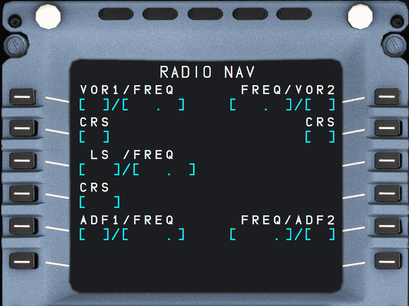

# RAD NAV: Radio Navigation Page

## Description

This page enables the pilot to select or verify the radio NAVAIDs, tuned for display purposes only.
These NAVAIDs include: VOR, VOR/DME, TAC, VORTAC, ILS, and ADF.

If either RMP is set on NAV, this page is blank on both MCDUs.

!!! info ""
    Currently, RMP based NAV is not available or INOP in the FBW A32NX for Microsoft Flight Simulator.

## Usage

- VOR1/FREQ & FREQ/VOR2 (1L, 1R)
    - This line displays the identifiers and frequencies of VORs 1 and 2, whether they are automatically or manually tuned. 
    - To manually tune a VOR, the pilot inserts the IDENT or frequency. If the IDENT is not in the database, the new NAVAID page comes up. 
    - A “clear” action reverts the selection to the autotuned NAVAID. 
     
- CRS (2L, 2R) 
    - This line displays courses for the NAVAIDs in Line 1. 
    - The pilot can manually enter the courses from these fields.

- ILS/FREQ (3L)
    - This field displays the IDENT and frequency of an ILS. 
    - It is autotuned if the ILS is associated with the departure runway, or if the flight plan shows an ILS approach selected for the destination and whenever the aircraft is at climb phase or greater and within 250 NM of destination. 
    - The ILS may also be entered manually. 
    - When the manually entered ILS differs from the ILS that would be autotuned, "RWY-ILS MISMATCH" appears.

- CRS (4L)
    - This field displays the course associated with the ILS in Line 3. 
    - It comes up automatically if an ILS is autotuned, or if an ILS has been manually tuned via its IDENT. 
      Otherwise, the course must be entered manually.
    - The course may be backbeam (Bxxx) or frontbeam (Fxxx).
  
        !!! info ""
            Currently, the backbeam format is not available or INOP in the FBW A32NX for Microsoft Flight Simulator.

- ADF1/FREQ & FREQ/ADF2 (5L, 5R)
    - This line displays the identifiers and frequencies of ADFs 1 and 2. 
    - The pilot can use the IDENT or the frequency to manually tune the ADF.

- ADF1/BFO & BFO/ADF2 (6L, 6R)
    - When an ADF is selected, these fields display an ADF/BFO prompt. 
    - The flight crew presses this key once to erase the arrow and revert ADF to BFO (Beat Frequency Oscillator) mode.
    - A clear action recalls the arrow, and cancels BFO.

    !!! info ""
        Currently not available or INOP in the FBW A32NX for Microsoft Flight Simulator.

!!! note 
    - The autotune function only works for NAVAIDs stored in the database.
    - When tuning manually, the Operator should use the IDENT, rather than the frequency, unless the NAVAID is not in the database.
    - Manually tuned frequencies are displayed in large font.