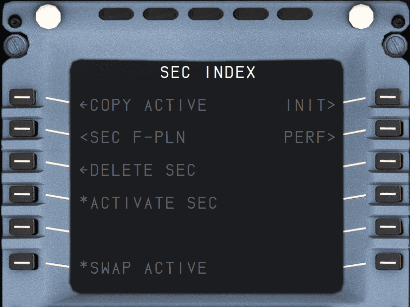

# SEC F-PLN: Secondary Flight Plan Page

!!! info ""
    Currently, not implemented yet in the FBW A32NX for Microsoft Flight Simulator.

The SEC F-PLN key on the MCDU console allows the flight crew to call up the secondary index page and the secondary flight plan page. The secondary flight plan is generally used to prepare a diversion, an alternate routing, for predictable runway changes at takeoff or landing, or for a next flight.
There are two types of secondary index page, depending on whether a secondary flight plan has already been defined.

