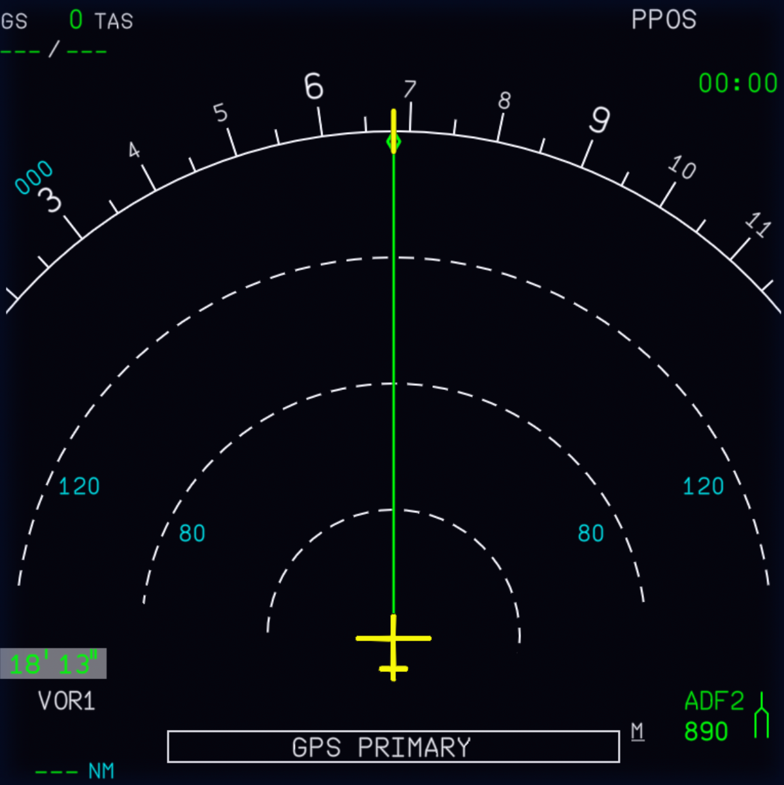

<link rel="stylesheet" href="../../../../stylesheets/nd-interactive.css">
<link rel="stylesheet" href="../../../stylesheets/toc-tables.css">

# Navigation Display (ND)

## Interactive ND

    
    <a href="/pilots-corner/a32nx-briefing/nd/tpl/">               
Top Left Corner
</a>
    <a href="/pilots-corner/a32nx-briefing/nd/tpr/">               
Top Right Corner
</a>
    <a href="/pilots-corner/a32nx-briefing/nd/crs/">
Course
</a>
    <a href="/pilots-corner/a32nx-briefing/nd/sel-heading/">         
Selected Heading
</a>
    <a href="/pilots-corner/a32nx-briefing/nd/other-msg/">       
Other Messages
</a>
    <a href="/pilots-corner/a32nx-briefing/nd/chrono/">     
Chronometer
</a>
    <a href="/pilots-corner/a32nx-briefing/nd/nav-receivers/">     
Navigation Receivers
</a>
    <a href="/pilots-corner/a32nx-briefing/nd/nav-receivers/">     
Navigation Receivers
</a>

## Description

The Navigation Display (ND) is the main navigation instrument for the pilots. It provides information for: 

- Lateral position in space
- Track/heading
- GS/TAS/Wind
- To waypoint information with ETA, track miles to go
- Flight plan
- Tuned navaids
- Constraints
- Airports
- Navaids
- Waypoints
- Weather and terrain info
- Other messages such as GPS PRIMARY

---

## Chapters

|Quick Links|
|:----|
|[Navigation Receivers](nav-receivers.md)|
