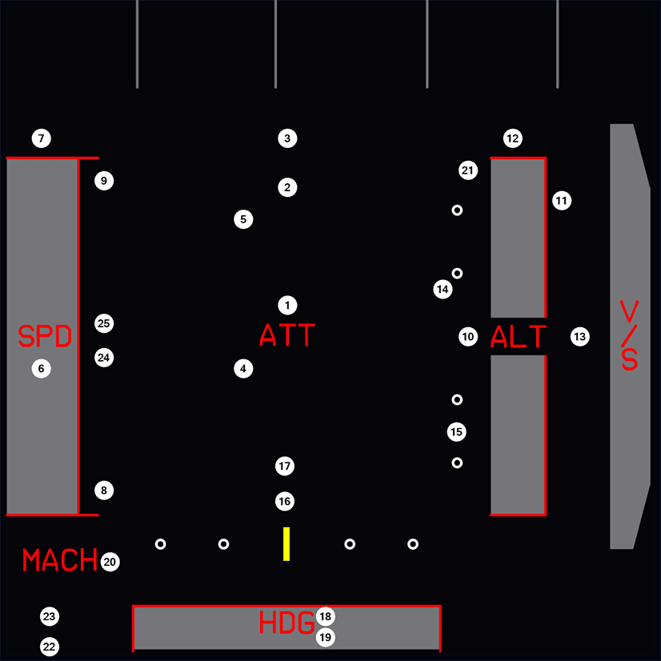

# Flags and Messages

    
    <a href="/pilots-corner/a32nx-briefing/pfd/fma/">               
Flight Mode Annunciators
</a>
    <a href="/pilots-corner/a32nx-briefing/pfd/altitude-indicator/">
Altitude Indicator
</a>
    <a href="/pilots-corner/a32nx-briefing/pfd/vertical-speed/">    
Vertical Speed Indicator
</a>
    <a href="/pilots-corner/a32nx-briefing/pfd/baro-ref/">          
Barometric Reference
</a>
    <a href="/pilots-corner/a32nx-briefing/pfd/artificial-horizon/">
Attitude and Guidance
</a>
    <a href="/pilots-corner/a32nx-briefing/pfd/speedtape/">         
Actual Airspeed Reference Line and Scale
</a>
    <a href="/pilots-corner/a32nx-briefing/pfd/heading-ref/">       
Heading Reference Line and Scale
</a>
    <a href="/pilots-corner/a32nx-briefing/pfd/ils-indicator/">     
Loc and G/S Deviation Scale
</a>
    <a href="/pilots-corner/a32nx-briefing/pfd/ils-indicator/">     
Loc and G/S Deviation Scale
</a>
    <a href="/pilots-corner/a32nx-briefing/pfd/ils-indicator/">     
ILS Information
</a>

## Description

These are flags and messages displayed on the PFD. The numbers correspond to their location on the PFD in the photo below.

{loading=lazy}

=== "1"
    ATT FLAG

    This is displayed in red. If the PFD loses all attitude data, the entire artificial horizon is cleared to display the ATT flag.

=== "2"
    CHECK ATT

    CHECK ATT will be displayed in amber when there is a disagreement of at least 5 degrees in the attitude information displayed by the two PFDs. This will be shown on both PFDs and a caution will be shown on the ECAM.

=== "3"
    SI Flag

    This is displayed in red. If sideslip information is lost, the index disappears and the SI flag is displayed.

=== "4"
    FPV Flag

    This is displayed in red. It appears in the TRK FPA mode, when the drift angle or flight path angle is not valid.

=== "5"
    FD Flag

    This is displayed in red. It appears if both of the FMGCs fail, or if both flight directors are disengaged and the FD pushbutton is on and the attitude is valid.

=== "6"
    SPD Flag

    This is displayed in red. If the speed information fails, this flag will replace the airspeed indicator.

=== "7"
    SPD SEL Flag

    This is displayed in red. If the selected speed information fails, this flag will appear.

=== "8"
    SPD LIM Flag

    This is displayed in red. It appears when both FACs are inoperative, or in case of dual flap/slat channel failure. In this case, the following information is lost:
    
    - VLS
    - S
    - F
    - Green Dot
    - Vtrend
    - Vmax
    - VFE next
    - VSW

=== "9"
    V1 INOP Flag

    This is displayed in red. When the V1 signal is not valid, this flag will replace the digital value.

=== "10"
    ALT Flag

    This is displayed in red. If the altitude information fails, this flag will replace the altitude scale.

=== "11"
    CHECK ALT Flag

    This is displayed in amber. This appears both as a flag on the PFD and on the ECAM as a caution if the difference between the two PFD altitude indicators is greater than 250 feet when the QNH Barometric Reference is selected, or 500 feet when STD is selected.
    
    This flag disappears when the pilot's and first officer's barometer or references are different.

=== "12"
    ALT SEL Flag

    This is displayed in red. It appears if the selected altitude information fails.

=== "13"
    V/S Flag

    This is displayed in red. It appears if the vertical speed information fails and replaces the vertical speed scale.

=== "14"
    LOC and G/S Flags

    This is displayed in red and appears if the localiser or glideslope receiver fails.

=== "15"
    V/DEV Flag

    This is displayed in red. It appears if the vertical deviation information fails, and the LS pushbutton has not been pressed. This flag replaces the V/DEV scale.
    
    !!! attention ""
        Currently not available for the FBW A32NX for Microsoft Flight Simulator.

=== "16"
    RA Flag

    This is displayed in red. If both radio altimeters fail, this flag appears instead of the radio height indication.

=== "17"
    DH Flag

    This is displayed in amber and is shown when the aircraft has reached the decision height.

=== "18"
    HDG Flag

    This is displayed in red and is shown if the heading information has failed. It replaces the heading scale.

=== "19"
    CHECK HDG Flag

    This is displayed in amber and is also shown on the ECAM as a caution. It is shown if there is a 5 degree difference in heading between the Captain's PFD and the First Officer's PFD

=== "20"
    MACH Flag

    This flag is displayed in red and appears if the mach data fails.

=== "21"
    V/DEV Flag (amber)

    !!! attention ""
        Currently not available for the FBW A32nx for Microsoft Flight Simulator.
    
    This is displayed in amber. It flashes on the top of the glide scale when the aircraft is in the approach phase and when either the final mode is armed/engaged or a non ILS approach has been selected, and the LS pushbutton has been selected.

=== "22"
    DME X Flag

    This is displayed in red. When the DME distance is not available, a DME 1 (on PFD 1) or a DME 2 (on PFD 2) flag replaces the DME distance indication.

=== "23"
    ILS X Flag

    If an ILS frequency is not available, or if the localiser or glideslope signals fail, an ILS 1 (on PFD 1) or an ILS 2 (on PFD 2) flag replaces the ILS frequency indication.

=== "24"
    WINDSHEAR

    This is displayed in red and is shown when the aircraft has encountered a windshear.
    
    This function is implemented into the FAC and is available when the slats/flaps are extended as follows:
    
    - At takeoff, from 5 seconds after liftoff up to 1300 feet radio altitude.
    - At landing, from 1300 feet radio altitude down to 50 feet radio altitude.
    
    It remains displayed at least 15 seconds after windshear detection and is associated with an aural windshear warning.
    
    !!! attention ""
        Currently not available for the FBW A32nx for Microsoft Flight Simulator.

=== "25"
    W/S AHEAD

    This is displayed in either amber or red depending on the alert level.

    This is shown when the predictive windshear function has detected a windshear in front of the aircraft.
    
    !!! attention ""
        Currently not available for the FBW A32nx for Microsoft Flight Simulator.

