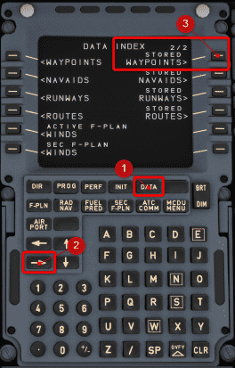

# Data Management

## Stored Waypoints

The MCDU allows the flight crew to enter and store custom waypoints.

There can be up to 99 waypoints stored. To see the stored waypoints, you need to select `DATA` on the MCDU and move to the second page with the lateral arrow key.

!!! block ""

    {loading=lazy align=left width=46%}

    {loading=lazy align=right width=46%}

These waypoints can be used in the flight plan (MCDU F-PLN page) in the same way as any other fix by entering the fix ident.

!!! info ""
    These stored waypoints are not persisted and not stored on your PC. This is similar to the configuration of most real-world aircraft, where the waypoints will also be erased after the flight (when in the [DONE](../../airliner/flight-phases.md#done-phase) phase).

The following chapters will explain how to create, use and delete these stored waypoints.

### How to Create a Stored Waypoint

There are three ways to create new custom waypoints:

1. Enter a new unique identifier into the scratchpad and insert it into the flight plan as if inserting a normal additional waypoint. This will bring up the `NEW WAYPOINT` page with the identifier already filled out.
2. Press the LSK 5R (5th on the right) of `NEW WAYPOINT` on the `STORED WAYPOINT` page
3. By directly entering the new waypoint in one of the three formats into the scratchpad on the F-PLN page and inserting it into the flight plan. In this case, the FMS will generate a default name (PBDnn, PBXnn, or LLnn, where nn is the storage number of the stored waypoint).

#### New Waypoint Page

{loading=lazy width=50%}

Enter a unique name for your waypoint into the scratchpad and press the LSK 1L left of the IDENT field.

Here you have then 3 methods of creating a new waypoint.

### Format: Latitude-Longitude (LL)

This creates a point at an exact latitude and longitude.

The format is:

&lt;latitude&gt;/&lt;longitude&gt;

- latitude is 4 digits with one decimal digit and N or S (for Northern or Southern hemisphere)
- longitude is 4 or 5 digits with one decimal digit and E or W (for Eastern or Western Hemisphere)

!!! tip "Example for LL"
    !!! block ""
        {loading=lazy align=left width=46%}

        {loading=lazy align=right width=46%}

!!! tip "Detailed Format Description"

    |      | Format                   | Range            | Units                        |
    |:-----|:-------------------------|:-----------------|:-----------------------------|
    | LAT  | DDMM.MB or BDDMM.M       |                  |                              |
    |      | DD is degrees            | DD: 0 - 90       | Degrees                      |
    |      | MM.M is minutes          | MM.M: 0.0 - 59.9 | Minutes and tenth of minutes |
    |      | B is direction           | B: N or S        |                              |
    |      | Leading 0 may be omitted |                  |                              |
    |      | Displayed as DDMM.MB     |                  |                              |
    |      |                          |                  |                              |
    | LONG | DDDMM.MB or BDDDMM.M     |                  |                              |
    |      | DDD is degrees           | B: E or W        |                              |
    |      | MM.M is minutes          | DDD: 0 - 180     | Degrees                      |
    |      | B is direction           | MM.M: 0.0 - 59.9 | Minutes and tenth of minutes |
    |      | Leading 0 may be omitted |                  |                              |
    |      | Displayed as DDDMM.MB    |                  |                              |

### Format: Place-Bearing-Distance (PBD)

This creates a point at a specified bearing and distance from another fix.

The format is:

&lt;ident1&gt;/&lt;bearing&gt;/&lt;distance&gt;

!!! tip "Example for PBD"
    !!! block ""
        {loading=lazy align=left width=46%}

        {loading=lazy align=right width=46%}

### Format: Place-Bearing-Place-Bearing (PBX)

This creates a point at the intersection of a line on a bearing from one fix, and a similar line on a bearing from another fix.

The format is:

&lt;ident1&gt;-&lt;bearing&gt;/&lt;ident2&gt;-&lt;bearing&gt;

!!! tip "Example for PBX"
    !!! block ""
        {loading=lazy align=left width=46%}

        {loading=lazy align=right width=46%}

### How to Use a Stored Waypoint

Stored waypoints can be added to the flight plan as any other navigation fix. Just enter the ident and press the LSK left of the place where you want to insert the waypoint.

### How to Delete Stored Waypoints

You can delete a single or all stored waypoints at any time. If you try to delete any waypoints used within the FMS, the waypoint will be retained and a scratchpad message `F-PLN ELEMENT RETAINED` appears.

### Delete a Single Stored Waypoint

Single stored waypoints can be deleted from the list of stored waypoints by calling up the stored waypoint's page and using CLR on the identifier to delete it.

{loading=lazy width=50%}

### Delete All Stored Waypoints

To delete all stored waypoints, use the `DELETE ALL` option from any stored waypoint page.

{loading=lazy width=50%}

Alternatively, you can use the `MCDU DATA A/C STATUS` page to delete all stored waypoints.

{loading=lazy width=50%}

### 320 Sim Pilot Video

