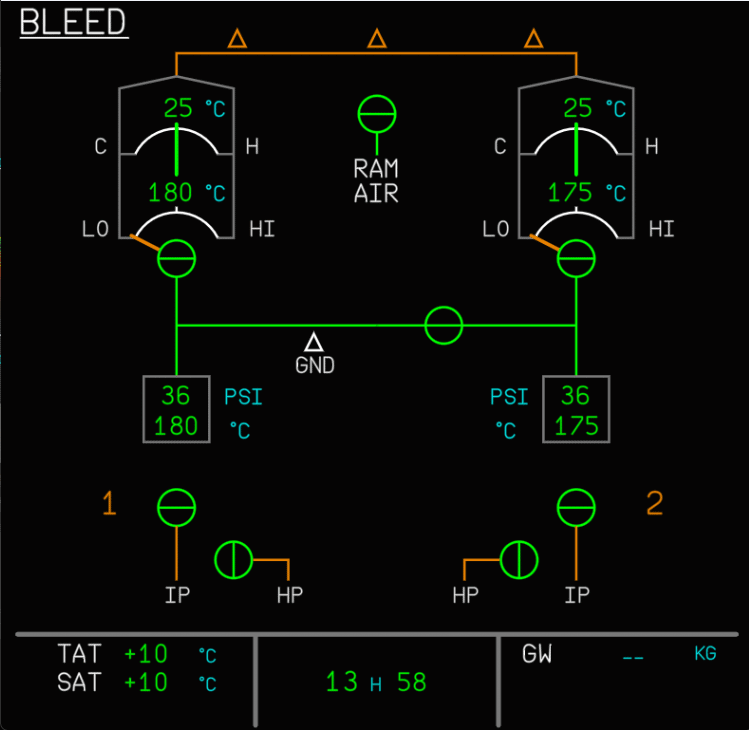

# ASU Engine Start

## Overview

When an aircraft has an inoperative APU, there is no supply of high pressure air available on board the aircraft to spin the turbine to allow for engine start. The solution to this is to use an external source of this air, supplied by a unit known as an Air Start Unit (ASU). These units are mobile towed units, with usually an old APU or even very old jet engines from scrapped aircraft housed inside.

With this air supply, an engine is started on stand before pushback while external power is still available to it. After the start, the ASU and external power is removed to allow for pushback and then a crossbleed start for the other engine.

[Crossbleed Engine Start Guide](crossbleed-start.md){.md-button}

!!! warning "Please Note"
    Sounds and physical ASU model are not yet implemented.

## Procedure

Before the procedure is started, boarding and refuelling should be completed, with the aircraft closed up and ready for pushback.

Notify ATC and request an engine start on stand beforehand as some airports require operations vehicles to be monitoring the area to keep ground traffic away from the starting aircraft.

An external power source is required as the APU is not supplying any electrical power to the aircraft.

Normally engine 1 is started first but either engine can be started with this procedure, the example below will assume engine 1 is the ASU assisted engine.

### Initial State before ASU connection

- `PACK 1` - `OFF`
- `PACK 2` - `OFF`
- `APU BLEED` - `OFF`
- `ENGINE BLEED 1` - `OFF`
- `ENGINE BLEED 2` - `OFF`
- `X BLEED` - `OPEN`

{loading=lazy}

- `ASU CONNECTED` - `REQUEST`
    - This is done from the flyPad Ground page - example below.

{loading=lazy}

### Engine Start Clearance

Turn on the beacon light.
Select the BLEED page on the ECAM SD.
Check that BLEED PSI is being supplied from the ASU. A minimum of 30 psi is required for a successful engine start.

{loading=lazy width=75%}

Start engine 1 with the normal start procedure.

### After Engine Start

- `EXTERNAL POWER` - `DESELECT`
    - Check the external power shows AVAIL to prevent ground crew injury.
- `EXTERNAL POWER` - `DISCONNECT`

!!! warning ""
    Due to MSFS modelling, this may not be fully possible as it shows external power connected constantly as long as the aircraft is on stand.

- `AIR START UNIT` - `DISCONNECT`
    - Use the flyPad Ground page to remove the ASU.
- `PACK 1` - `ON`
- `PACK 2` - `ON`
- `ENGINE 1 BLEED` - `ON`
- `CROSSBLEED START PROCEDURE` - `APPLY`

{loading=lazy}

Continue to [Crossbleed Start Guide](crossbleed-start.md).