# Example Managed Flight

This section will showcase a complete picture of the PFD and the ND during different flight phases to help pilots understand what might be seen when climbing or descending in managed modes. It will be based on the following routing:

```title="Sample Routing"
VHHH/07R SKATE1X SKATE V4 NOMAN A461 AVMUP W16 TADEL TADEL7R RPLL/06
```

## Sample Charts 

`SKAT1X` departure from RWY 07R at VHHH.

{loading=lazy width=90%}

<sub>*Copyright © 2021 Navigraph / Jeppesen<br/>
"Navigraph Charts are intended for flight simulation use only, not for navigational use."*

`TADE7R` arrival into RWY 06 at RPLL

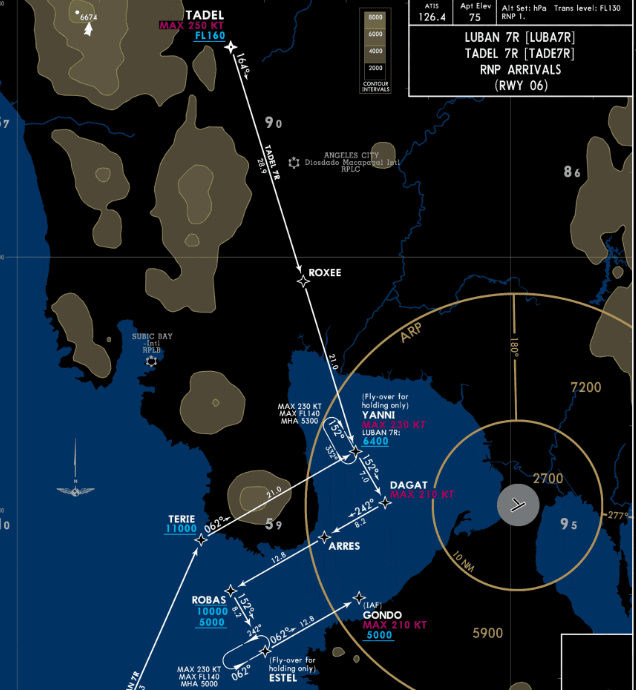{loading=lazy width=90%}

<sub>*Copyright © 2021 Navigraph / Jeppesen<br/>
"Navigraph Charts are intended for flight simulation use only, not for navigational use."*

Specific details on the symbology associated with vertical guidance can be seen in the section below:

[Navigation Display Symbols](nd-symbols.md){loading=lazy .md-button}

##  Primary Flight Display Indications

### ^^Sample Pre-Flight^^

!!! block ""
    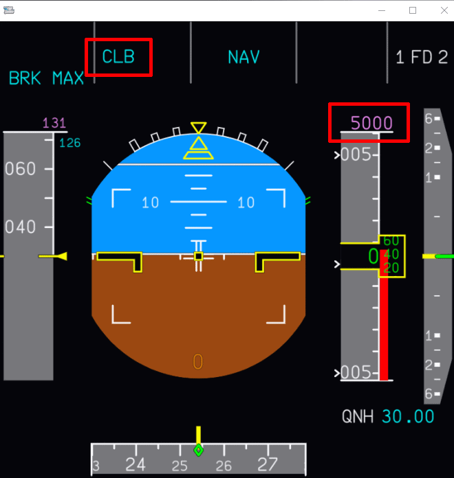{loading=lazy align=left width=50%}

    This is an example of the PFD after you have fully configured the aircraft for takeoff and are ready to taxi to the departure runway. It's important to take note of two items:
    
    1. `CLB` is armed in blue (for Managed Climb).
    - `5000` in Magenta denotes that the commanded altitude in the FCU is above a constraint set in the MCDU on the flight path. This means the aircraft will level off at 5000 ft.

### ^^Sample Takeoff^^

!!! block ""
    {loading=lazy align=left width=50%}

    This example showcases the aircraft in a managed climb after taking off from the runway. You can still see `5000` in magenta at the top of the altitude indicator, however, the FMA has new information.

    The current mode is `CLB` but the aircraft has an `ALT` armed in magenta. This means that the aircraft is ready to level off at 5000 ft and will transition to `ALT CST*`.

!!! block ""
    {loading=lazy align=left width=50%}

    As you reach 5000 ft again, it's important to note two items:

    1. A mode revision to `ALT CST*` as you capture the altitude constraint set in the MCDU.
    2. `CLB` will be armed in blue indicating further climb is expected as set in your FCU.
    3. The altitude indicator will show the targeted altitude of 5000 ft in magenta.

### ^^Descent^^

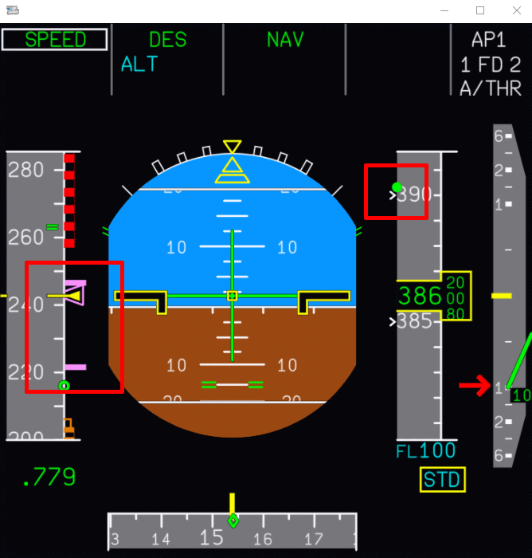{loading=lazy width=60%}

In the above example, we have just initiated a managed descent to FL100. There are three important things to pay attention on the PFD (from left to right):

1. Shows you the targeted managed speed alongside the range the aircraft will deviate to match the descent profile.
- The V/DEV or "yoyo" indicator. It provides a visual indicator of how far below the descent profile from the command altitude (FL100). In this case, you will notice the aircraft is far below the profile, in part due to starting the descent early.
    - This can happen due to various factors, such as ATC instructions.
- When starting a descent early, the aircraft will typically target a V/S - 1000 ft.

---

{loading=lazy width=60%}

As we catch up to the profile, you will notice the V/DEV indicator shift and match the altitude indicator. This informs the crew that we have caught up with the profile and the aircraft is now increasing its descent rate to V/S - 2000 ft.

## Navigation Display Indications

As a reminder, the section [Navigation Display Symbols](nd-symbols.md) contains detailed descriptions of the various symbols you'll encounter when indicated on the flight instruments.

### ^^Departure^^

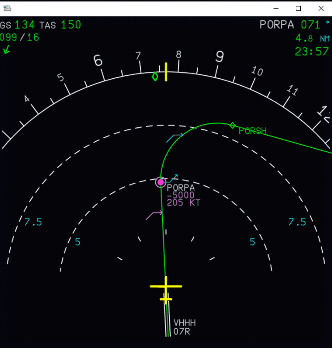{loading=lazy width=60%}

The above image showcases a typical departure with constraints set at the first waypoint on the flight plan. The aircraft now has just taken off the runway and is climbing to a cleared altitude of 7000 ft. Following the direction of the aircraft's flight path as indicated on the ND, we can note that at the waypoint `PORPA` we have a planned constraint *at or below* 5000 ft with a speed restriction of 205 kt.

There are also a few **pseudo waypoints** indicated on the ND indicating different changes to the flight profile as the aircraft continues along the flight plan.

- The first pseudo waypoint you encounter in <span style=color:magenta>magenta</span> indicates the calculated point where the aircraft will level off at 5000 ft to meet the constraint at `PORPA`.
- At the waypoint `PORPA` there are a few different indicators described in more detail below. This is a result of information entered into the F-PLN page on the MCDU.
- The final pseudo waypoint displayed is a <span style=color:cyan>cyan arrow</span> indicating the point where the FCU commanded altitude (in our case, 7000 ft) will be reached.

---

!!! block ""
    PORPA Waypoint Indicators

    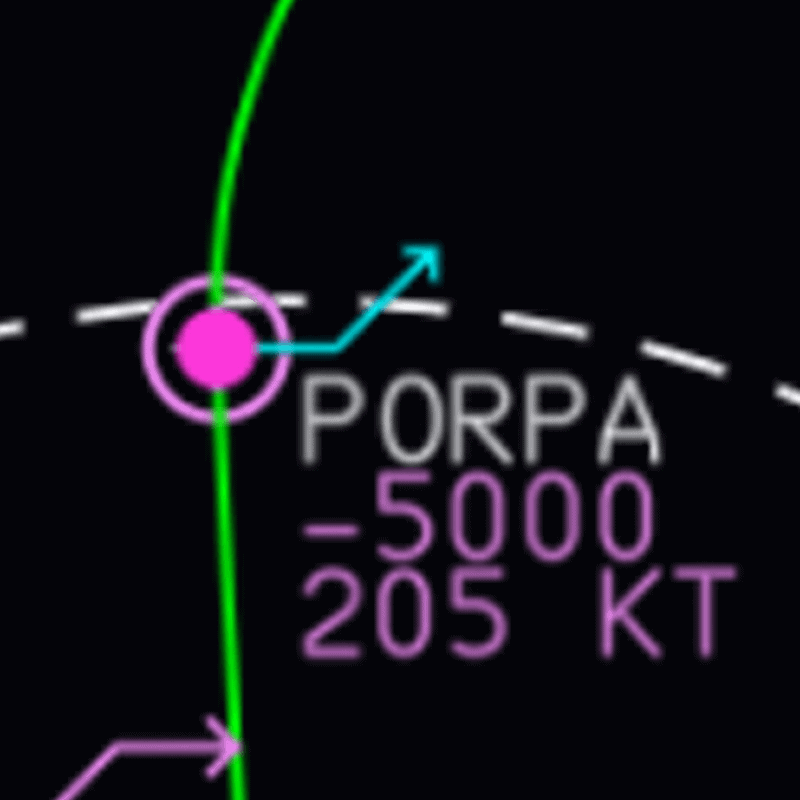{loading=lazy align=left width=30%}

    - The <span style=color:cyan>cyan arrow</span> indicates that CLB is armed, and the AP will continue climbing above 5000 ft at `PORPA`.
    - The solid <span style=color:magenta>magenta dot</span> indicates the aircraft will increase speed at `PORPA` to 220 kt as indicated by the `SKAT1X` SID.
    - The <span style=color:magenta>magenta outer ring</span> reaffirms there is a constraint at `PORPA` but additionally signifies the `ALT CSTR` will be met, and the aircraft will cross *at or below* 5000 ft.

---

### ^^Climb^^

!!! block ""
    {loading=lazy align=left width=60%}

    As we continue along the flight path and pass all speed restrictions again, we can see a couple of familiar indicators on the ND.

    - The solid <span style=color:magenta>magenta dot</span> inidcating our aircraft will increase speed to 250 kt as we climb out of 7000 ft.
    - The <span style=color:cyan>cyan arrow</span> indicating the point where the FCU commanded altitude (in our case FL170) will be reached.

!!! tip ""
    **Note:** The top of climb pseudo waypoint can shift as various flight conditions affect climb performance.

### ^^Descent^^

!!! block ""
    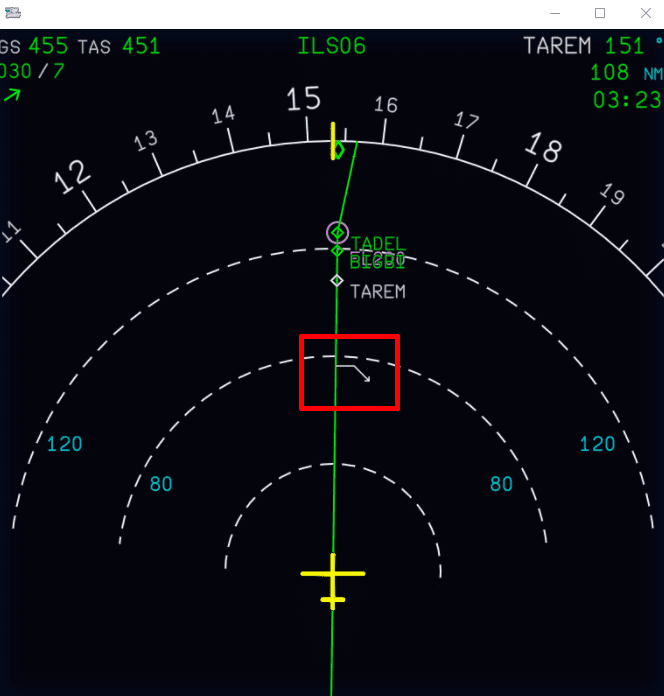{loading=lazy align=left width=60%}

    The Top of Descent symbol is indicated by a downward facing white arrow (DES is not armed) on the ND. Pilots can choose to initiate descent at this point for an optimal *managed* descent.

    !!! tip "Useful Tip"
        The Top of Descent symbol is typically only useful if we are flying the entire STAR. 

        If ATC wanted to provide a shortcut or earlier descent instructions, additional indications will appear. See next section.

### Early Descent Example

!!! block ""
    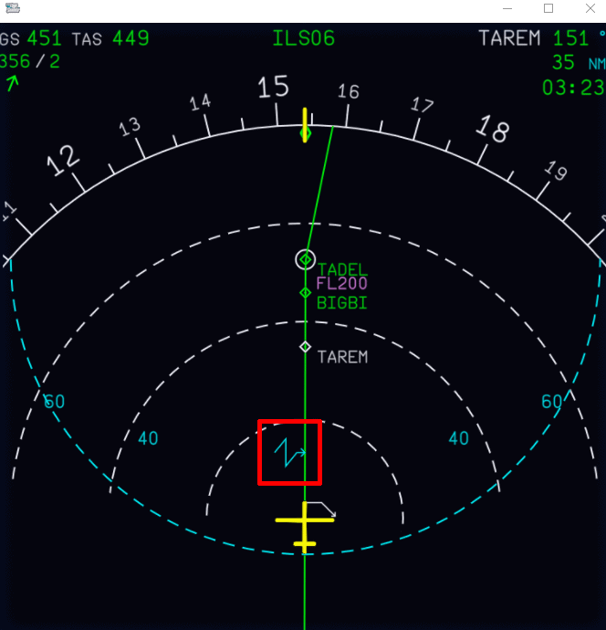{loading=lazy align=left width=60%}

    In this example, we have already initiated an early descent ahead of the Top of Descent symbol, and the aircraft is descending to a mandatory restriction of FL200 set by the pilot.

    Highlighted in the image is the <span style=color:cyan>intercept point</span> symbol in blue, which indicates the point at which the aircraft will "meet" the descent path.

### Continued Descent

!!! block ""
    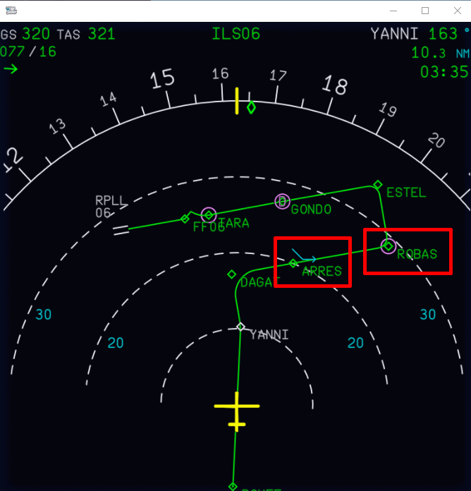{loading=lazy align=left width=60%}

    In this example, the aircraft is descending from FL200 to FL100. You can note two important indications: 

    1. Just past the `ARRES` waypoint is the level-off symbol in <span style=color:cyan>cyan</span> predicting where the aircraft will level off at FL100.
    - The `ROBAS` waypoint has a <span style=color:magenta>magenta circle</span> around it, indicating a constraint at this waypoint.

!!! block ""
    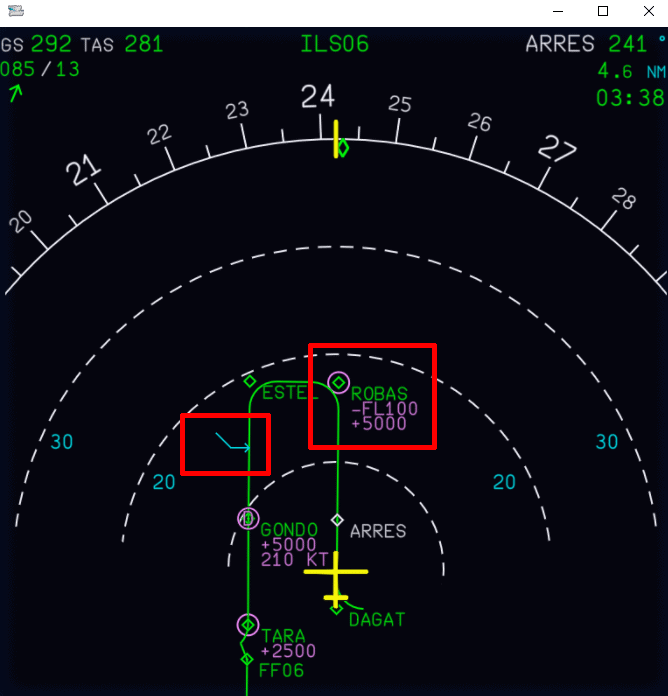{loading=lazy align=left width=60%}

    In this example, the aircraft continues flying down the STAR. We have commanded further descent from FL100 to 5000 ft and turned on `CSTR` on the EFIS. 

    We can now see the following indications:

    1. The level-off symbol has moved further down the flight path just past the `ESTEL` waypoint.
    - The constraint at `ROBAS` now also shows the values.

## FMS (MCDU)

### PROG Page Indications

When the aircraft is descending, you can take note of the vertical deviation against the predicted descent profile on the `PROG` page of the MCDU. Alongside other indicators on the PFD, the `PROG` page provides a numerical value in feet. See the following two examples:

!!! block ""
    {loading=lazy width=45% align=left}
    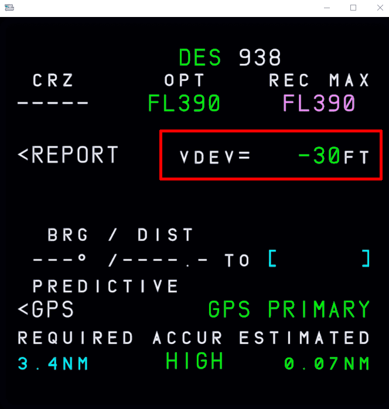{loading=lazy width=45% align=right}

### INIT A Winds

You can find expected winds on your OFP from simBrief. Depending on the format you choose for your OFP's the location may vary. An example from the LIDO format is found after the FLIGHT LOG section.

Sample Image:

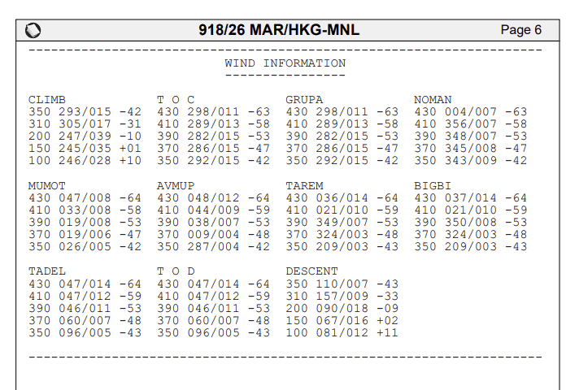

!!! block ""
    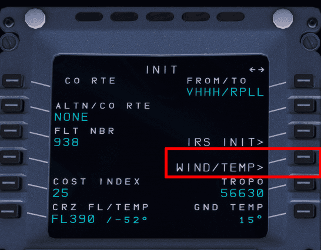{loading=lazy width=60% align=left}
    
    In order to improve accuracy and have a valid Top of Descent, entering the winds is an important aspect of flight planning and setting up the MCDU. You can find the WIND/TEMPS easily on the INIT A page.

After selecting this, you can navigate through different stages of flight CLB, CRZ, and DES using `LSK 4R` to go to PREV PHASE or `LSK 5R` to go to NEXT PHASE.

!!! block ""
    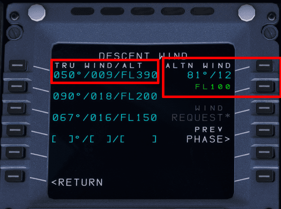{loading=lazy width=60% align=left}

    The winds page accepts the following format: `HDG / SPEED / ALTITUDE`. 

    When entering the winds for the alternate destination, the flight crew can omit the `ALTITUDE` value, as that has been populated on the right side of the screen. 

To enter the examples highlighted in the image, you can type:

- `050/009/390` and press LSK 1L to input the FL390 winds.
- `081/012` and press LSK 1R to input the alternate destination winds at FL100. **Note:** the flight level is omitted in the entry.
