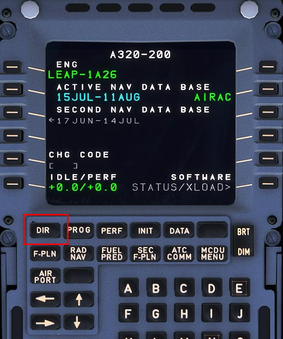
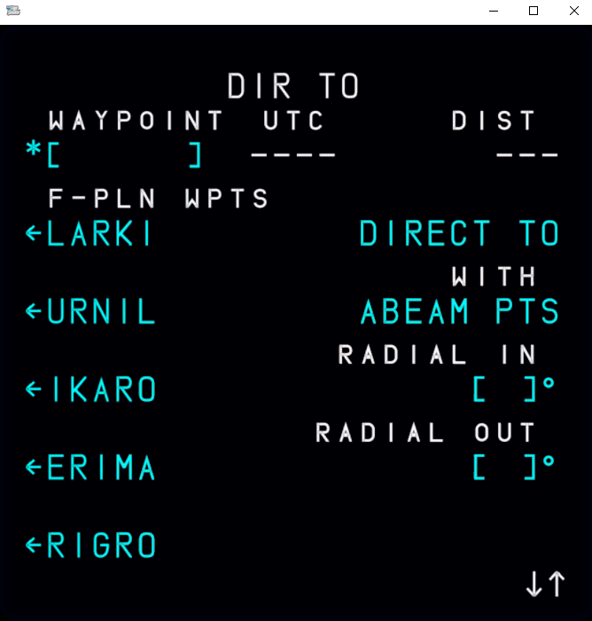
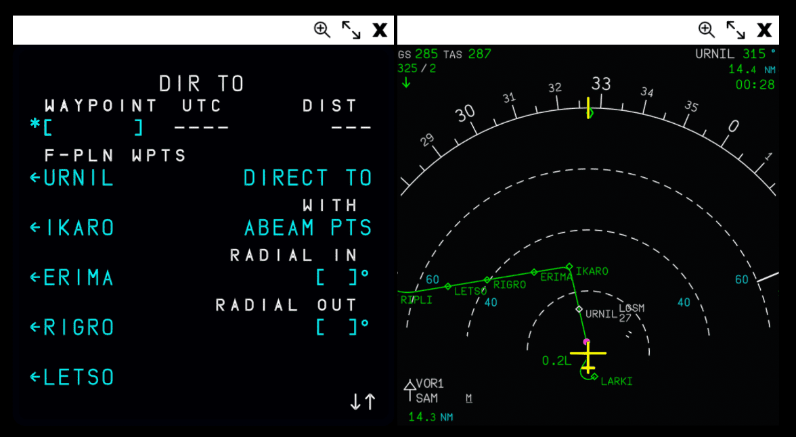
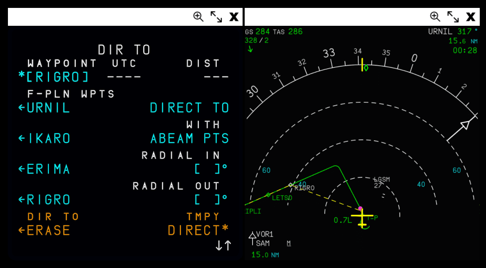

# Direct

This is a short guide on utilizing the "direct" feature on the MCDU found on the "DIR TO" page. Pilots can navigate to this page by selecting the `DIR` key.

{==

It is important to note that currently we are simulating the Thales version of the DIR TO page on our MCDU. We intend to change this at a later time to the Honeywell version to be in line with the rest of our implementation.

==}

{loading=lazy width=50%}

While en-route, pilots may encounter discontinuities ([read more here](disco.md)) or be instructed by ATC to proceed directly to a specific waypoint. The direct function allows pilots to quickly program lateral revisions to a specific waypoint, which would command the LNAV to proceed to that point upon selecting `INSERT`.

!!! tip "HDG/NAV Modes"
    Please keep in mind the following two concepts:

    - If you are currently in NAV (indicated on the FMA) then the aircraft will stay in this mode and proceed on the new active track.
    - If you are in HDG mode, the aircraft will revert to NAV and proceed on the new active track.

There are three functions available on the DIR TO page.

- [DIR TO](#dir-to): Creates a direct leg from the present position of the aircraft to a specified waypoint.

!!! warning "Not Yet Implemented"
    - [DIR TO/ABEAM](#dir-toabeam) (if selected): Calculates the abeam waypoints along the direct leg.
    - [DIR TO/INTCPT](#dir-tointcpt): Creates a defined path based on a specified RADIAL INBOUND / OUTBOUND at the inserted waypoint.

## DIR TO

This function is the simplest to use. 

- Navigate to the DIR TO page by selecting `DIR` key on the MCDU.
- Select your desired en route waypoint from your flight plan using the left LSKs.

!!! block ""
    This is an example of the DIR TO page on the MCDU with en route waypoints displayed.

    {loading=lazy width=40%}

    Before selecting a waypoint, you can visually see your en route waypoints on the ND matching those displayed on the DIR TO page in the side by side example below: 

    {loading=lazy}

If you wish to or are required to proceed direct to a waypoint not on your current flight plan, you can:

- Enter the waypoint using the MCDU's scratchpad.
- Select LSK 1L to input it as the desired waypoint.

Upon selecting a desired waypoint using the corresponding left LSK, you should see something like this side by side example:

{loading=lazy}

On the Navigation Display, you will see the calculated track in yellow dashed lines from the aircraft's present position direct to the waypoint specified above. If you are happy with what is displayed, you can select LSK 6R to confirm the DIRECT and add it to your flight plan.

You will see `T-P` added to your flight plan, followed by the waypoint you selected. This indicates your turning point to the now active track to the new waypoint.

!!! info "Be Advised"
    - Any existing en-route waypoints between your present position and the selected new waypoint will be removed from the active flight plan. 
    - There are cases where the plane does not draw a nice curve between T-P and the direct line. This is true to life in different cases depending on the leg types.

## DIR TO/ABEAM

!!! warning "Not Yet Implemented"
    Below is a quick explanation of what this feature entails.

There may be instances where the flight crew would not want existing waypoints to be deleted from the flight plan when performing a direct. By selecting the `WITH ABEAM PTS` option on the DIR TO page, this would insert and display the previous waypoints "abeam" their original counterparts.

!!! tip "Defining Abeam"
    On the beam; at a right angle to the centerline or keel of a vessel or aircraft; being at a bearing approximately 090 degrees or 270 degrees relative.

    Source [Wikipedia](https://en.wiktionary.org/wiki/abeam){target=new}.

This is useful when pilots would want to check fuel, time, or other actions after inserting the direct to waypoint. The abeam waypoints would be prefaced with `AB` on both the Navigation Display and the F-PLN page.

## DIR TO/INTCPT

!!! warning "Not Yet Implemented"
    Below is a quick explanation of what this feature entails.

This feature allows the flight crew to enter a specific radial to intercept a waypoint. Another way to describe this is programming a specific direction from which to approach or leave a waypoint.

This is useful when ATC provides instructions such as *"Intercept the 214 radial to WAYPOINT"*.

By setting a RADIAL INBOUND/OUTBOUND, it would allow the aircraft to be flying a specific heading towards the INTCEPT point calculated by the FMS to the waypoint instructed by ATC.  

