# Holds

Holding patterns, as they are officially known, can be used as a delaying tactic for airborne aircraft, for course reversal, and for gaining altitude before crossing terrain in some procedures. Typically, holding patterns have a racetrack pattern that can easily be spotted on flight trackers. All holds are made up of segments. The segments are shown in the figure below. 

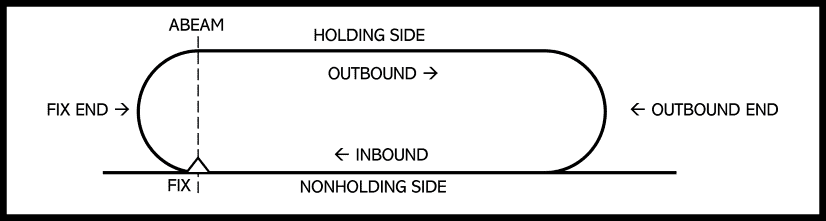{loading=lazy}

## Why Hold?
Holds are always used to delay aircraft near a navigational fix in certain airspace. There are many reasons why airplanes might need to hold. Common examples would be:

- Bad weather passing over the airport
- Traffic
- To gain or lose energy in the plane (altitude or speed)
- To burn off fuel
- To reverse the course of the aircraft before entering a final approach

Holds are sometimes used because of topographical constraints. Innsbruck-Kranebitten International Airport (LOWI) is an excellent example of such a constraint because it is situated in a valley, as seen in the picture below.

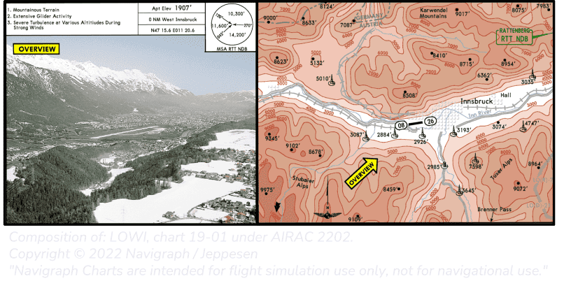{loading=lazy}

## Identifying Holds

Aircraft can technically hold at any waypoint if given permission by or requested from ATC in advance. Holds that are published on aviation charts are called published holds. For this guide, we will only consider a published hold. Holds can be identified on charts in 2 different ways, where both options can be applied on the same chart. For example, look at the chart below.

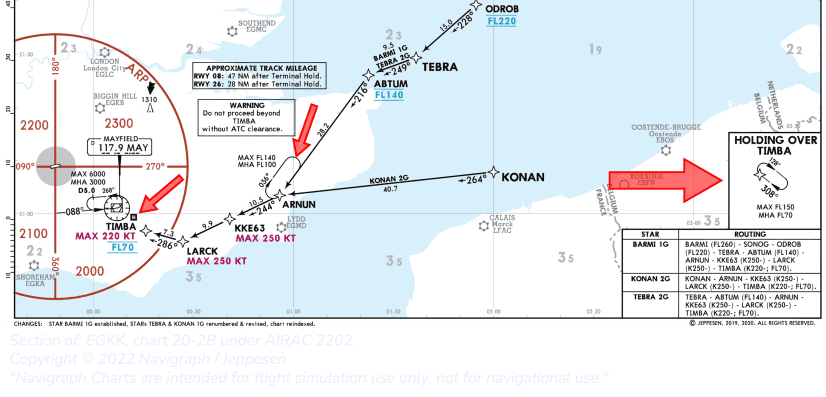{loading=lazy}

Waypoints with published holds can be spotted by a racetrack pattern, or holds can be published and displayed in a diagram in one of the corners of the main navigation section on the chart. 

Now that you know where to hold, you should learn how to program the hold. Next, you will need to find information on the chart to enter into the FMS. The primary information you need to have is:

1. Name of the fix/waypoint
2. Inbound course
3. Turning direction
4. Length of the legs, either in time or distance (see Standards below)
5. Maximum airspeed (see Standards below)

!!! tip "Standards"
    There are standards for length of legs, and airspeed that must be respected if no other information is present on the chart. The standards are published in [Hold Standards](#hold-standards).
 
 The inbound course/heading or the reciprocal of the hold is always depicted on the chart.

## Hold Examples    

??? info "Example charts to acquire hold information (click to expand)"

    === "1"

        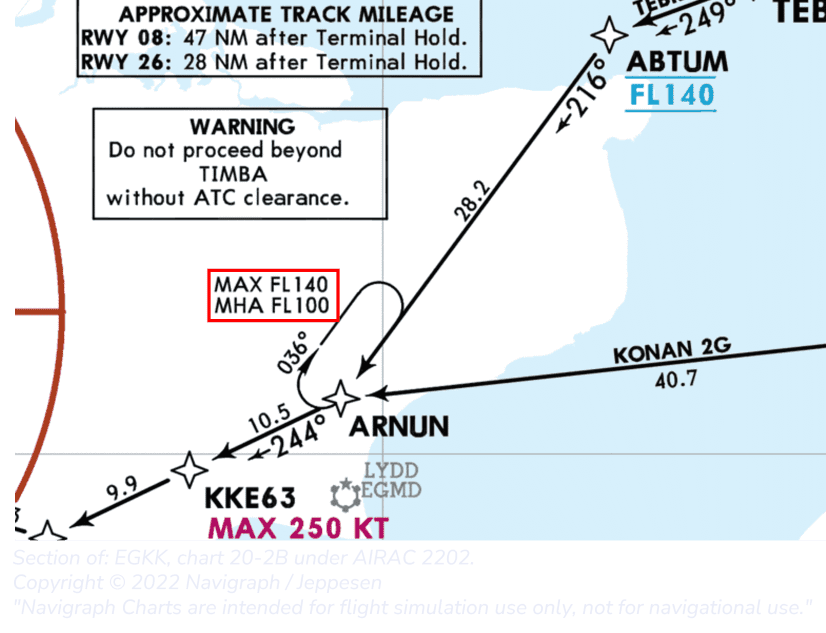{loading=lazy}

        | Hold information  | Details |
        |-------------------|---------|
        | Fix               | ARNUM   |
        | Inbound course    | 216°    |
        | Turning direction | Right   |
        | Leg distance      | STD     |
        | Max speed         | STD     |
        | Max alt           | FL140   |
        | Min alt (MHA)     | FL100   |

    === "2"

        >**_NOTE:_**  The altitude constraints of the fix SUGOL are not relevant for the altitude constraints of the hold at SUGOL. The same principle applies to speed restrictions as well.

        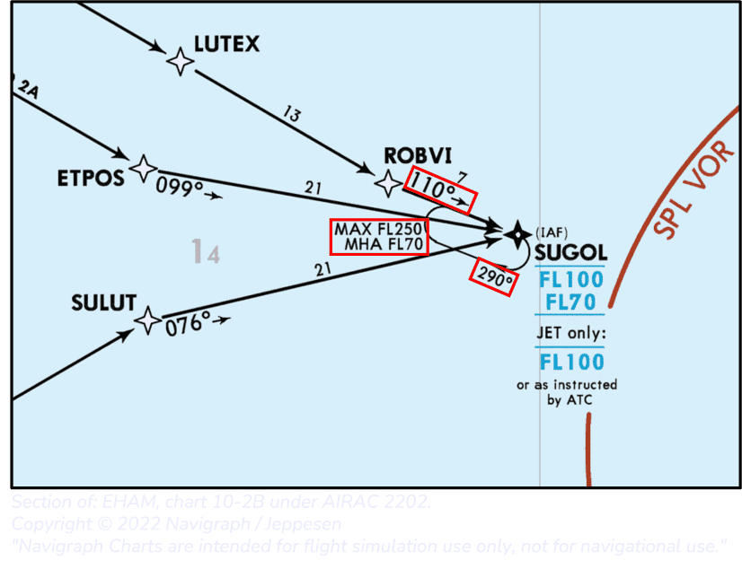{loading=lazy}

        | Hold information  | Details |
        |-------------------|---------|
        | Fix               | SUGOL   |
        | Inbound course    | 110°    |
        | Turning direction | Right   |
        | Leg distance      | STD     |
        | Max speed         | STD     |
        | Max alt           | FL250   |
        | Min alt (MHA)     | FL70    |
        
    === "3"

        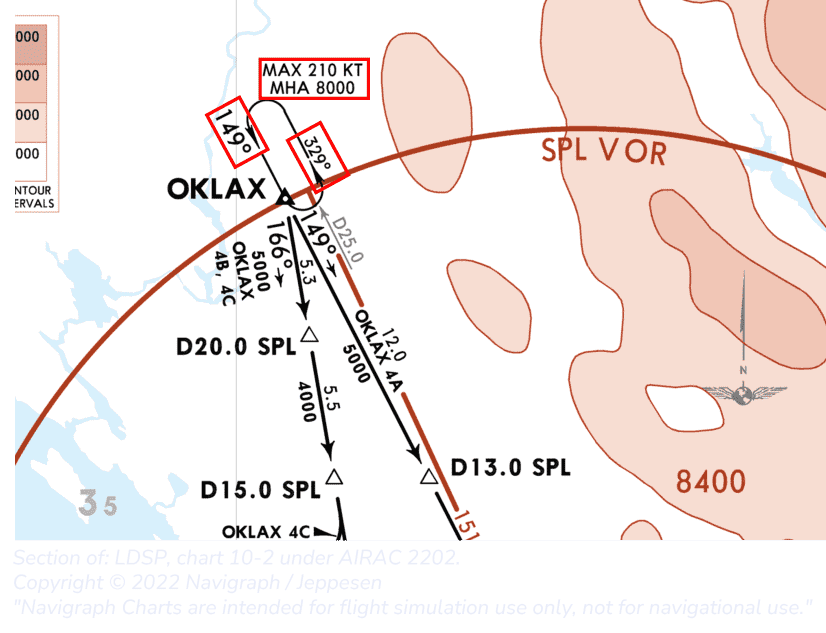{loading=lazy}

        | Hold information  | Details |
        |-------------------|---------|
        | Fix               | OKLAX   |
        | Inbound course    | 149°    |
        | Turning direction | Left    |
        | Leg distance      | STD     |
        | Max speed         | 210 kt  |
        | Max alt           | STD     |
        | Min alt (MHA)     | 8000 ft |

    === "4"

        >**_NOTE:_**  The chart's design makes it confusing what the leg length is for the DVN hold. You could argue that this is 3.4 NM. However, 3.4 is just the length between the D11.0 SPL and the DVN fix and does not influence the hold leg length.

        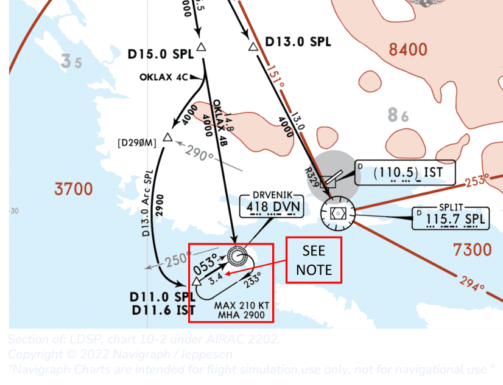{loading=lazy}

        | Hold information  | Details |
        |-------------------|---------|
        | Fix               | DVN     |
        | Inbound course    | 053°    |
        | Turning direction | Right   |
        | Leg distance      | STD     |
        | Max speed         | 210 kt  |
        | Max alt           | -       |
        | Min alt (MHA)     | 2900 ft |
    
    === "5"

        >**_NOTE:_**  Holds at BOTON and PANZE have a minimum hold altitude dictated by the minimum flight altitude of 6000 ft of the earlier and following legs. 

        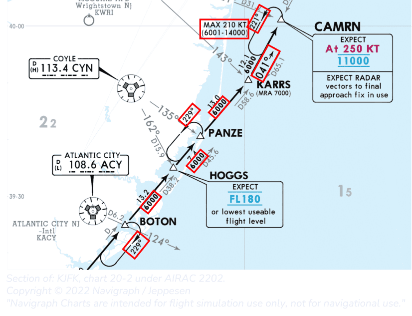{loading=lazy}

        | Hold information  | Details | Details | Details  |
        |-------------------|---------|---------|----------|
        | Fix               | BOTON   | PANZE   | CAMRN    |
        | Inbound course    | *049°   | *049°   | 041°     |
        | Turning direction | Right   | Left    | Left     |
        | Leg distance      | STD     | STD     | STD      |
        | Max speed         | STD     | STD     | 210 kt   |
        | Max alt           | -       | -       | 14000 ft |
        | Min alt (MHA)     | 6000 ft | 6000 ft | 6000 ft  |
        
        *The inbound course can be calculated by subtracting or adding 180 to the reciprocal.

    === "6"

        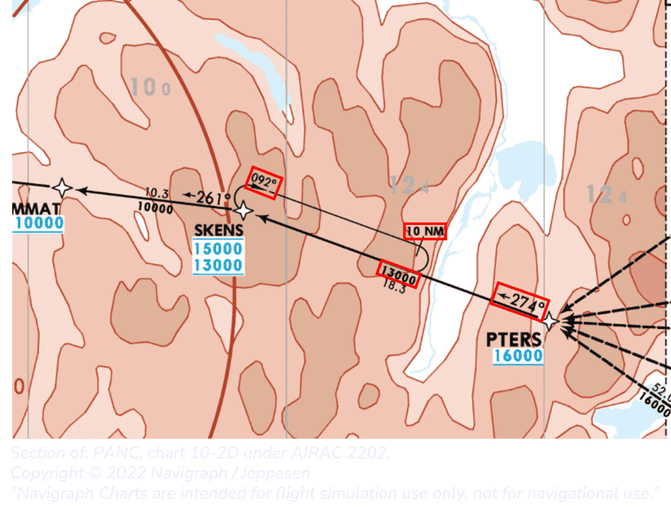{loading=lazy}

        | Hold information  | Details   |
        |-------------------|-----------|
        | Fix               | SKENS     |
        | Inbound course    | 274°      |
        | Turning direction | Right     |
        | Leg distance      | 10 NM     |
        | Max speed         | STD       |
        | Max alt           | -         |
        | Min alt (MHA)     | 13 000 ft |

    === "7"

        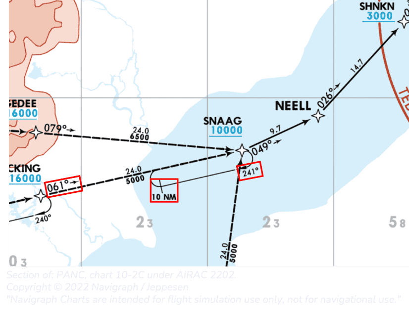{loading=lazy}

        | Hold information  | Details |
        |-------------------|---------|
        | Fix               | SNAAG   |
        | Inbound course    | 061°    |
        | Turning direction | Right   |
        | Leg distance      | 10 NM   |
        | Max speed         | STD     |
        | Max alt           | -       |
        | Min alt (MHA)     | -       |

    === "8"

        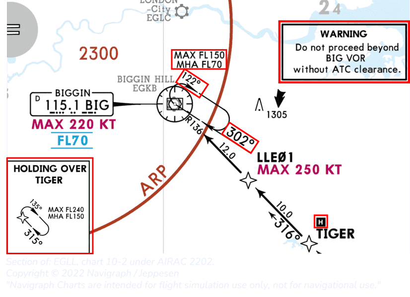{loading=lazy}

        | Hold information  | Details | Details |
        |-------------------|---------|---------|
        | Fix               | TIGER   | BIG     |
        | Inbound course    | 315°    | 302°    |
        | Turning direction | Right   | Right   |
        | Leg distance      | STD     | STD     |
        | Max speed         | STD     | STD     |
        | Max alt           | FL240   | FL150   |
        | Min alt (MHA)     | FL150   | FL70    |

    === "9"

        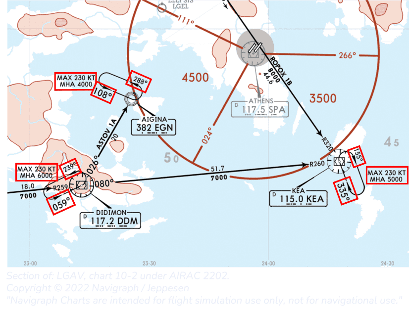{loading=lazy}

        | Hold information  | Details | Details | Details |
        |-------------------|---------|---------|---------|
        | Fix               | DDM     | EGN     | KEA     |
        | Inbound course    | 059°    | 059°    | 335°    |
        | Turning direction | Left    | Left    | Right   |
        | Leg distance      | STD     | STD     | STD     |
        | Max speed         | 230 kt  | 230 kt  | 230 kt  |
        | Max alt           | -       | -       | -       |
        | Min alt (MHA)     | 6000 ft | 4000 ft | 5000 ft |

    === "10"

        >**_NOTE:_**  The leg length for the CRS hold is presented as a distance from another navigational beacon

        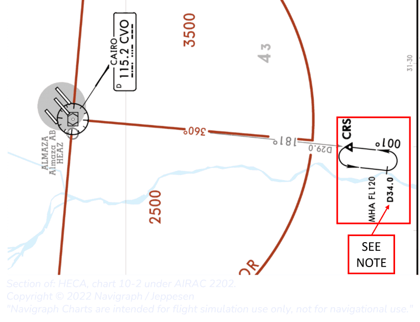{loading=lazy}

        | Hold information  | Details         |
        |-------------------|-----------------|
        | Fix               | CRS             |
        | Inbound course    | 001°            |
        | Turning direction | Left            |
        | Leg distance      | Until D34.0 CVO |
        | Max speed         | STD             |
        | Max alt           | -               |
        | Min alt (MHA)     | FL120           |
     
## Hold Standards

The Airbus FMS follows ICAO definitions for default holding pattern parameters. The default leg length for a computed hold is:

| Altitude (ft MSL) | Leg distance |
|-------------------|--------------|
| <= 14 000         | 1 minute     |
| > 14 000          | 1.5 minutes  |

The managed speed target in a hold is the lowest of:

- maximum endurance (approximately "green dot" speed)
- ICAO speed limit (see table below)
- speed constraint
- speed limit, if below speed limit altitude

The ICAO speed limits are as follows:

| Altitude (ft MSL) | Airspeed (KIAS) |
|-------------------|-----------------|
| < 14 000          | 230             |
| 14 000 - 20 000   | 240             |
| 20 000 - 34 000   | 265             |
| > 34 000          | .83 Mach        |

The default turn direction for a computed hold is **right**, in-line with ICAO specifications. 

## Programming Holds 
Now that all information about the hold is known, it is time to create a hold in the FMS via the MCDU. A step-by-step guide to hold at SKENS is provided below.

{loading=lazy}

### MCDU Setup

!!! info "MCDU Setup"

    === "1"

        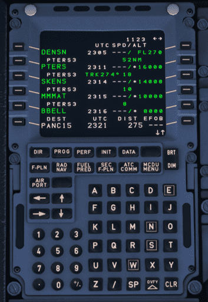{loading=lazy}

        Find the waypoint in the F-PLN page on the MCDU. Select the corresponding line. In this case, the 3rd from the top, SKENS, and push the left line selector key (LSK) for SKENS.
    
    === "2"

        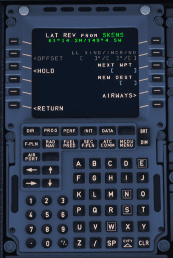{loading=lazy}

        On this page, select the 3rd LSK to enter the hold section for the SKENS waypoint.

    === "3"

        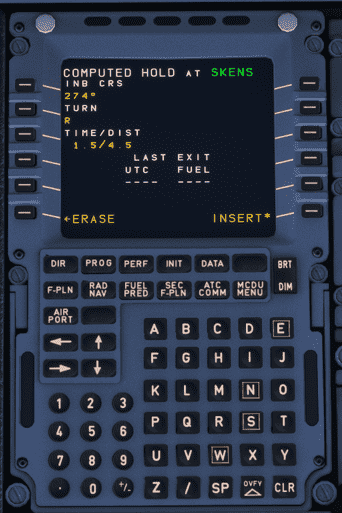{loading=lazy}

        Notice the title of the page is called COMPUTED HOLD at SKENS. 
        
        Computed means that this is information provided by the simulator. This information can be wrong and can be edited by overwriting the computed data. 

    === "4"
        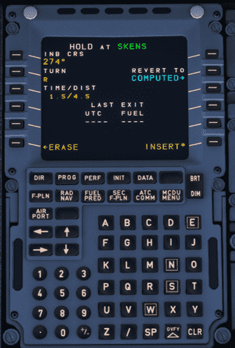{loading=lazy}

        As can be seen by the bigger symbols, the inbound course 274 is inserted in the FMS
        
        Note that the title has changed to HOLD, and a REVERT TO COMPUTED appeared.  REVERT TO COMPUTED will restore all hold settings and revert to the computed hold settings.

    === "5"

        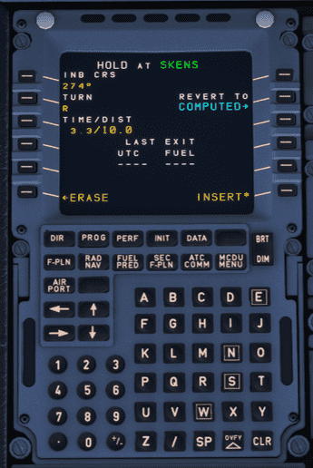{loading=lazy}

        As can be seen in the chart, the hold has a leg length of 10NM. To enter this in the FMS, type `/10` in the MCDU and select LSK3 to feed it in the TIME/DIST box. 
        The time needed to complete the leg is also re-calculated and is 3.3 minutes in this case. 

        If leg distance is constrained by time (as it is for a standard hold), this can be set by typing, for example, `1.5` in the MCDU and feeding it in the TIME/DIST box. Also, the leg distance will automatically be re-calculated.

        {loading=lazy}

    === "Last Exit"

        !!! warning "Not yet implemented"

        {loading=lazy}

        In the bottom section of the MCDU screen, 'LAST EXIT' can be found. The section compromises a UTC and FUEL reading. Last exit provides information on how long the airplane can safely stay in the hold while still having the fuel for the rest of the approach, to go around, divert and the final reserve fuel. The UTC and FUEL will give you the time and minimum fuel needed when leaving the hold. 

    === "6"

        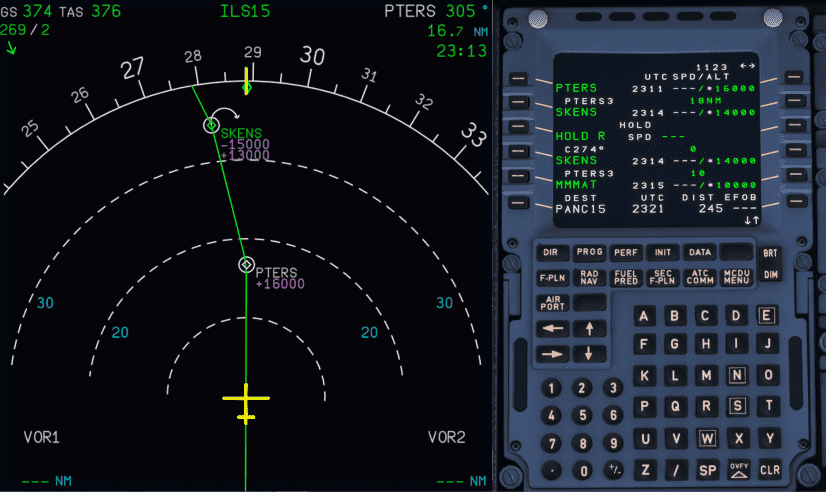{loading=lazy}

        If the inbound course, turning direction and leg distance are set correctly, press the 6th LSK on the right to insert the hold into the Flight plan. 

        Notice the white curved arrow in the ND. In this case, it is turned to the right; however, the arrow would turn left if left-hand turns were selected for the hold.
        Also, notice how the hold waypoint now appears for an additional time in the flight plan. This is needed for the FMS to calculate a good exit path when leaving the hold.

        Depending on the angle between the aircraft and the inbound course of the hold, aircraft need to fly different entry patterns. The A320 will automatically fly the correct entry pattern.

    === "7"
        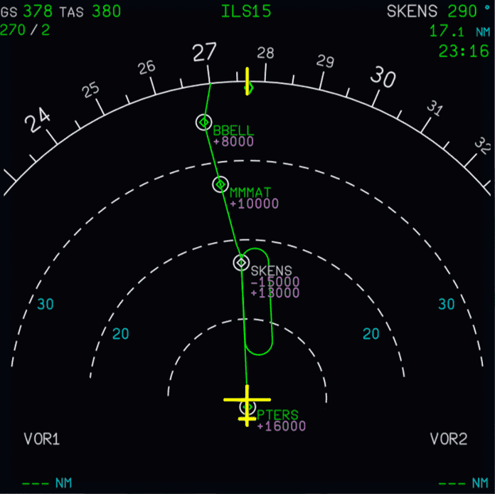{loading=lazy}
        
        As soon as the aircraft is heading to the waypoint with the hold programmed, the hold will be calculated and completely shown on the ND. [IMM EXIT*](#leaving-the-hold) will also appear on the MCDU. 

    === "8"
        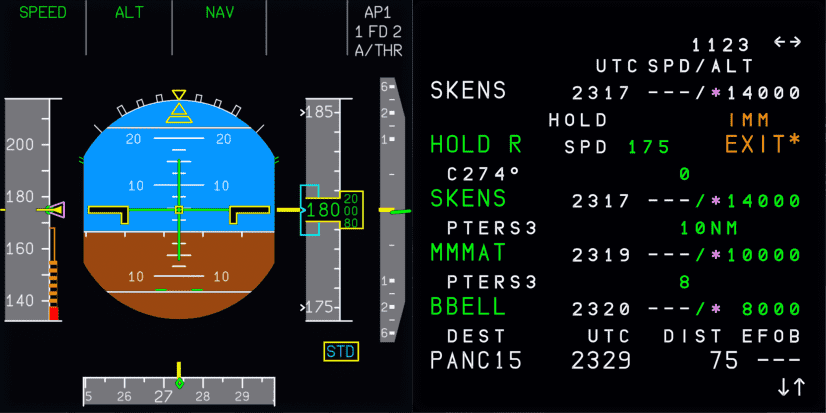{loading=lazy}

        The FMS calculates the holding speed in accordance with [Hold Standards](#hold-standards) to achieve the lowest possible fuel consumption, except in the approach phase where the "characteristic" speed for the current configuration is used. A deceleration point is calculated, giving enough distance before the hold fix to slow down to the holding speed. From this point, IMM EXIT becomes available on the F-PLN page, and pressing it prior to actually reaching the hold fix will cause deletion of the hold. If speed is managed, the deceleration will begin automatically; if speed is selected, a SET HOLD SPEED prompt will appear, prompting the pilot to set their desired holding speed, or to engage managed speed.

        Also, the F-PLN page on the MCDU will continue to show IMM EXIT*. This is needed when [leaving the hold](#leaving-the-hold).

### Descending in the Hold
Managed descent mode (DES) in the hold will limit the descent rate to a maximum of - 1000 ft/min for traffic separation purposes. Open descent (OP DES) will descend at idle thrust as normal.

The TCAS system should remain on TA/RA when flying in the hold. However, it might be convenient to switch to ALL or BLW.

### Leaving the Hold

The plane will continue to fly in the hold until a pilot gives the command to the FMS to leave by either activating a direct to (DIR TO), or pressing the IMM EXIT prompt on the F-PLN page. During the hold, and prior to the hold after crossing the deceleration point, the F-PLN page will display IMM EXIT prompt in amber. The pilot may press the right LSK next to IMM EXIT to leave the hold. The aircraft will shorten the hold as much as possible, fly around until reaching the hold fix, and then exit, continuing with the subsequent flight plan. At any time prior to reaching the hold fix, the RESUME HOLD prompt may be used to re-enable the hold.

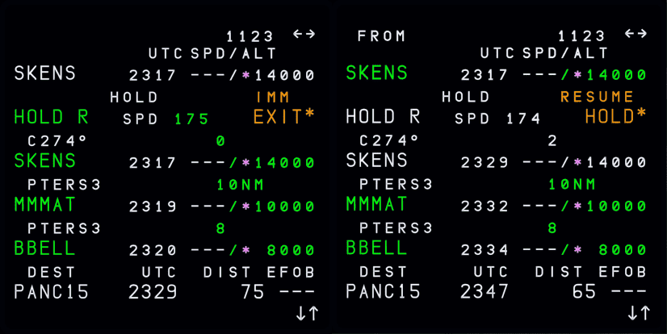{loading=lazy}

## Video Tutorial by 320 Sim Pilot

