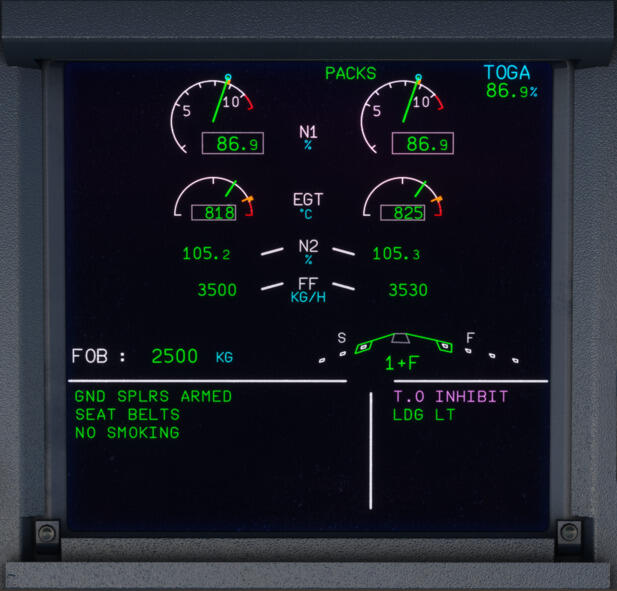

# Rejected Takeoff in the A320

The term rejected takeoff (also known as RTO) refers to incidents in which an aircraft's pilots elect to abort their departure before reaching a critical speed. 

This critical speed is known as '[V~1~](../../common/abbreviations.md)', and this refers to the maximum speed an aircraft can reach on its takeoff roll and then be brought to a stop whilst remaining within the accelerate-stop distance (the distance the airplane actually needs to accelerate and stop in accordance with regulations). 
If the aircraft reaches this speed and the Pilot Flying has not yet acted to stop the plane, the takeoff must be continued unless the airplane is unsafe to fly.

[V-Speeds Information](../../common/abbreviations.md){.md-button target=new}

??? tip "Extra Knowledge - ASDA (Click to Expand)"
    To be able to take off, the takeoff weight and V~1~ speed must result in an accelerate-stop distance that is no longer than the accelerate-stop
    distance available (ASDA). 

    The ASDA is a distance declared by the airport and is the runway length available for a rejected takeoff plus any stopway that may be present. A stopway is an area beyond the takeoff runway meeting certain dimensional requirements that is designed to support the airplane during a rejected takeoff without causing structural damage to the airplane.

    ---
    
    **Additional Info**

    The reason we mention runway length available for a rejected takeoff above, is that in some cases the ASDA can actually be shorter than the physical length of the runway.

    For example, in the U.S., airports must provide a 1000-foot runway safety area (RSA) or an engineered material arresting system (EMAS) beyond the runway end. If this isn't possible, one option is to shorten the length of the runway declared as ASDA to provide for the RSA. This could result in the ASDA being up to 1000 feet shorter than the actual runway.

When the aircraft speed is at or above 100 kt, it may become hazardous to reject a takeoff. Therefore, a takeoff is split into 3 phases:  

- Below 100 kt  
- Above 100 kt and below V~1~  
- Above V~1~  

!!! warning "Attention"

    If the takeoff is rejected below 72 kt, spoilers & autobrakes will not activate, therefore full manual braking would be required in addition to the other stop actions listed in the rejected takeoff procedure.  

Jump to [Rejected Takeoff Procedure](#rejected-takeoff-procedure)

## What Happens During a Rejected Takeoff in Real Life?

The decision to reject the takeoff and the stop action is made by the Captain, it is therefore recommended that the Captain keeps his hand on the thrust levers until the aircraft reaches V~1~, whether he is Pilot Flying (PF) or Pilot Not Flying (PNF).

As soon as the Captain decides to abort, he calls “STOP”, takes over control of the aircraft, and performs the stop actions.

## Reasons for a Rejected Takeoff  

It is not possible to list all the factors that could lead to the decision to reject the takeoff. However, to help the Captain decide, the ECAM inhibits warnings that are not essential once the plane passes 80 kt and stops inhibiting them once the plane reaches 1500 ft AGL (or 2 min after lift-off, whichever occurs first). A magenta T.O INHIBIT memo is displayed in the Upper ECAM (E/WD) to inform the pilots of this.

- Below 100 kt:  
    - Any ECAM warning/caution should prompt the Captain to seriously consider discontinuing the takeoff
- Above 100 kt and below V~1~:  
    - Fire warning or severe damage
    - Sudden loss of engine thrust
    - Any red ECAM warning
    - Any amber ECAM caution listed below:
        - F/CTL SIDESTICK FAULT
        - ENG FAIL
        - ENG REVERSE FAULT
        - ENG REVERSE UNLOCKED
        - ENG 1(2) THR LEVER FAULT
- Above V~1~:  
    - Malfunctions or conditions that give unambiguous indications that the aircraft will not fly safely

## Rejected Takeoff Procedure  

!!! note

      We have modified and condensed the rejected takeoff procedure to enable a single pilot to perform for simulation purposes. In real life operations, the procedures are split between the Captain and FO. 

---

[//]: # (Backup Text Below)

[//]: # ("STOP"......................................................ANNOUNCE  )

[//]: # (THRUST LEVERS..................................................IDLE  )

[//]: # (REVERSE THRUST.....................................MAX AVAIL  )

[//]: # (REVERSERS................................CHECK/ANNOUNCE  )

[//]: # (DECELERATION..........................CHECK/ANNOUNCE  )

[//]: # (AUDIO WARNINGS.........................................CANCEL  )

[//]: # ()
[//]: # (**AIRCRAFT STOPPED**  )

[//]: # ()
[//]: # (REVERSERS...................................................STOWED  )

[//]: # (THRUST LEVERS..................................................IDLE  )

[//]: # (ATC...................................................................NOTIFY  )

[//]: # (PARKING BRAKE.....................................................ON  )

[//]: # (CABIN CREW.....................................................ALERT  )

[//]: # (ECAM ACTIONS..........................................PERFORM  )

---

!!! note 

    - Full reverse thrust may be used until coming to a complete stop. But, if there is enough runway available at the end of the deceleration, it is preferable to set thrust levers to idle reverse when passing 70 kt.
    - If the brake response from the autobrake does not seem appropriate for the runway condition, FULL manual braking should be applied and maintained. IF IN DOUBT, TAKE OVER MANUALLY.
