# After Landing and Taxi to Gate

This guide will explain the correct procedures after we have landed and vacated the runway and then taxiing to the designated gate.

!!! warning "Disclaimer"
    The level of detail in this guide is meant to get a FlyByWire A320neo beginner from the runway to the designated destination gate.

    A *beginner* is defined as someone familiar with flying a GA aircraft or different types of airliners. Aviation terminology and know-how is a requirement to fly any airliner, even in Microsoft Flight Simulator.

    Further reading: [A320 Autoflight](https://www.smartcockpit.com/aircraft-ressources/A319-320-321-Autoflight.html) 
    Also, you will find many great videos on YouTube on how to fly the FlyByWire A32NX. 
    Check out the FlyByWire YouTube Channel as well: [FlyByWire on YouTube](https://www.youtube.com/c/FlyByWireSimulations/playlists)

---

## Prerequisites

Aircraft has vacated the runway completely and has been brought to a stop on the taxiway as per previous chapters.

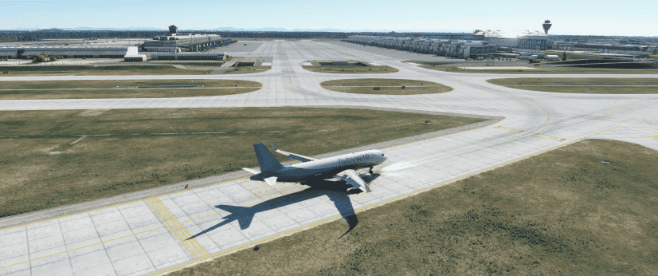{ loading=lazy }

[Download FlyByWire Checklist](../assets/sop/A32NX%20Documentation/FBW%20A32NX%20Checklist.pdf){ .md-button }

## Chapters / Phases

This guide will cover these phases:

1. [After Landing](#1-after-landing)
2. [Taxi to Gate](#2-taxi-to-gate)

---

### 1. After Landing

**Situation:**

- Aircraft has vacated the runways completely and has come to a stop on the taxi way as per previous chapters.
- Flaps and Ground Spoilers are still deployed.
- ATC has been informed that we vacated the runway.

!!!info "Simulation vs. Real Life"
    In real life, the A320 will have two pilots who can actually do things in parallel. Talking to ATC, taxiing the aircraft and doing the after landing tasks.

    In the simulation we are typically alone, so it is perfectly fine to stop once we have fully vacated the runway and do these things one after the other.

ATC Tower will usually hand us off to ATC Ground, and they will give us taxi instructions for our destination gate. Write them down and read them back as usual, but you don't have to move immediately unless ATC explicitly tells you to. Online ATC understand that the after-landing- tasks do take some time.

**Immediate steps after vacating the runway:**

- Set your radio frequency to the one assigned by ATC or the airport charts.

    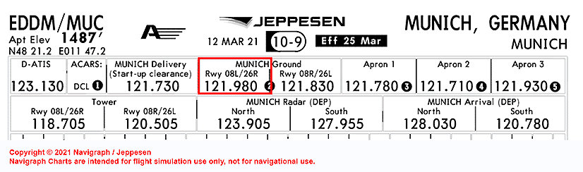{ loading=lazy }

    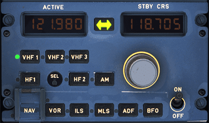{loading=lazy }

- Disarm the `Speed Brake` lever (Ground Spoilers) by pushing down on the lever.

    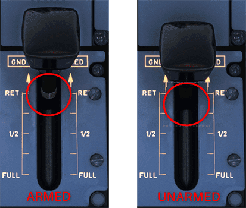{loading=lazy }

- Set your `ENG MODE` selector to NORM in case you set it to IGN/START before.

    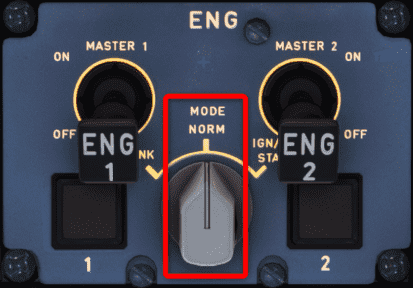{loading=lazy }

- Retract your `FLAPS` to 0.

    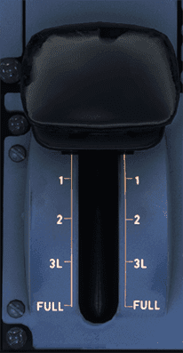{loading=lazy }

- Set your `TCAS` to STANDBY.

    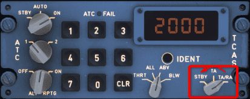{loading=lazy }

- Set your `RADAR` and Predictive Windshear System (`PWS`) to OFF.

    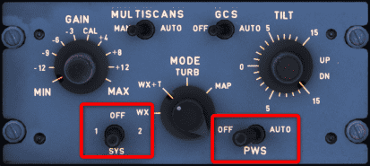{loading=lazy }

- Start your `APU` by clicking the `APU MASTER SW` button, then the `APU START` button.

    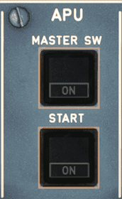{loading=lazy }

- Turn `ANTI ICE` OFF if not required.

- Set your exterior lights:
    - Set your `NOSE` light to TAXI.
    - Set `RWY TURN OFF` light to ON.
    - Set your `STROBE` lights to AUTO/OFF (If you are crossing a runway, keep them ON until you vacate the runway).
    - For `LAND` lights, you can choose to retract them or turn them off.

        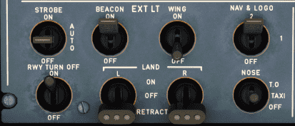{loading=lazy }

- Turn the brake fan (`BRK FAN`) on if you get a hot brakes ECAM warning.

    {loading=lazy }

- Complete the **After Landing** checklist.

    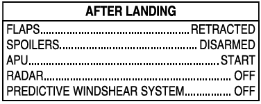{loading=lazy width=50%}

This concludes *After Landing*

### 2. Taxi to Gate

**Situation:**

- Aircraft on taxiway directly after runway.
- **After Landing** checklist is completed.
- ATC Ground has given taxi instructions.

**Taxiing**

Make sure to also read the Taxi section of the [Engine Start and Taxi](engine-start-taxi.md#taxi) chapter.

Use your charts to follow the ATC taxi instructions to the designated gate.

**Crossing a Runway**

When approved to cross a runway (active or not) perform the following actions:

- Look out the windows and visually ensure that there are no visible aircraft to your left and right.
- Turn on extra lights to ensure your aircraft is visible when crossing:
    - Strobe lights - `Set to ON`
- Inform ATC you have vacated the runway if required.

!!! warning
    Never cross a runway without express permission from ATC and providing a read back of said instructions. Always ensure maximum safety when crossing.

**Turning into the Gate**

 When turning into the gate, turn off your `NOSE` light and your `RWY TURN OFF` lights to not blind the ground personnel. This, of course, is only done at this point if enough lighting is available to safely park into the gate.

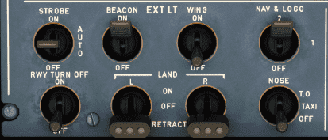{loading=lazy }

This concludes *Taxi to Gate*

Continue with [Powering Down](powering-down.md)
