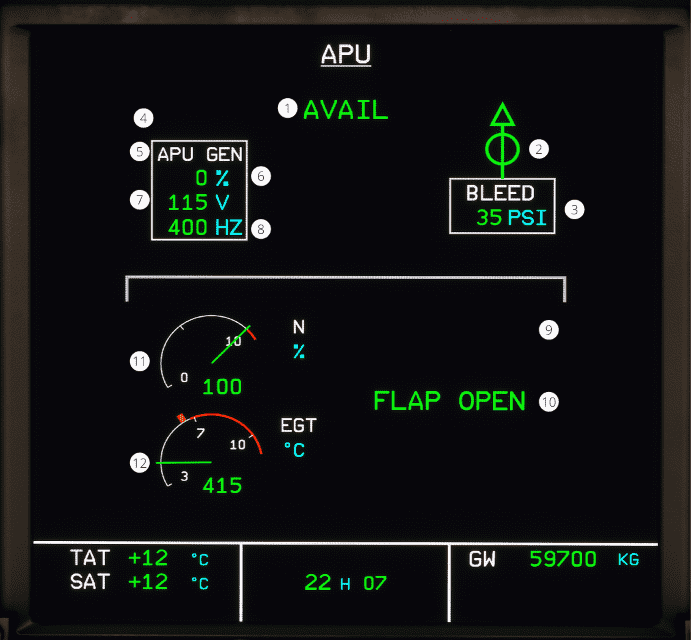

# ECAM APU page

[Back to ECAM System Display Overview](index.md){ .md-button }

| Number | Name                     | Variation               | Meaning                                                                                               |
|:-------|:-------------------------|:------------------------|:------------------------------------------------------------------------------------------------------|
| 1      | AVAIL                    | Green color             | The APU N is above 99.5 % or when the APU N is above 95 % for 2 seconds                               |
|        |                          | Hidden                  | The APU is not available                                                                              |
| 2      | APU Bleed air valve      | Green crossline         | The APU bleed air valve is closed.                                                                    |
|        |                          | Amber crossline         | The APU bleed air valve is closed, but the APU bleed is ON.                                           |
|        |                          | Green inline            | The APU bleed air valve is open                                                                       |
|        |                          | Amber XX                | The APU bleed air valve status is not available, or the APU Bleed pushbutton is not available.        |
| 3      | APU bleed air pressure   | Green color             | The bleed air pressure is within normal operating range.                                              |
|        |                          | Amber XX                | ADIRS 1 or ADIRS 2 is not available, or the data from the ECB is not available.                       |
| 4      | APU GEN line contactor   | Green color             | The APU GEN line is closed                                                                            |
|        |                          | Hidden                  | The APU GEN line is open                                                                              |
| 5      | APU GEN indication       | White color             | APU GEN parameters are within normal operating range.                                                 |
|        |                          | Amber color             | At least one of the APU GEN parameters is in an amber color                                           |
| 6      | APU GEN Load legend      | Green color             | The APU GEN load is within normal operating range.                                                    |
|        |                          | Amber color             | The APU GEN load is greater than 100%.                                                                |
| 7      | APU GEN voltage legend   | Green color             | The APU GEN voltage is within normal operating range.                                                 |
|        |                          | Amber color             | The APU GEN voltage is greater than 120 volts or lower than 110 volts.                                |
| 8      | APU GEN frequency legend | Green color             | The APU GEN frequency is within normal operating range.                                               |
|        |                          | Amber color             | The APU GEN frequency is greater than 410 Hertz or below 390 Hertz.                                   |
| 9      | Fuel pressure            | Amber FUEL LO PR        | The APU fuel pressure is low                                                                          |
|        |                          | Hidden                  | The APU fuel pressure is within normal operating range.                                               |
| 10     | APU Flap                 | Green FLAP OPEN         | The APU air intake is fully open.                                                                     |
|        |                          | Green pulsing FLAP OPEN | The APU air intake is not fully closed after the APU master switch has been turned off for 3 minutes. |
|        |                          | Hidden                  | The APU air intake is fully closed.                                                                   |
| 11     | APU N                    | Green color             | The APU N speed is within normal operating range.                                                     |
|        |                          | Amber color             | The APU N speed is greater than 102 %.                                                                |
|        |                          | Red color               | The APU N speed is greater than 107 %.                                                                |
| 12     | APU EGT                  | Green color             | The APU EGT temperature is within normal operating range.                                             |
|        |                          | Amber color             | The APU EGT is greater than the EGT Maximum minus 33 °C, while the APU is starting.                   |
|        |                          | Pulsive Amber color     | The APU EGT is greater than the EGT maximum minus 33 °C, while the APU is running.                    |
|        |                          | Red color               | The APU EGT is greater than the EGT max.                                                              |

