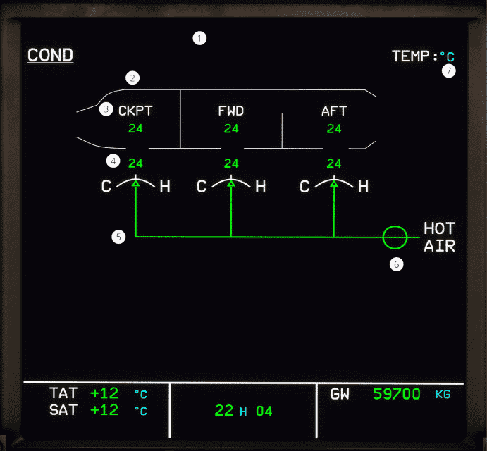

# ECAM COND page

[Back to ECAM System Display Overview](index.md){ .md-button }

| Number | Name                              | Variation       | Meaning                                                                                                   |
|:-------|:----------------------------------|:----------------|:----------------------------------------------------------------------------------------------------------|
| 1      | Zone controller fault indication  | Hidden          | The zone controller is within normal operations                                                           |
|        |                                   | Green ALTN MODE | The primary zone controller is faulty.                                                                    |
|        |                                   | Green PACK REG  | The zone controller is faulty.                                                                            |
| 2      | Cabin Fan fault indication        | Amber FAN       | The recirculation fan is faulty.                                                                          |
|        |                                   | Hidden          | The recirculation fan is within normal operations.                                                        |
| 3      | Zone temperature indication       | Green number    | The temperature of the zone .                                                                             |
| 4      | Zone duct temperature             | Green number    | The temperature of the zone duct.                                                                         |
|        |                                   | Amber number    | The temperature is greater than 80 °C.                                                                    |
| 5      | Zone trim air valve position      | Green C         | The cold valve is fully closed                                                                            |
|        |                                   | Green H         | The hot valve is fully open                                                                               |
|        |                                   | Amber XX        | The valves have failed.                                                                                   |
| 6      | Hot air pressure regulating valve | Green crossline | The pushbutton is at AUTO and the valve is fully closed.                                                  |
|        |                                   | Amber crossline | The pushbutton is OFF and the valve is closed, or the valve is not coordinated with the control position. |
|        |                                   | Green inline    | The valve is open.                                                                                        |
|        |                                   | Amber inline    | The valve is open, but it is not coordinated with the control position.                                   |
| 7      | Temperature unit                  | Green number    | The unit of temperature indications.                                                                      |             

