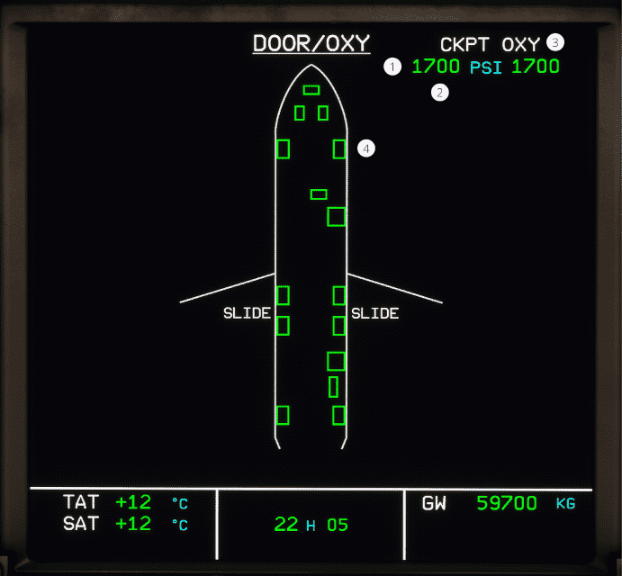

# ECAM DOOR page

[Back to ECAM System Display Overview](index.md){ .md-button }

| Number | Name                       | Variation          | Meaning                                                                           |
|:-------|:---------------------------|:-------------------|:----------------------------------------------------------------------------------|
| 1      | Oxygen pressure indication | Green number       | The pressure is within the normal operating range.                                |
|        |                            | Green pulse number | The pressure is low.                                                              |
|        |                            | Amber number       | The pressure is dangerously low.                                                  |
| 2      | REGUL LO PR                | Displayed Amber    | The oxygen pressure on the low-pressure circuit is low.                           |
|        |                            | Hidden             | The oxygen pressure on the low-pressure circuit is within normal operating range. |
| 3      | CKPT OXY indication        | White              | The oxygen system is within normal operation.                                     |
|        |                            | Amber              | The oxygen pressure is low, or the OXYGEN CREW SUPPLY is off.                     |
| 4      | Door position indication   | Green box          | The door is closed and armed                                                      |
|        |                            | Amber box          | The door is open.                                                                 |

