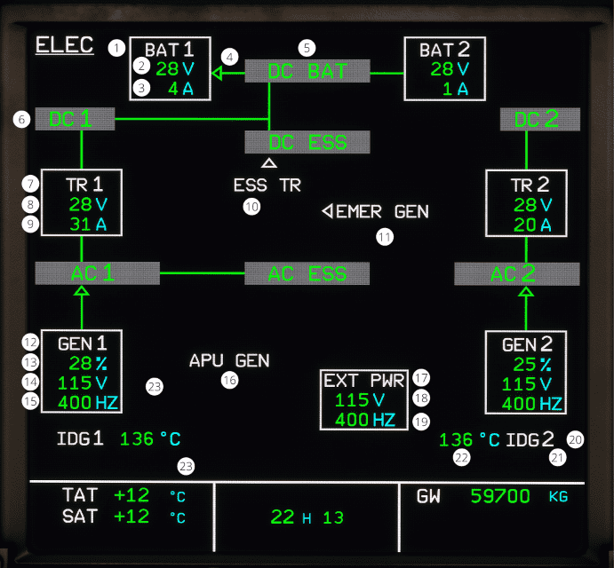

# ECAM ELEC page

[Back to ECAM System Display Overview](index.md){ .md-button }

| Number | Name                         | Variation                   | Meaning                                                                                                                   |
|:-------|:-----------------------------|:----------------------------|:--------------------------------------------------------------------------------------------------------------------------|
| 1      | Battery                      | White color                 | The battery is within normal operating range.                                                                             |
|        |                              | Amber color                 | There is a BAT FAULT alert, or the battery voltage or battery current is amber.                                           |
| 2      | Battery voltage              | Green color                 | The battery voltage is within normal operating range.                                                                     |
|        |                              | Amber color                 | The battery voltage is less than 25 volts or greater than 31 volts.                                                       |
| 3      | Battery current              | Green color                 | The battery current is within normal operating range.                                                                     |
|        |                              | Amber color                 | The battery current is discharging at greater than 5 ampere.                                                              |
| 4      | Battery charge and discharge | Green Left arrow            | The battery contactor is closed, and the charging current is greater than 1 ampere.                                       |
|        |                              | Amber right arrow           | The battery contactor is closed, and the discharge current is greater than 1 ampere.                                      |
|        |                              | Green line                  | The battery contactor is closed, and the current is less than 1 ampere.                                                   |
|        |                              | No line                     | The battery contactor is open.                                                                                            |
| 5      | DC Battery                   | Green color                 | The DC Battery voltage is within normal operating range.                                                                  |
|        |                              | Amber color                 | The DC Battery voltage is less than 25 volts.                                                                             |
| 6      | Bus bar                      | Green color                 | The corresponding bus bar is in normal operations.                                                                        |
|        |                              | Amber color                 | The corresponding bus bar is not powered.                                                                                 |
|        |                              | Amber SHED                  | The AC or the DC SHED ESS BUS is in shed mode.                                                                            |
| 7      | TR                           | White color                 | The TR parameters are in normal operations.                                                                               |
|        |                              | Amber color                 | The TR voltage is in amber, or the TR current is in amber.                                                                |
| 8      | TR Voltage                   | Green color                 | The TR voltage is within normal operating range.                                                                          |
|        |                              | Amber color                 | The TR voltage is less than 25 volts or greater than 31 volts.                                                            |
| 9      | TR current                   | Green color                 | The TR current is within normal operating range.                                                                          |
|        |                              | Amber color                 | The TR current is less than 5 amperes.                                                                                    |
| 10     | ESS TR                       | Hidden                      | The essential TR is open.                                                                                                 |
|        |                              | Shown                       | The essential TR is closed.                                                                                               |
| 11     | EMER GEN                     | Hidden                      | The EMER GEN line contractor is open                                                                                      |
|        |                              | Shown                       | The EMER GEN line contractor is closed.                                                                                   |
| 12     | GEN                          | White color                 | The corresponding generator is in normal operations                                                                       |
|        |                              | Amber color                 | The corresponding generator has either a load legend in amber, a voltage legend in amber, or a frequency legend in amber. |
| 13     | GEN load                     | Green color                 | The corresponding generator load is within normal operating range.                                                        |
|        |                              | Amber color                 | The corresponding generator load is greater than 100 %.                                                                   |
| 14     | GEN Voltage                  | Green color                 | The corresponding generator voltage is within normal operating range.                                                     |
|        |                              | Amber color                 | The corresponding generator voltage is less than 110 volts, or greater than 120 volts.                                    |
| 15     | GEN frequency                | Green color                 | The corresponding generator frequency is within normal operating range.                                                   |
|        |                              | Amber color                 | The corresponding generator frequency is less than 390 hertz, or greater than 410 hertz.                                  |
| 16     | APU GEN                      | White APU GEN               | Remains on the display regardless of the position of the APU GEN switch.                                                  |
|        |                              | Amber APU GEN and White OFF | The APU Master switch is ON, but the APU GEN is off.                                                                      |
|        |                              | White and Green color table | Same as generator indications.                                                                                            |
| 17     | External Power Indication    | Hidden                      | The external power is not available                                                                                       |
|        |                              | White color                 | The external power parameters are in normal operations.                                                                   |
|        |                              | Amber color                 | The external power voltage or frequency is in amber color.                                                                |
| 18     | External Power voltage       | Green color                 | The external power voltage is within normal operating range.                                                              |
|        |                              | Amber color                 | The external power voltage is less than 110 volts, or greater than 120 volts.                                             |
| 19     | External Power Frequency     | Green color                 | The external power frequency is within normal operating range.                                                            |
|        |                              | Amber color                 | The external power frequency is less than 390 hertz, or greater than 410 hertz.                                           |
| 20     | IDG Legend                   | White color                 | The IDG is in normal operations.                                                                                          |
|        |                              | Amber color                 | The oil outlet temperature is greater than 180 °C, the oil pressure is too low, or the IDG becomes disconnected.          |
| 21     | DISC/LO PR                   | Hidden                      | The IDG is connected.                                                                                                     |
|        |                              | Amber DISC                  | The IDG is disconnected                                                                                                   |
|        |                              | Amber LO PR                 | An IDG low pressure is detected on the associated engine.                                                                 |
| 22     | Oil outlet temperature       | Green color                 | The oil outlet temperature is within normal operating range.                                                              |
|        |                              | Amber color                 | The oil outlet temperature is greater than 180 °C.                                                                        |
|        |                              | Pulsion                     | The oil outlet temperature is greater than 147 °C, but less than 180 °C.                                                  |

