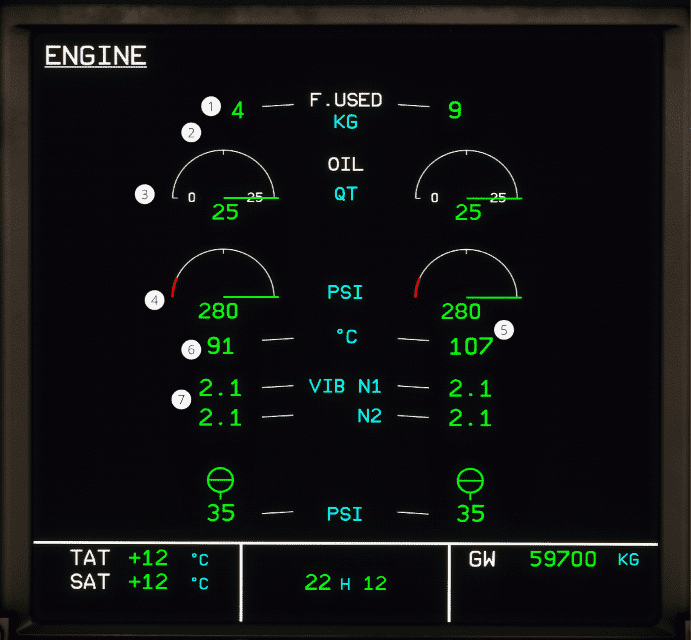

# ECAM ENG page

[Back to ECAM System Display Overview](index.md){ .md-button }

| Number | Name                        | Variation      | Meaning                                                                                     |
|:-------|:----------------------------|:---------------|:--------------------------------------------------------------------------------------------|
| 1      | Fuel used indication        | Green number   | The fuel consumed by the engine.                                                            |
|        |                             | Two amber dash | The fuel consumed value is inaccurate.                                                      |
| 2      | Fuel filter clog indication | Displayed      | The pressure loss in the fuel filter is excessive.                                          |
|        |                             | Hidden         | The pressure is normal in the fuel filter.                                                  |
| 3      | Oil quantity                | Green number   | The oil quantity is within normal operation range.                                          |
|        |                             | Green pulses   | The oil quantity is below the oil advisory limit.                                           |
| 4      | Oil pressure                | Green number   | The oil pressure is within normal operating range.                                          |
|        |                             | Green pulses   | The oil pressure is above the advisory limit.                                               |
|        |                             | Amber number   | The oil pressure is within the amber range.                                                 |
|        |                             | Red number     | The oil pressure is within the red range.                                                   |
| 5      | Oil filter clog indication  | Displayed      | The pressure loss in the oil filter is excessive.                                           |
|        |                             | Hidden         | The pressure is normal in the oil filter.                                                   |
| 6      | Oil temperature             | Green number   | The oil temperature is within normal operating range.                                       |
|        |                             | Green pulses   | The oil temperature is high.                                                                |
|        |                             | Amber number   | The oil temperature is above limits.                                                        |
| 7      | N1 and N2 vibrations        | Green number   | The vibration of the low-pressure and high-pressure rotor is within normal operating range. |
|        |                             | Amber number   | The vibration of the low-pressure and high-pressure rotor is excessive.                     |

