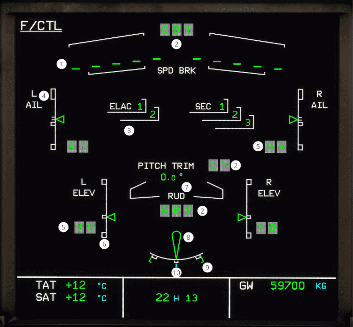

# ECAM F/CTL page

[Back to ECAM System Display Overview](index.md){ .md-button }

| Number | Name                              | Variation                   | Meaning                                                                 |
|:-------|:----------------------------------|:----------------------------|:------------------------------------------------------------------------|
| 1      | Spoilers and speedbrakes position | Green triangle              | The spoiler is deflected by more than 2.5°.                             |
|        |                                   | Amber triangle              | The spoiler has a fault and is deflected.                               |
|        |                                   | Green line                  | The spoiler is retracted.                                               |
|        |                                   | Amber 1                     | The spoiler has a fault and is retracted.                               |
|        |                                   | Amber X                     | The spoiler position is not valid.                                      |
| 2      | Hydraulic system pressure         | Green color                 | The hydraulic system pressure is within normal operating range.         |
|        |                                   | Amber color                 | The hydraulic system pressure has decreased.                            |
| 3      | ELAC and SEC                      | White label                 | The ELAC and SEC are ON and have no fault                               |
|        |                                   | Green number                | The associated computer number.                                         |
|        |                                   | Amber number                | The computers have failed, or is switched to OFF.                       |
| 4      | Aileron position                  | White scale and green index | The ailerons are in normal operations.                                  |
|        |                                   | Amber color                 | The blue and green hydraulic servo jack is unavailable.                 |
| 5      | Aileron and elevator actuator     | Green color                 | The green and blue hydraulic pressure is within normal operating range. |
|        |                                   | Amber color                 | The green or blue hydraulic pressure is low                             |
|        |                                   | Amber box                   | The associated computer or actuator is failed.                          |
| 6      | Elevator position                 | White scale and green index | The corresponding systems are available.                                |
|        |                                   | Amber color                 | Both corresponding systems are unavailable                              |
| 7      | Pitch trim position               | Green number                | The pitch trim is in normal operations.                                 |
|        |                                   | Amber number                | The yellow and yellow hydraulic pressure is decreasing.                 |
|        |                                   | White PITCH TRIM            | The pitch trim is in normal operations.                                 |
|        |                                   | Amber PITCH TRIM            | The pitch trim is jammed.                                               |
| 8      | Rudder position                   | Green color                 | The rudder is operating normally.                                       |
|        |                                   | Amber color                 | The blue, green, and yellow hydraulic pressure is low.                  |
| 9      | Rudder travel limiter             | Green color                 | The rudder travel limiter is operating normally.                        |
|        |                                   | Amber color                 | The rudder travel limiters 1 and 2 are faulty.                          |
|        |                                   | Amber TLU                   | The TLU indexes are suppressed                                          |
| 10     | Rudder trim position              | Blue color                  | The rudder trim is operating normally.                                  |
|        |                                   | Amber color                 | The rudder trim reset has failed.                                       |

