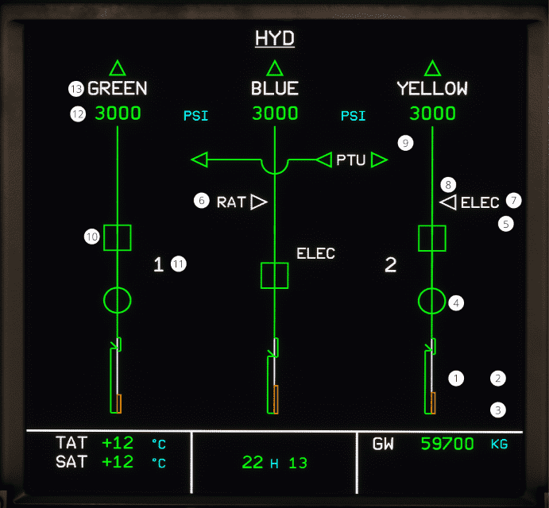

# ECAM HYD page

[Back to ECAM System Display Overview](index.md){ .md-button }

| Number | Name                             | Variation                                | Meaning                                                                                     |
|:-------|:---------------------------------|:-----------------------------------------|:--------------------------------------------------------------------------------------------|
| 1      | Reservoir quantity               | Green color                              | The fluid quantity is normal.                                                               |
|        |                                  | Amber                                    | The fluid quantity is below the warning level.                                              |
| 2      | Reservoir Pressure               | Ambure LO AIR PRESS                      | The air pressure at the corresponding reservoir is below normal.                            |
|        |                                  | Hidden                                   | The air pressure at the corresponding reservoir is normal.                                  |
| 3      | Reservoir Overheat               | Amber OVHT                               | The temperature of the returning fluid is above normal.                                     |
|        |                                  | Hidden                                   | The temperature of the returning fluid is normal.                                           |
| 4      | Fire valve                       | Amber crossline                          | The valve is fully closed.                                                                  |
|        |                                  | Green inline                             | The valve is partially closed                                                               |
| 5      | Overheat warning                 | Amber OVHT                               | The corresponding electric pump is overheating.                                             |
|        |                                  | Hidden                                   | The corresponding electric pump does not overheat.                                          |
| 6      | Ram Air Turbine                  | White Arrow                              | The Ram Air Turbine is stowed.                                                              |
|        |                                  | Green Arrow                              | The Ram Air Turbine is deployed.                                                            |
|        |                                  | Amber Arrow                              | The Ram Air Turbine is not available, or the pressure for stowing the RAT has been applied. |
| 7      | ELEC                             | White color                              | The associated power supply is supplying electrical power.                                  |
|        |                                  | Amber color                              | The associated power supply has failed.                                                     |
| 8      | Yellow Electric Pump             | White arrow                              | The electric pump is OFF.                                                                   |
|        |                                  | Green arrow                              | The electric pump is ON.                                                                    |
|        |                                  | Amber arrow                              | The electric pump is ON and the yellow system pressure is low.                              |
| 9      | PTU                              | Green outbound arrow                     | The PTU switch is in AUTO and is not transferring pressure.                                 |
|        |                                  | Amber outbound arrow                     | The PTU is off.                                                                             |
|        |                                  | Green arrows, all pointing to the left.  | The PTU is supplying the green hydraulic system.                                            |
|        |                                  | Green arrows, all pointing to the right. | The PTU is supplying the yellow hydraulic system.                                           |
| 10     | Engine Pump control and pression | Green inline                             | The corresponding pump is ON, and the hydraulic pressure is normal.                         |
|        |                                  | Amber crossline                          | The corresponding pump is OFF.                                                              |
|        |                                  | Amber LO                                 | The corresponding pump is ON and the hydraulic pressure is low.                             |
| 11     | Pump legend                      | White color                              | The N2 is in the normal operating range.                                                    |
|        |                                  | Amber color                              | The N2 is below idle.                                                                       |
| 12     | System pressure                  | Green color                              | The corresponding system pressure is in the normal operating range.                         |
|        |                                  | Amber color                              | The corresponding system pressure is below 1450 psi.                                       |
| 13     | System label                     | White Yellow/Blue/Green                  | The pressure is greater than 1450 psi.                                                     |
|        |                                  | Amber Yellow/Blue/Green                  | The pressure is less than 1450 psi.                                                        |
|        |                                  | Green triangle                           | The pressure is greater than 1450 psi.                                                     |
|        |                                  | Amber triangle                           | The pressure is less than 1450 psi.                                                        |

