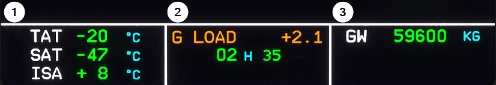

# ECAM Systems Display
(Electronic Centralized Aircraft Monitoring)

## ECAM System Display Pages

!!! note ""
    Click on the page to get a detailed description of the page.

    
    <a href="/pilots-corner/a32nx-briefing/ecam/sd/eng/">      
 ENG
</a>
    <a href="/pilots-corner/a32nx-briefing/ecam/sd/bleed/">    
  BLEED
</a>
    <a href="/pilots-corner/a32nx-briefing/ecam/sd/press/">    
PRESS
</a>
    <a href="/pilots-corner/a32nx-briefing/ecam/sd/elec/">     
  ELEC
</a>
    <a href="/pilots-corner/a32nx-briefing/ecam/sd/hyd/">      
HYD
</a>
    <a href="/pilots-corner/a32nx-briefing/ecam/sd/fuel/">     
  FUEL
</a>
    <a href="/pilots-corner/a32nx-briefing/ecam/sd/apu/">      
 APU
</a>
    <a href="/pilots-corner/a32nx-briefing/ecam/sd/cond/">     
  COND
</a>
    <a href="/pilots-corner/a32nx-briefing/ecam/sd/door/">     
  DOOR
</a>
    <a href="/pilots-corner/a32nx-briefing/ecam/sd/wheel/">    
WHEEL
</a>
    <a href="/pilots-corner/a32nx-briefing/ecam/sd/f-ctl/">    
  F-CTL
</a>
    <a href="/pilots-corner/a32nx-briefing/ecam/sd/sts/">      
STS
</a>
    <a href="/pilots-corner/a32nx-briefing/ecam/sd/cruise/">   
  CRUISE
</a>

## ECAM Control Panel

!!! note ""
    Click on the page button to get a detailed description of the page.

    
    <a href="/pilots-corner/a32nx-briefing/ecam/sd/eng/">      
 ENG
</a>
    <a href="/pilots-corner/a32nx-briefing/ecam/sd/bleed/">    
  BLEED
</a>
    <a href="/pilots-corner/a32nx-briefing/ecam/sd/press/">    
PRESS
</a>
    <a href="/pilots-corner/a32nx-briefing/ecam/sd/elec/">     
  ELEC
</a>
    <a href="/pilots-corner/a32nx-briefing/ecam/sd/hyd/">      
HYD
</a>
    <a href="/pilots-corner/a32nx-briefing/ecam/sd/fuel/">     
  FUEL
</a>
    <a href="/pilots-corner/a32nx-briefing/ecam/sd/apu/">      
 APU
</a>
    <a href="/pilots-corner/a32nx-briefing/ecam/sd/cond/">     
  COND
</a>
    <a href="/pilots-corner/a32nx-briefing/ecam/sd/door/">     
  DOOR
</a>
    <a href="/pilots-corner/a32nx-briefing/ecam/sd/wheel/">    
WHEEL
</a>
    <a href="/pilots-corner/a32nx-briefing/ecam/sd/f-ctl/">    
  F-CTL
</a>
    <a href="/pilots-corner/a32nx-briefing/ecam/sd/sts/">      
STS
</a>
    <a href="/pilots-corner/a32nx-briefing/ecam/sd/cruise/">   
  CRUISE
</a>

!!! note ""
    STS has two links (left/right) to see Status page or Cruise page details.

## Permanent Data

| Number | Name                  | Variation             | Meaning                                                                                                                                    |
|:-------|:----------------------|:----------------------|:-------------------------------------------------------------------------------------------------------------------------------------------|
| 1      | Permanent Data Left   | TAT                   | Total Air Temperature is the SAT plus the temperature rise associated with high-speed flight.                                              |
|        |                       | SAT                   | Static Air Temperature is the temperature of undisturbed air.                                                                              |
|        |                       | ISA                   | Difference between SAT and the International Standard Atmosphere temperature (ISA) temperature. Only displayed in STD altitude mode.       |
| 2      | Permanent Data Middle | G LOAD                | G LOAD in amber when g load > 1.4*g* or < 0.7*g* for more than 2 s. Inhibited in some flight phases.                                       |
|        |                       | ALT SEL               | Selected altitude in green when metric units are selected and load factor not displayed.                                                   |
|        |                       | UTC                   | Universal Time Coordinated (UTC), synchronized with the cockpit clock.                                                                     |
| 3      | Permanent Data Right  | Gross Weight (GW)     | Gross Weight in green as soon as first engine is started. Last digits dashed if accuracy is degraded. Blue dashes if no data is available. |
|        |                       |                       |                                                                                                                                            |
| ALL    | Amber Crosses         | XX                    | Value not available.                                                                                                                       |
|        | Amber Dashes          | -- (over last digits) | Value accuracy is degraded.                                                                                                                |

<!--- [ENG](sd/eng/eng.md)-->
<!--- [BLEED](sd/bleed/bleed.md)-->
<!--- [PRESS](sd/press/press.md)-->
<!--- [ELEC](sd/elec/elec.md)-->
<!--- [HYD](sd/hyd/hyd.md)-->
<!--- [FUEL](sd/fuel/fuel.md)-->
<!--- [APU](sd/apu/apu.md)-->
<!--- [COND](sd/cond/cond.md)-->
<!--- [DOOR](sd/door/door.md)-->
<!--- [WHEEL](sd/wheel/wheel.md)-->
<!--- [WHEEL](sd/sts/sts.md)-->
<!--- [STS](sd/sts/sts.md)-->
<!--- [CRUISE](sd/cruise/cruise.md)-->
