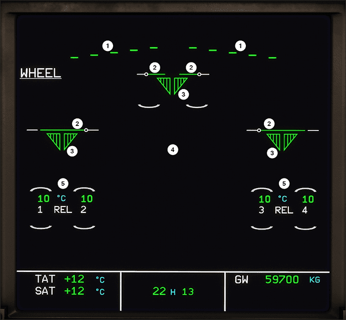

# ECAM WHEEL page

[Back to ECAM System Display Overview](index.md){ .md-button }

| Number | Name                              | Variation                    | Meaning                                                                                                                                                      |
|:-------|:----------------------------------|:-----------------------------|:-------------------------------------------------------------------------------------------------------------------------------------------------------------|
| 1      | Spoilers and Speedbrakes Position | Green triangle               | The spoiler is deflected by more than 2.5°.                                                                                                                  |
|        |                                   | Amber triangle               | The spoiler has a fault and is deflected.                                                                                                                    |
|        |                                   | Green line                   | The spoiler is retracted.                                                                                                                                    |
|        |                                   | Amber 1                      | The spoiler has a fault and is retracted.                                                                                                                    |
|        |                                   | Amber X                      | The spoiler position is not valid.                                                                                                                           |
| 2      | Doors (2x Nose/Left/Right)        | Green Horizontal Line        | Door is locked up.                                                                                                                                           |
|        |                                   | Amber Diagonal Line          | Door is in transit.                                                                                                                                          |
|        |                                   | Amber Vertical Line          | Door is fully open.                                                                                                                                          |
| 3      | Gears (Nose/Left/Right)           | Green triangle               | Landing gear down and locked.                                                                                                                                |
|        |                                   | Red triangle                 | Landing gear in transit.                                                                                                                                     |
|        |                                   | No triangle                  | Landing gear up and locked.                                                                                                                                  |
|        |                                   | Amber crosses                | Landing Gear Control Interface Unit (LGCIU) 1 or 2 failed.                                                                                                   |
| 4      | Legends                           | UP LOCK (amber, above doors) | Appears when landing gear uplock is engaged when the landing gear is down locked.                                                                            |
|        |                                   | L/G CTL (amber)              | Appears when landing gear lever and actual position do not agree.                                                                                            |
|        |                                   | N/W STEERING (amber)         | Appears when nosewheel steering is lost or OFF. Green Y when yellow hydraulic system is available, otherwise amber Y.                                        |
|        |                                   | ANTI SKID                    | Appears amber when antiskid is lost of OFF. Appears in green if antiskid is available while autobrake, normal braking or alternate braking failure.          |
|        |                                   | NORM BRK                     | Appears green when autobrake or alt. braking fails, but normal still available. Amber when normal braking is failed. Green or amber G for green hyd. status. |
|        |                                   | ALTN BRK                     | Appears green in alternate braking mode. Amber when alternate braking is failed.                                                                             |
|        |                                   | &rarr; ACCU PR               | Appears green with ALTN BRK when Y hydraulic is available. Amber with no arrow when pressure from Y or accu is low.                                          |
|        |                                   | &larr; ACCU ONLY             | Appears green when alternate braking is pressurized by accu.                                                                                                 |
|        |                                   | AUTO BRK                     | Appears green when autobrake is armed. Flashes after autobrake disengagement. Appears amber to indicate failure.                                             |
|        |                                   | LO/MED/MAX                   | Selected autobrake rate.                                                                                                                                     |
| 5      | Brakes (Left/Right)               | White number                 | Wheel number.                                                                                                                                                |
|        |                                   | Green arc                    | Appears on hottest wheel when one brake > 100°.                                                                                                              |
|        |                                   | Amber arc                    | Appears when brake > 300°.                                                                                                                                   |
