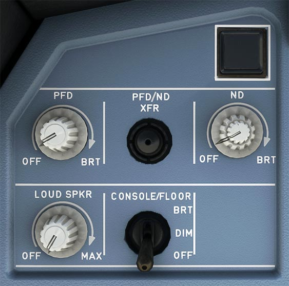

# Instrument Lighting Control Panel

---

[Back to Flight Deck](../index.md){ .md-button }

---

!!! note "API Documentation: [ILCP Panel API](../../../../../aircraft/a32nx/a32nx-api/a32nx-flightdeck-api.md#instrument-lighting-control-panel)"

## Description

These additional EFIS Controls help manage and adjust the main displays of the pilots.

## Usage

### OFF/BRT knobs

These knobs are used to turn the displays (PFD, ND) on and off, and also adjust their brightness.

- PFD
    - If the PFD is turned off (knob turned all the way counterclockwise) the PFD image is automatically displayed on the NDU, but the pilot may recover the ND by means of the PFD-ND XFR pushbutton.

    !!! info ""
        Currently, PFD/ND XFR is not available in the FBW A32NX for Microsoft Flight Simulator.

- ND
    - The outer knob adjusts the brightness of both the weather radar image and the EGPWS terrain display. The inner knob adjusts the brightness of the ND symbols. The ND is turned off if this knob is turned all the way counterclockwise.

### PFD/ND XFR Pushbutton

Exchanges the PFD and the ND. If the PFDU fails, the PFD automatically transfers to the NDU.

!!! info ""
    Currently not available or INOP in the FBW A32NX for Microsoft Flight Simulator.

### Loudspeaker Volume Knob

Adjusts the volume of the loudspeaker for radio communication.

- OFF:
    - Radio signals are not broadcast on loudspeaker.
- Clockwise rotation:
    - Radio signals are broadcast on loudspeaker at the set volume.

Note: Does not control the loudness of aural alert and voice messages.

!!! info ""
    Currently not available or INOP in the FBW A32NX for Microsoft Flight Simulator.

### Console/Floor Lt.

Adjusts the lights of the side console and of the briefcase on each side of the cockpit. Also adjusts the lighting of the floor around each flight crew member's seat. The lights can be set to bright, dim, or off.

### GPWS – G/S pushbutton

The Ground Proximity Warning System (GPWS) is warning the flight crew of potentially hazardous situations, such as a collision with terrain. It detects these and triggers aural and visual indications.

Five basic GPWS modes active up to radio height of 2 500 ft:

- Excessive rate of descent (Mode 1)
- Excessive terrain closure rate (Mode 2)
- Altitude loss after takeoff or go-around (Mode 3)
- Terrain clearance not sufficient (if not in landing config). (Mode 4)
- Excessive descent below the glide slope (Mode 5).

**Usage:**

- GPWS Lt:
    - This red light comes on when any mode from 1 to 4, or any TAD (Terrain Awareness and Display) or TCF (Terrain Clearance Floor) alert is activated. A specific voice alert accompanies it.
- G/S Lt:
    - Amber light when Mode 5 is activated. Accompanied by aural “GLIDE SLOPE” warning.
    - Press to clear G/S light and “GLIDE SLOPE” aural warning (soft or loud).
- Test:
    - On ground, press this pushbutton briefly for some of the aural warnings sounds and pushbutton captions, related to the GPWS, come on. Pressed continuously, then all the aural warnings sound.

---

[Back to Flight Deck](../index.md){ .md-button }
