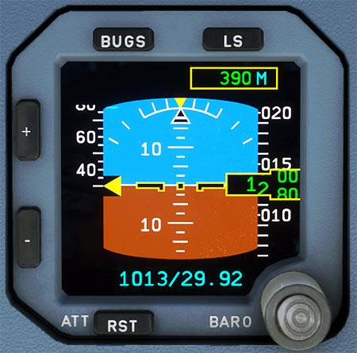

# Integrated Standby Instrument System

---

[Back to Flight Deck](../index.md){ .md-button }

---

!!! note "API Documentation: [ISIS Panel](../../../../../aircraft/a32nx/a32nx-api/a32nx-flightdeck-api.md#isis)"

## Description

The Integrated Standby Instrument System (ISIS) integrates the 4 classical standby instruments (Compass, Horizon, Airspeed, Altimeter) into one single instrument.

The ISIS system displays the following information:

- Attitude
- Airspeed and mach
- Altitude
- Barometric pressure
- LS function
- Bugs

## Usage

### ”+” / “-”

- Used to adjust the level of brightness.

### LS

- Pressing the LS pb will display the LS scales. Pressing the LS pb again will remove the LS scales.

### BUGS

- Pressing the BUGS pushbutton will activate the BUGS function and display the bug values to be selected.

SPD BUG and ALT BUG columns:

- The SPD BUG column gives four speed values (in knots) that can be selected by the crew.
- The ALT BUG column gives two altitude values (feet) to be selected by the crew.

### BUGS value selection knob

- It allows the bug value to be set by rotating the BARO knob. This value cannot be lower than 30 kt for a speed bug, or a negative value for an altitude bug.
- Pressing the BARO setting knob, once a bug value box is activated, will deselect the bug value.
- The “OFF” label comes on close to the activated box.
- The entered values are memorized by the system, when exiting the screen, by pressing the BUGS pushbutton (1), or after 15 s without any pilot action.

### “+” / ”-” box activation buttons

- Access from one box to another is obtained by pressing the “+” or “–” pushbutton.
- When a bug value is entered, access to the next box is obtained by pressing the “–” pushbutton. The box becomes active and flashes.
- The “+” pushbutton can be used to return to a previous box.

---

[Back to Flight Deck](../index.md){ .md-button }

