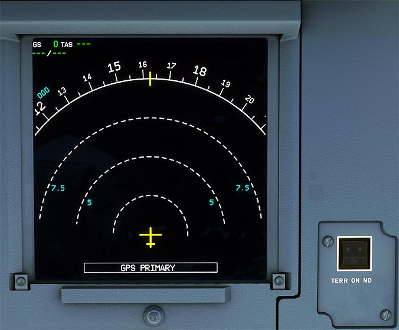

# Navigation Display (ND)

---

[Back to Flight Deck](../index.md){ .md-button }

---

!!! note "API Documentation: [ND Panel](../../../../../aircraft/a32nx/a32nx-api/a32nx-flightdeck-api.md#terr-on-nd)"

---

## Description

The Navigation Display (ND) is one of the main instruments for the pilots for situational awareness and navigation in flight.

It plots configurable information for speed, heading, flight plan, terrain, weather, distances etc. in 5 different basic view modes:

- ROSE LS, VOR, NAV
    - A 360-degree view around the aircraft.
- ARC
    - A 180-degree forward view.
- PLAN
    - A 360-degree view used for stepping through the current flight plan.

The weather radar image can be displayed in all modes except PLAN.

<!-- TODO: UPDATE -->
!!! info "Future Update"
    A more in-depth description of the Navigation Display is currently being developed and will be available in the near future. Listed below will be interim updates until we have fully completed the documentation.

    - Various [vertical guidance symbology](../../../advanced-guides/flight-guidance/vertical-guidance/nd-symbols.md) as seen on the ND is now available.

## Usage

### TERR ON ND pushbutton

These pushbuttons are located on either side of the ECAM. Each pushbutton controls the onside terrain display.

- ON:
    - The terrain is displayed on the ND if the:
        - TERR pb-sw is selected ON, and
        - TERR FAULT light is not on.
        - TERR STBY ECAM memo is not displayed.
        - The FMGS navigation accuracy is high.

    The ON light comes on.

- OFF:
    - The terrain data is not displayed on the ND.
    - Note:
        - If the predictive functions of the GPWS generate a caution or a warning, while the TERR ON ND is not switched ON, the terrain is automatically displayed on the NDs and the ON light of the TERR ON ND pushbutton comes on.
        - To differentiate between the terrain and the weather display, the TERR indication comes on, instead of the TILT indication, in the lower-right corner of the ND.

---

[Back to Flight Deck](../index.md){ .md-button }

