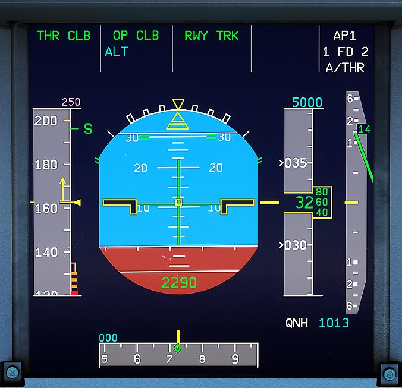

# Primary Flight Display (PFD)

---

[Back to Flight Deck](../index.md){ .md-button }

---

## Description

The Primary Flight Display (PFD) is the main aviation instrument for the pilots. It provides information for:

- Attitude
- Sideslip Indication
- Airspeed (Knots or Mach) and speed trend
- Altitude (baro and radio)
- Vertical Speed
- Heading and Track
- Autopilot / Flight Director Guidance
- Sidestick Order Indication
- Flight Mode Annunciator and Flight Modes FMGS
- Deviations (vertical and lateral)
- Radio navigation (ILS, DME, etc.)
- Various scales and limits (bank limits, max sidestick deflection, pitch, etc.)

---
[In Depth PFD Guide](../../pfd/index.md){ .md-button }

[Back to Flight Deck](../index.md){ .md-button }
