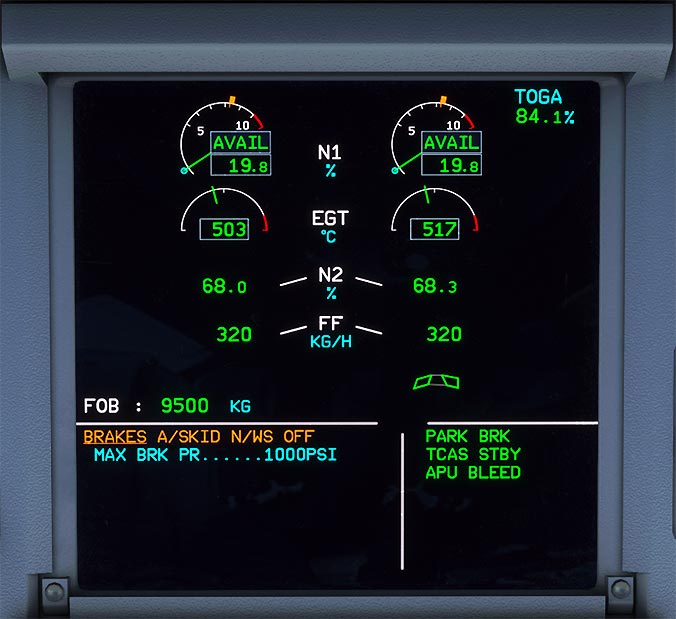

# Engine and Warning Display (Upper ECAM)

---

[Back to Flight Deck](../index.md){ .md-button }

---

See our detailed documentation for the upper ECAM:

[ECAM Engine and Warning Display](../../ecam/ecam-e-wd.md){ .md-button }

## Description

The Electronic Centralized Aircraft Monitoring (ECAM) consists of two displays:

- the Engine and Warning Display (E/WD) aka Upper ECAM
    - Primary engine indications, fuel quantity, flap and slat position
    - Warning and caution alerts, or memos
- the Systems Display (SD) aka Lower ECAM
    - Synoptic diagrams of aircraft systems, and status messages
    - Permanent flight data

[Back to Flight Deck](../index.md){ .md-button }
