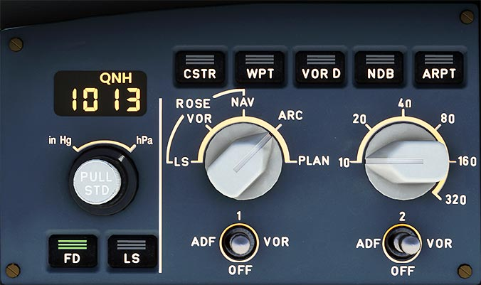

# EFIS Control Panel

---

[Back to Flight Deck](../index.md){ .md-button }

---

!!! note "API Documentation: [EFIS Control Panel](../../../../../aircraft/a32nx/a32nx-api/a32nx-flightdeck-api.md#efis-control-panel)"

## Description

This panel controls:

- Desired ND modes (ROSE-ILS, -VOR, NAV, ARC, PLAN) and ranges.
- Baro setting.

## Usage

### Barometer Reference Display Window

- Barometer Range: 745 hPa to 1100 hPa.

### Barometer Reference Selector

- Outer ring selector:
    - Allows switching of the barometer reference to either hectoPascals or inches of mercury.

    Note: Unit selection does not appear on the PFD.

- Inner knob selector:
    - Allows manipulation of the value displayed in the barometer reference window and on the PFD (visible below the altitude scale). When the FCU is initialized, it will display 1013 or 29.92 based on the outer ring selection.

- Pulling the knob selects the standard baro reference setting. The display window and PFD both will show "STD."
      - When in the STD position, pushing the knob makes the last selected QFE or QNH setting available.
      - When pushing the knob after switching from STD position, it will change between QNH to QFE based on current selection. The display window will note QFE or QNH.

- Note: The QFE selection is a program installed on both the FMGC and GPWS computers. It allows for each computer to use the selected program independently of the barometer reference selected through the EFIS control panel.

###  FD Pushbutton

- Pushing the FD button either enables or removes the flight director bars from the respective PFD. If in TRK FPA, it will enable or remove the flight path directory symbol.
- When `ON` the button light is green and when `OFF` there is no illumination.

###  LS Pushbutton

- Selecting this LS button will display the glide slope scales on the PFD and localizer information.
- The diamond deviation symbols will appear only if the localizer is within range.
- When `ON` the button light is green and when `OFF` there is no illumination.

### Mode Select Switch

- Changes the mode displayed on the respective ND.

### Range Select Switch

- Changes range displayed on the respective ND.

- Note : If there are any failures, the display defaults to ROSE NAV mode and 80NM range

### ADF-VOR Select Switches

- Selects between ADF or VOR pointers and DME distance on the respective ND. Provides the corresponding NAVAID information on the ND (except in PLAN mode).

### Optional Data Display Pushbutton (CSTR, VOR D, WPT, NDB, ARPT)

- This button shows any optional information alongside the data that is permanently shown in PLAN, ARC, or ROSE NAV modes. Only one selection can be active at a time.
- When ON, the button light is green and when OFF, there is no illumination.

---

[Back to Flight Deck](../index.md){ .md-button }

