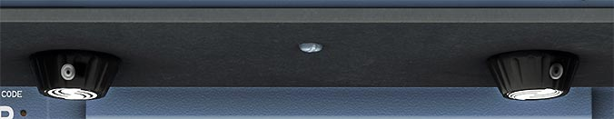

# Instrument Panel Lighting Knobs

---

[Back to Flight Deck](../index.md){ .md-button }

---

!!! note "API Documentation: [Lighting Knobs API](../../../../../aircraft/a32nx/a32nx-api/a32nx-flightdeck-api.md#lighting-knobs)"

## Description

The four knobs under the glareshield are used to control brightness of lighting for (from left to right):

- sliding table and map holder lighting Captain side.
- integral lighting on the glareshield.
- FCU displays.
- sliding table and map holder lighting First Officer side.

---

[Back to Flight Deck](../index.md){ .md-button }
