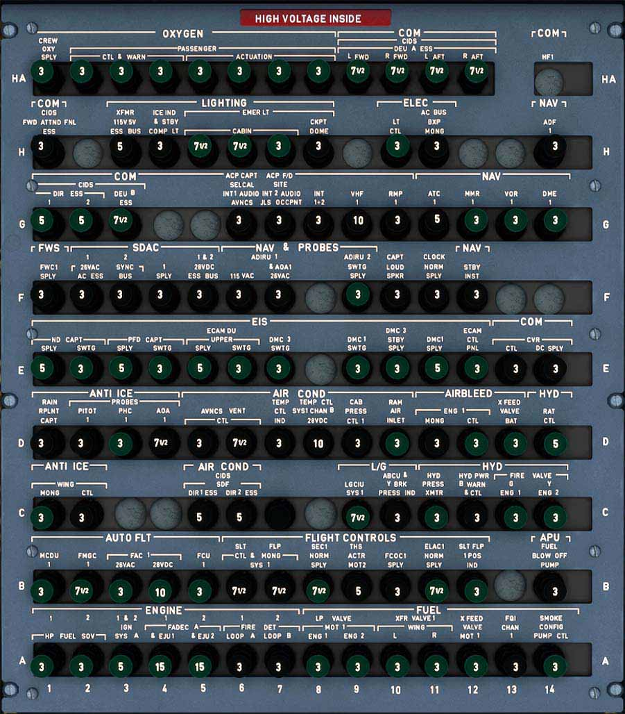
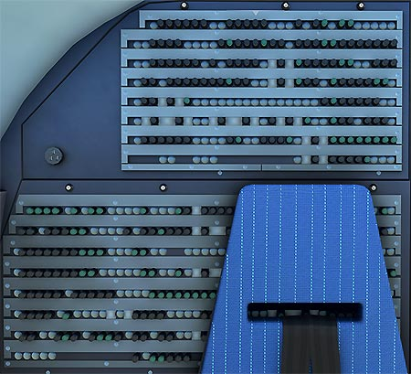

# Circuit Breaker Panel

---

[Back to Flight Deck](../index.md){ .md-button }

---

## Description

The Overhead Aft Panel contains the Emergency Circuit Breaker Panel.

The aircraft has two types of Circuit Breakers (C/Bs):

- Monitored (green): When out for more than one minute, the C/B TRIPPED warning is triggered on the ECAM.
- Non-monitored (black).

The C/B TRIPPED warning on the ECAM points to the location of the affected C/B. These panels are monitored: OVHD PNL, L(R) ELEC BAY, REAR PNL J-M or N-R or S-V or W-Z.

Note: The CLR or the EMER CANCEL pushbutton can be used to clear the ECAM caution. If the EMER CANCEL is used, and if a second C/B is tripped on the same panel, the corresponding C/B TRIPPED caution will not be triggered.

The Overhead Aft Panel is usually not used during flight.

!!! info ""
    Currently not available or INOP in the FBW A32NX for Microsoft Flight Simulator.

## Rear Right Back Panel

There are further "Secondary Circuit Breakers" on the Rear Right Panel.

{loading=lazy}

!!! info ""
    Currently not available or INOP in the FBW A32NX for Microsoft Flight Simulator.

---

[Back to Flight Deck](../index.md){ .md-button }
