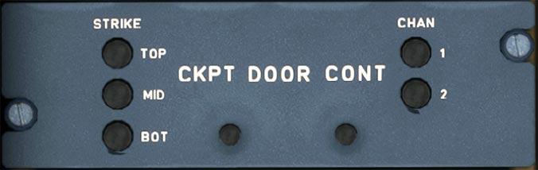

# Cockpit Door Panel

---

[Back to Flight Deck](../index.md){ .md-button }

---

## Description

!!! info ""
    Currently not available or INOP in the FBW A32NX for Microsoft Flight Simulator.

### Strikes' status lights

- OFF: locking latch is operative.
- ON: locking latch is faulty.

###  Pressure sensor

Rapid pressure variation in the cockpit is detected by two redundant differential pressure sensors. This allows simultaneous opening of all latches when a certain pressure drop is detected.

### Pressure sensor status lights

- OFF: Pressure sensor 1 or 2 is operative.
- ON: Pressure sensor 1 or 2 is faulty.

Note: When the Central Pedestal Fault indicator light is ON, these indicators enable the crew to identify the faulty item.

---

[Back to Flight Deck](../index.md){ .md-button }

